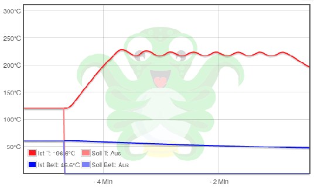

<link rel=”manifest” href=”docs/manifest.webmanifest”>

# Calibration
For getting high quality prints, you need to calibrate your printer. As there are many things being worth mentioned and I can't cover and explain all of them, I'll just talk about a few which seem to be the most crucial ones beginners might not be aware of. There are many websites and YouTube guides out there to find which are already covering this wide topic of calibration, so I'd recommend to do a little research by your own.  
However, to make this journey a bit easier for you to begin with, I'll list some pages that I personally found useful in the section ["Calibration Guides"](calibration.md#calibration-guides). For more informations and general sources of informations also check out the chapter ["Further Sources"](further_sources.md).  

??? tip "Calibration Using OctoPrint"

    If you're using OctoPrint, you might want to check out the plugin ["Marlin Calibration Tools"](https://plugins.octoprint.org/plugins/CalibrationTools/) which allows you to easily execute different calibration procedures.  
    
??? tip "Calibration Models for Cura"

    If you're using Cura, you might want to check out the plugin ["Calibration Shapes"](https://marketplace.ultimaker.com/app/cura/plugins/5axes/CalibrationShapes) which gives you access to different STL models you can use for calibration. Before slicing and printing, make sure you're reading the specific notes about the models at the [wiki page of the creator](https://github.com/5axes/Calibration-Shapes/wiki).  
    
??? tip "Calibration Using SuperSlicer"

    I personally prefer SuperSlicer (after I used Cura in the first place). One of the great functions is, that SuperSlicer already comes with an inbuilt set of calibration tools. You'll follow the proposed order and generate the specific 3d models for your specific needs with just one click. After that, you just print them and don't have to take care about additional code sections (e.g. like applying temperature or retraction distance changes at layer xy) which is necessary when using Cura and the abovementioned Calibration Shapes plugin.  
    

## Calibration Guides
There are many sites and tutorials to find which are about calibration, so you might want to search for that at your preferred site first. However, I found the following guides useful.  

- A handy reference when it comes down to **judging the quality of your first layer** is the [poster about what incorrect bed leveling can cause](https://i.imgur.com/hIcGr8U.png) made my [Billie Ruben](https://www.billieruben.info/).
- [Elli's Print Tuning Guide](https://ellis3dp.com/Print-Tuning-Guide/) made by @[AndrewEllis93](https://github.com/AndrewEllis93)
- [All3DP's article "Extruder Calibration: How to Calibrate E-Steps"](https://all3dp.com/2/extruder-calibration-6-easy-steps-2/)
- The [Print Quality Troubleshooting Guide](https://www.simplify3d.com/resources/print-quality-troubleshooting/) is a good start to compare your faulty prints and see what may caused the problem.  

## Z-Offset  
The z-offset is the distance between the nozzle and the bed/plate you're printing on. It comes into account when printing the first layer of a model and therefore it's crucial and absolutely important that you dial in your z-offset to get your first layer as perfect as possible.  
If the nozzle is too far up above the plate, you'll experience that the print doesn't stay onto the bed or (if it's way too far up) that it'll just produce 'spaghetti' while printing up in the air.  
If it's too close to the plate and therefore the filament will be squished into the plate too much, then it'll either be difficult to remove the object or (if the nozzle is way too close) it'll provoke clogging as the filament won't be able to come out of the nozzle. Worst case would be that the nozzle scrapes across the plate and that you damage the hardware itself.  
  
To determine the perfect first layer, I'd recommend to have a look at [this handy guide](https://i.imgur.com/hIcGr8U.png) from [Billie Ruben](https://www.billieruben.info/) first to get an impression how you can judge if the first layer (and therefore the z-offset) is good or not and how it should look like.  

??? tip "Tram The X-Axis Gantry"  

    I'd recommend to tram the x-axis gantry before adjusting the z-offset. Of course you don't need to do this every time you adjust the z-offset, you need to tram the gantry one time and then it should be good.  
    If you're using the rigid stock spacers, tram the gantry in relation to the bed itself. If you're using adjustable spacers, tram the gantry in relation to the base frame and then tram the bed in relation to the nozzle. See the first violet expandable textbox in the section ["X-Axis Gantry"](hardware/axes.md#x-axis-gantry) of the chapter ["Axes"](hardware/axes.md) for a more detailed description.  
    
??? tip "Proceed An ABL Sequence First"  

    Before adjusting the z-offset, I recommend to execute an ABL sequence first. If you execute an ABL *after* you dialed in your z-offset, then you'll have to set the z-offset *again* as it seems that the ABL procedure somehow 'resets' the setting.  
    
When it comes down to describe the actual process of how to determine and set the z-offset correctly, I have to mention that right now I don't give a 'real' step-by-step instruction here about how to proceed, as I'm using Klipper and don't remember 100% how I proceeded when using the stock firmware. However, from what I do remember right now you roughly do it this way:  
After tramming the x-axis gantry (if you never did it before, otherwise you can skip this step) and executing an ABL sequence, home the printer. Preheat the system for PLA temperatures by using the control unit.  Enter the menu in the control unit where you can move the axes manually, choose "Move Z" and set the value to zero. Then move the printhead to the middle of the bed (x and y axes) - I'd recommend to do so by using the control unit as well instead of moving it manually to avoid any movement on the z-axis. Then take a 0.1mm feeler gauge (or a piece of paper if you don't have a feeler gauge) and place it under the nozzle. Then enter "Leveling" -> "Z-Offset" in the control unit and lower the printhead *carefully step by step* until the nozzle touches the gauge/paper. You want to be able to still move the gauge/paper without any force, but you should feel a tiny bit of resistance to make sure the nozzle touches the gauge/paper. Once you found the sweet spot, save the value. Then start a print job and verify that the first layer came out perfect. Compare the look of it with the abovementioned poster from Billie Ruben to check if it really is perfect or if you need a bit of adjustment.  

## Retraction Settings
As a crucial element for great printing results you need to find the optimum settings for retraction distance and retraction speed. The correct setting will avoid stringing (more or less). There are various aspects which affect the retraction settings. One of the main aspects is the printing temperature and the kind of filament. The higher the temperature, the more liquid/fluid the filament will be, which leads to more stringing in general.   
In general you'll determine the correct settings (after determining the correct print temperature) by printing retraction distance and retraction speed towers. Slight adjustments might be necessary later on though, so pay attention to not only the stringing, but also to e.g. starts and ends of layers where over-/underextrusion might be occur due to imperfect retraction settings.  

!!! warning "Feeder Gear Pressure Is Crucial!"

    It should be noted that the correct pressure of the feeder gear is very crucial (not only) when it comes down to retracting.  
    If the feeder gear pressure is too low, the gear won't 'grab' the filament sufficiently and therefore starts slipping and grinding instead of pulling it back. If the pressure is too high though, it'll deform the filament which may result in e.g. visible artefacts of your printed model. So make sure you adjusted the correct pressure.   
    
??? info "Stringing"

    Stringing can be caused and affected by different factors and therefore can't always be avoided by adjusting retraction settings only. You can find countless articles about it, so maybe do a little research on it.  
    Based on my own experiences, the following variables besides the retraction settings should be taken into account as well as one probably doesn't think about them in the first place:  
    
    - The type of filament (PLA, ABS, PETG, TPU), the quality of filament and the moisture of filament (moist filament increases stringing).  
    - The printing temperature (too high as well as too low printing temperatures cause stringing).  
    - The feeder gear pressure (see note above).  
    - The quality and the state of the nozzle (low-quality nozzles as well as worn out and/or slightly clogged nozzles increase stringing).  
    - The quality and the state of the PTFE tube inside of the heatbreak (stringing got way better after I replaced the stock PTFE tube with a Capricorn one, it seems that the lower friction of the Capricorn tube affected the retraction capability; also a slightly clogged and/or deformed tip of the PTFE tube affected this).  
    - The object one wants to print (certain objects just caused stringing, even tho I usually printed without any stringing; I'd recommend to print retraction towers with two cone-shaped towers as well, to get the different diameter into account as well).  
    - The settings of the slicer (there are many articles and videos about this topic, so I'd recommend to do some research on it for your specific slicer).
    

### Retraction Distance
The retraction distance is a crucial setting one has to take care about. The retraction *distance* (r.d.) is the setting how *far* the feeder gear will pull back the filament when retracting. However, if the r.d. is too high, it'll lead to clogs.    
Finding the correct setting here can be difficult as it depends on various other settings and variables, so there isn't a general one-fits-all setting one could use. However, there is a rule of thumb though one should be aware of: if you're using a bowden drive feeder gear system like the one of the **Go**, the r.d. is higher than the one using a direct drive system like the **Neo**. This is because of the slack of the bowden drive system, where the feeder gear is about 30cm away from the hotend. So as a general rule it's said that at bowden drives the r.d. is something around 6mm, at direct drives it's around 1mm.   
  
For finding out the correct r.d. setting, you can print retraction distance towers, where different r.d. values are applied at ceratin heights (kinda the same like when printing temperature towers). Before doing so, you should have figured out the correct printing temperature though. I'd suppose to start with the following settings as *maximum* r.d. values:  

- **Go** as a bowden drive system: max. 6mm retraction distance
- **Neo** as a direct drive system: max. 1mm retraction distance  
    
!!! warning "**Neo:** Don't Use Anycubic's Profile Right Away!"  

    This one is really important for the **Neo**: watch out if you're going to use the profile of Anycubic, the retraction distance is set to 6mm there, which is way too much for the direct drive system of the **Neo** as mentioned above! So change that setting to max. 1mm and go from there.   
    Always make sure to check this setting in general when using preconfigured profiles!  


### Retraction Speed
Retraction *speed* (r.s.) is the setting how *fast* the feeder gear will pull back the filament when retracting. It plays together with the setting of the retraction distance, and both settings affect each other.  
In general it seems that you can say that the higher the *speed*, the lower the *distance* can be - but like with every 'rule of thumb', this is just a 'rough' guide and you'll need to find out the optimum setting for your specific setup by your own.   

There is a little problem though with both the **Go** and the **Neo**: the retraction speed is limited in the firmware by default to *25mm/s*!   
This means that every higher value you set in your sclicer will just be ignored and reduced to 25mm/s as that's the encoded limit. Means, when you're starting to print retraction speed towers with higher vales than 25mm/s, those speeds will be 'ignored' so to say as the speed is actually capped to 25mm/s.   
It has to be mentioned though that a high(er) r.s. isn't always the key - it can also be the case that using a lower speed than e.g. the default maximum 25mm/s is necessary for getting the best results. This also depends on the type and quality of the filament as well.  
However, there is a way you can change the default setting of the maximum retraction speed. Please go to the chapter [Stock Firmware (Marlin Based)](firmware/fw_marlin.md), scroll down to the section "Limited Retraction Speed" for your specific model and read the expandable box "Setting a Higher Maximum Value for Retraction Speed".  
  
   
  
## PID Tuning
Without going into too much details here, PID stands for Proportion, Integral and Derivate. These are three variables of an algorith which is supposed to keep the temperature stable.  
By executing a PID tuning, the printer heats up the desired heating element (extruder or bed) to a given temperature, cools down again a few degrees and heats up again for a given amount of circles and measures the fluctuation. After the process is done, you'll then get an output of three values P, I and D and save them to the firmware.  

It's advisable to execute a PID tuning for both the extruder and the bed before you want to use your printer for the first time.  
Also after you changed something at the hotend (like installed a new nozzle or heatbreak) and especially if you changed the cartridge heater or a thermistor (or even the position of it when removing and reinserting it) or installed a new bed, you should execute a PID tuning.  
  
The best way to execute a PID tuning is by simply using certain G-code commands and send them to your printer. To do so, I'll show you an example of how to do it using OctoPrint - but you can do it with any other program that allows you to send G-code commands directly also.  
  
PID tuning needs to be done in two steps: one for the extruder and one for the bed.

### Extruder
Because I use to print at 220°C, I want to use this temperature for the PID tuning of the extruder.  
I want the printer to execute seven cycles - the more the better the result will be.  

The belonging G-code is  
`M303 E0 S220 C7`  
where `M303` is the PID tune, `E0` is the extruder, `S220` is the temperature of 220°C and `C7` means seven cycles.  
      
After sending this command, the printer will reply and start the process:  
```
Send: M303 E0 S220 C7  
Recv: PID Autotune start
```
    
The printer will then display the process and values for each cycle. You don't need that later, but just that you saw that once I'll show you an output of one of those cycles:  
```
Recv:  T:219.87 /0.00 (244.63) B:47.71 /0.00 (3646.75) @:101 B@:0
Recv:  T:218.31 /0.00 (252.13) B:47.62 /0.00 (3648.25) @:101 B@:0
Recv:  T:216.46 /0.00 (261.00) B:47.55 /0.00 (3649.25) @:101 B@:0
Recv:  T:215.44 /0.00 (265.88) B:47.43 /0.00 (3651.13) @:101 B@:0
Recv:  T:214.66 /0.00 (269.63) B:47.34 /0.00 (3652.50) @:101 B@:0
Recv:  T:214.71 /0.00 (269.38) B:47.21 /0.00 (3654.38) @:101 B@:0
Recv:  T:215.13 /0.00 (267.38) B:47.07 /0.00 (3656.50) @:101 B@:0
Recv:  T:216.17 /0.00 (262.38) B:47.06 /0.00 (3656.75) @:101 B@:0
Recv:  T:217.55 /0.00 (255.75) B:46.99 /0.00 (3657.75) @:101 B@:0
Recv:  T:219.04 /0.00 (248.63) B:46.91 /0.00 (3659.00) @:101 B@:0
Recv:  T:220.84 /0.00 (240.63) B:46.86 /0.00 (3659.75) @:0 B@:0
Recv:  T:223.09 /0.00 (231.63) B:46.72 /0.00 (3661.88) @:0 B@:0
Recv:  T:224.44 /0.00 (226.25) B:46.62 /0.00 (3663.38) @:0 B@:0
Recv:  T:225.22 /0.00 (223.13) B:46.50 /0.00 (3665.25) @:0 B@:0
Recv:  T:225.78 /0.00 (220.88) B:46.44 /0.00 (3666.13) @:0 B@:0
Recv:  T:225.19 /0.00 (223.25) B:46.28 /0.00 (3666.63) @:0 B@:0
Recv:  T:224.50 /0.00 (226.00) B:46.24 /0.00 (3669.13) @:0 B@:0
Recv:  T:223.53 /0.00 (229.88) B:46.16 /0.00 (3670.38) @:0 B@:0
Recv:  T:222.34 /0.00 (234.63) B:46.08 /0.00 (3671.63) @:0 B@:0
Recv:  T:220.34 /0.00 (242.63) B:46.00 /0.00 (3672.75) @:0 B@:0
Recv:  bias: 101 d: 101 min: 214.48 max: 225.78 Ku: 22.76 Tu: 38.85
Recv:  Classic PID
Recv:  Kp: 13.65 Ki: 0.70 Kd: 66.31
```
As you can see looking at the first value "T:" which is the temperature of the extruder, it fluctuates around the desired 220°C, so the printer heats it up and let it cool down around the 220°C.  
  
You can see the process by looking at the temperature graph as shown below.  


After finishing the seven cycles, you'll receive a summarized output like the one below:  
``` 
Recv: PID Autotune finished! Put the last Kp, Ki and Kd constants from below into Configuration.h
Recv: #define DEFAULT_Kp 20.84
Recv: #define DEFAULT_Ki 1.86
Recv: #define DEFAULT_Kd 58.26
Recv: ok
```
You can see the values for P = Kp, I = Ki and D = Kd - these have to be sent to the printer.  
To do so, we take the values from above and send the following `M301` command, the printer will answer with a "received" message:  
```
Send: M301 P20.84 I1.86 D58.26
Recv: echo: p:20.84 i:1.86 d:58.26
Recv: ok
```
Now we need to save everything by sending the `M500` command:
```
Send: M500 
Recv: echo:Settings Stored (735 bytes; crc 9159)
Recv: ok
```
That's it!  
Congratulations, you just did the PID tuning for your extruder!
    
### Bed
Now you want to do the same for your heated bed, but you have to use a different command.  
Because I use to print at a bed temperature of 60°C, I want to execute the PID tuning at that temperature also. Again it should be done seven times.  

The belonging code is  
`M303 E-1 S60 C7`
where `M303` is the PID tune, `E-1` is the bed, `S60` is the temperature of 60°C and `C7` means seven cycles.  
     
Because you already know the steps now, I'll just write down the commands and answers from the printer:  
```
Send: M303 E-1 S60 C7
Recv: PID Autotune start
(...)
Recv: PID Autotune finished! Put the last Kp, Ki and Kd constants from below into Configuration.h
Recv: #define DEFAULT_bedKp 124.24
Recv: #define DEFAULT_bedKi 21.69
Recv: #define DEFAULT_bedKd 474.49
Recv: ok
(...)
Send: M304 P124.24 I21.69 D474.49
Recv: echo: p:124.24 i:21.69 d:474.49
Recv: ok
(...)
Send: M500
Recv: echo:Settings Stored (735 bytes; crc 54612)
Recv: ok
```
That's it!  
Congratulations, you just did the PID tuning for your bed!

??? tip "Insulate The Bedplate"  

    Insulating the bedplate with sufficient material has a great effect on the stability and the behaviour while heating up and cooling down. It'll minimize temperature fluctuations and saves electrical energy as well. Check out the section [Insulating the Bed](hardware/bed.md#insulating-the-bed) for further informations.  
    
## Calibrating E-Steps
You've probably already came along the sentence "calibrate your e-steps" and maybe you wonder what it is, what you'd have to do and why you should do so. It's actually pretty simple: the "e-steps" are the steps of the motor of your extruder (so "e-steps" stands for "extruder-steps") and therefore they determine how much filament will be extruded with a certain amount of motor steps.  
Depending on how accurate this setting is (means, how well you calibrated the e-steps), you'll either have some pretty perfect prints (in the meaning of the amount of filament of each layer) or you'll see signs of more or less severe under- or overextrusion. Some people try to adjust or get rid of this problem by setting different extrusion multipliers in the slicer, but that's not the best/correct way (imho).  
Even though the e-steps of both the **Go** and the **Neo** don't seem to be way off, it's advisable to calibrate them. This whole procedure really isn't a big deal and doesn't take long, so make sure to do this calibration!  
  
The actual process of how to calibrate the e-steps is described in many articles and videos already, so right now I won't go into the final details here. Basically what you'll do is measure e.g. 100mm and 120mm of filament right above the printhead where the filament enters and mark those two spots. Then you heat up your system to your regular printing temperature, extrude 100mm and measure the distance between the printhead (where the filament enters) and the 100mm and 120mm marks once the extrusion is done.  
If e.g. the 100mm mark is right at the spot where the filament enters - great, no calibration necessary!  
But if either more or less than the 100mm got extruded, then you'd have to do a little math using the measured values of the distance to the marks for determining the final value of the e-steps, the formula can be found in numerous articles and videos as well as calculators where you just enter the belonging values. The calculated value has to be saved to the firmware then.  
After doing so, repeat this process for verifying that the new setting is correct.  
  
Some guides say that you should do it without a nozzle, some guides say you should do it with the nozzle. I personally found it most precise when doing the calibration using the final print setup, so these are my personal suggestions when it comes down to execute this procedure:  

- Determine the correct printing temperature for the filament you're using. 
- Use the nozzle you're going to use for printing as well - so don't calibrate the e-steps with e.g. a 0.4mm nozzle, when you're printing with a 0.6mm nozzle later. 
- Make sure the pressure of the feeder gear is correct and it's (mostly) the setting you'll use later on as well. So don't calibrate with a sloppy feeder gear and crank up the tension later and vice versa. 
- *Make sure to use a fine lined, waterproof pen for that, so don't use a fat marker which aleady draws a 1mm or 2mm wide line!* You want to be as precise as possible here! 
- *Make sure to use a precise ruler or a sliding gauge for being able to actually really measure 100mm!* You'd be suprised how bad certain measurement tools actually are and how big deviations can actually be, so make sure to use a sufficient measuring tool. 
