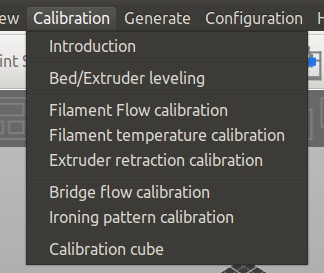
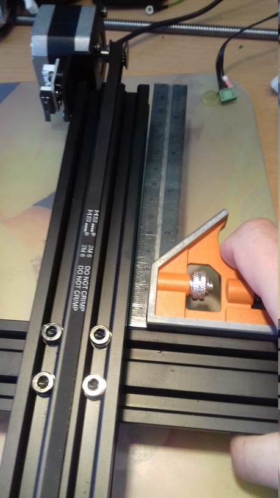

<link rel=”manifest” href=”docs/manifest.webmanifest”>

# Calibration
***Note: This is WIP, so maybe come back another time as well! ;)***  
  
For getting high quality prints, you need to calibrate your printer.  
As there are many things being worth mentioned and I can't cover and explain all of them, I'll just talk about a few which seem to be the most crucial ones beginners might not be aware of, especially with these printers.  

I'll divide this section into two parts: the section "Printer Calibration" and "Other Calibration".  

- The section "Printer Calibration" will cover the calibration of the hardware itself. It's absolutely necessary that everything is set up correctly and that you take care about some specific topics to get a reliable machine. Please refer to the belonging sections of the chapter ["Hardware"](hardware/hw_index.md) as well for further information.  
- The section "Other Calibration" will cover calibration procedures that need to be done for tuning in the printer itself, like dialing in the z-offset.   
Besides those steps being mentioned in the section "Other Calibration" (yet), you also have to do other calibrations as well for e.g. finding the correct printing temperature for your specific filament and so on. There are many websites and YouTube guides out there to find which are already covering this wide topic of calibrations and give way more detailed instructions for certain calibrations though, so I'd recommend to do a little research by your own.   
However, to make this journey a bit easier for you to begin with, I'll list some pages that I personally found useful in the following section.  

For further sources of information also check out the chapter ["Further Sources"](further_sources.md).  

If you encounter problems, check out the chapter ["Troubleshooting"](troubleshooting.md), you might find your problem and a solution mentioned there.  

---

## Calibration Guides
There are many sites and tutorials to find which are about calibration, so you might want to search for that at your preferred site first. However, I found the following guides useful.  

- A handy reference when it comes down to **judging the quality of your first layer** is the [**poster about bed leveling**](https://i.imgur.com/hIcGr8U.png) made my [Billie Ruben](https://www.billieruben.info/).
- A great resource with many specific calibration tips and instructions is [**Elli's Print Tuning Guide**](https://ellis3dp.com/Print-Tuning-Guide/) made by @[AndrewEllis93](https://github.com/AndrewEllis93).
- A great resource as well is the [calibration page from TeachingTech](https://teachingtechyt.github.io/calibration.html).
- For not only getting an idea what "calibrate your e-steps" means, but to get a useful guide about how to do so, maybe also read [All3DP's article "Extruder Calibration: How to Calibrate E-Steps"](https://all3dp.com/2/extruder-calibration-6-easy-steps-2/).


---

## Calibration Tools
Using certain tools makes it easier to calibrate your printer. It'll allow you to generate your own specific models which are necessary for certain calibrations, like e.g. temperature or retraction distance towers. I'll list some options in the following.   

- **SuperSlicer**  
  I personally prefer SuperSlicer (after I used Cura in the first place), especially when it comes down to calibration.   
  One of the great functions is, that SuperSlicer already comes with an *inbuilt set of calibration tools*.  
    
  You'll follow the proposed order and generate the specific 3d models for your specific needs with just one click, like temperature towers, retraction towers and so on.  
  After that, you just print them and don't have to take care about additional code sections (e.g. like applying temperature or retraction distance changes at layer xy) which is necessary when using Cura and the Calibration Shapes plugin.  

- **OrcaSlicer**  
  OrcaSlicer also comes with a set of inbuilt calibration tools. As I don't use OrcaSlicer (yet), I can't show you a screenshot right now, but it might be worth having a look at it.  

- **Cura**  
  If you're using Cura, you might want to check out the plugin ["Calibration Shapes"](https://marketplace.ultimaker.com/app/cura/plugins/5axes/CalibrationShapes) which gives you access to different STL models you can use for calibration.  
  Before slicing and printing, make sure you're reading the specific notes about the models at the [wiki page of the creator](https://github.com/5axes/Calibration-Shapes/wiki) and to add the additional code to the generated STL files when necessary.
  
  Another plugin is ["AutoTowers Generator"](https://marketplace.ultimaker.com/app/cura/plugins/Kartchnb/AutoTowersGenerator).  

- **OctoPrint**  
  If you're using OctoPrint, you might want to check out the plugin ["Marlin Calibration Tools"](https://plugins.octoprint.org/plugins/CalibrationTools/) which allows you to easily execute different calibration procedures.

---

## Printer Calibration 
The following steps should be done first to ensure that you set up your printer correctly and that you took care of printer specific pecullarities.  

---

### Correct Assembly
Make sure that you built and set up the printer correctly and that it's trammed as best as you can.  
**This is the most important and crucial thing, as you'll only be able to get good prints if the hardware itself is set up correctly.**   

This also should be checked if you're using the **Neo** which comes pre-assembled, as you shouldn't rely on the assumption that the manufacturere built everything correctly. Just to show you *how* important that is, look at the following picture of the y-axis frame of one of my Neos how it came preassembled from the manufacturer.  

  


So, please read through the hardware chapters if you didn't do it yet.  
  
In the following I'll list the most crucial points.  

- Set up the frame correctly!  
  Means, check if the baseframe is mounted being square, if the the z-axis aluminum parts are really mounted perpendicular onto the baseframe and so on. **As everything else relies on this, the proper alignment of the frame is the most important step!**  
  So, once again: **Set up your frame and your axes. Everything should be square, perpendicular and equidistant.**  
- Check the [axes](hardware/axes.md)!  
  Means, check the whole z-axis lead screw system for being assembled correctly and vertically aligned. Make sure you cleaned the old sticky 'oil' (or whatever that nasty stuff should be) off from the lead screw and applied fresh grease, assemble the anti-backlash nut correctly and so on.  
  Make sure that you have all wheels positioned correctly, that you don't have bad ball bearings which cause hiccups and irregular movements and that the belts of the x- and y-axis aren't too sloppy or too tight.  
- Check if everything moves smoothly while the printer is switched off!  
  Means, *slowly* move the bed and the printhead manually across the whole range of motion and turn the lead screw by hand (across the whole range of motion as well) and check if you feel any unusual resistance in certain areas. alter the movement speeds then and see if everything still feels well.   
  Parts being attached to the axes and running along them like the printhead and the bed shouldn't wiggle as well (never mind the top of the z-axis lead screw though - it's fine that it might wiggle a bit, as it isn't and shouldn't be fixated at the top).  
  When everything looks and feels good, you can move the bed, the printhead and the position of the x-axis gantry to about the middle of the range of motion, then turn on the printer and home all axes using the control unit to see if the endstops are working.

---

### Tram The Bed
Even though 'tramming the bed' (aka 'leveling' the bed) isn't really possible when using the rigid stock spacers of the bedplate these printers come with, there is something one can and should do though: check if those spacers are all of the same height. *This is really important, so better don't skip this step.*  

See the section ["Tramming The Bed"](hardware/bed.md#tramming-the-bed) for further information and instructions about how to do so.  


---

### Tram The X-Axis Gantry
Tramming the x-axis gantry (aka 'leveling' the gantry) is a really important step as well as it will ensure that the x-axis gantry either is parallel to the bed (when using the rigid stock spacers) or to the baseframe (when using adjustable spacers).  

See the section ["Tramming The X-Axis Gantry"](hardware/axes.md#tramming-the-x-axis-gantry) in the belonging hardware chapter for further information and instructions about how to do so.  

---

### ABL
There are two things you should take care of when it comes down to use the ABL function: you need to make sure that the tip of the sensor is at the correct height (in relation to the tip of the nozzle) and that the ABL function is activated before attempting to print.  

#### Level The ABL Sensor 
You also should level the ABL sensor in relation to the nozzle, so that you have a defined distance between the tip of the sensor and the tip of the nozzle. Every time you change the hotend or parts of it, you should check that distance again to make sure it's the same like before.  

See the belonging section for your specific model in the section ["ABL Sensor"](hardware/printhead.md#abl-sensor) for further information and instructions about how to do so.  

#### Activate The ABL Function
The ABL function should already be active, even though you might came across the fact that it's often said that you have to add the `M420 S1` after the last `G28` command in the start g-code of your slicer to activate it and have the bedmesh loaded. In the firmware there's the setting `#define ENABLE_LEVELING_AFTER_G28`, which activates the ABL after G28 (homing) was called. This will load the specific mesh values from the printer's EEPROM and activate the function of the ABL, so that minor height variations of the bed's surface will be compensated while printing. So there should be no need to add the `M420 S1` command. As a matter of fact, adding it might even cause irregularities.  

However, it seems that sometimes it *is* necessary to add that command to the start g-code though. In that case you can try if it really makes a change if you add it, or if it might even cause problems (like a wrong compensation). In that case enter your slicer's configuration settings, search for the start g-code section and add the command `M420 S1` in a new line right after the last `G28` command (which is the homing command) being in there.  


---

### Fan Duct
Even though this isn't really a 'calibration', let me mention it at this point while you're going through the steps of tuning in your printer.  

The stock fan ducts of both the **Go** and the **Neo**, which are only cooling from one side, are (imho) actually pretty bad. So I highly recommend to print a better one as soon as you're able to somehow print.  
This first one doesn't have to be perfect yet, but it'll most likely already have a big impact on the outcome, which allows you to tune in the settings even better and therefore finally print another fan duct.  
  
I linked to some STL files for both the **Go** and the **Neo** in the section ["Fan Duct"](hardware/printhead.md#fan-duct) of the chapter "Printhead", but search around at e.g. Thingiverse and Printables as well as the list isn't up to date and you'll probably find other models as well.  
  
If you're printing PETG, then this would be the material you want to end up using for this as it's more heat resistant than PLA.  
If you're only printing PLA (yet), then at least give it a try and see if it lasts or if it deforms due to the heat of the hotend or the bed. If you're only printing PLA with 60°C bed temperature, you'll most likely will be able to use a fan duct printed from PLA, but as soon as you raise the bed temperature, it'll most likely start to deform and sag.   

---

## Other Calibration
In the following I'll list some of the calibrations which are necessary. The list isn't completed yet, mostly I'll list calibrations where certain things come into account for these specific printer models. If you don't find a specific calibration mentioned here, please refer to other sources like the abovementioned calibration guides I linked to.  
  
Keep in mind that it may take some time until you found the best suitable settings. And even then it might occur that you'll have to adjust certain settings later when finally printing 'real' models. So maybe try to see it more like a process instead of the struggle of a search for the 'perfect' settings which must out there somewhere..  

Also keep in mind that you'll have to do certain calibrations again when using different kinds of filament. This doesn't only comes into account when printing a differenty type like ABS or PETG instead of PLA, but it also most likely will be the case when using the same type of filament but made from another manufaturer. Even the same type and brand of filament from the same manufacturer might need some slightly different settings like the temperature for example, when you're using a new spool or a different colour!  

---    

### Z-Offset  
The z-offset is the distance between the nozzle and the bed/plate you're printing on. It comes into account when printing the first layer of a model and therefore it's crucial and absolutely important that you dial in your z-offset to get your first layer as perfect as possible.  
If the nozzle is too far up above the plate, you'll experience that the print doesn't stay onto the bed or (if it's way too far up) that it'll just produce 'spaghetti' while printing up in the air.  
If it's too close to the plate and therefore the filament will be squished into the plate too much, then it'll either be difficult to remove the object or (if the nozzle is way too close) it'll provoke clogging as the filament won't be able to come out of the nozzle. Worst case would be that the nozzle scrapes across the plate and that you damage the hardware itself.  
  
*To determine the perfect first layer, I'd recommend to have a look at [this handy guide](https://i.imgur.com/hIcGr8U.png) from [Billie Ruben](https://www.billieruben.info/) first to get an impression how you can judge if the first layer (and therefore the z-offset) is good or not and how it should look like.*  
    
!!! warning "Proceed An ABL Sequence Before, Not After Setting The Z-Offset"  

    Before adjusting the z-offset, I recommend to execute an ABL sequence first - with an already [leveled ABL sensor](hardware/printhead.md#abl-sensor) as well as an already [trammed x-axis gantry](hardware/axes.md#tramming-the-x-axis-gantry) and [trammed bed](hardware/bed.md#tramming-the-bed).  
    If you execute an ABL *after* you dialed in your z-offset, then you'll have to set the z-offset *again* as it seems that the ABL procedure somehow 'resets' the setting.  
    
When it comes down to describe the actual process of how to determine and set the z-offset correctly, I have to mention that right now the following step-by-step instruction here about how to proceed is written from my memory how I did it when using the stock firmware. I'm using Klipper now and probably don't remember 100% how I proceeded when using the stock firmware, so please keep that in mind.   
However, from what I do remember right now you (roughly) do it this way:  
 
- Preheat the system for PLA temperatures by using the control unit.  
- With the printer homed, enter the menu in the control unit where you can move the axes manually, choose "Move Z" and set the value to zero.  
- Then move the printhead to the middle of the bed (x and y axes) - I'd recommend to do so by using the control unit as well instead of moving it manually to avoid any movement on the z-axis.  
- Take a 0.1mm feeler gauge (or a piece of paper if you don't have a feeler gauge) and place it under the nozzle.  
- Then enter "Leveling" -> "Z-Offset" in the control unit and lower the printhead *carefully step by step* until the nozzle touches the gauge/paper. *You want to be able to still move the gauge/paper without any force, but you should feel a tiny bit of resistance to make sure the nozzle touches the gauge/paper.*   
- Once you found the sweet spot, save the value.  

Then start a print job and verify that the first layer came out perfect. Compare the look of it with the abovementioned poster from Billie Ruben to check if it really is perfect or if you need a bit of adjustment.  
If you need to adjust the height, you don't need to execute an ABL sequence again, just correct the z-offset setting. You can also adjust it 'on the fly' while printing a (larger) first layer and look at the outcome - this is often even better as you'll see the effect right away.    

??? info "Don't Rely On The "Paper Method""

    Using the abovementioned feeler gauge or a sheet of paper (which people usually recommend - using a feeler gauge is more precise though) for dialing in your z-offset is only an *approach* to get in the right area of your z-offset. The *optimal* z-offset for printing a perfect first layer depends on various factors like e.g. layer height and type of filament being used. So *always* check the first layer while printing it and dial in your z-offset on the fly while printing it.   

??? info "Print A Skirt"  

    I personally recommend adding a skirt to the models you're printing. You activate that setting in your slicer, there you can also determine the width of the skirt and the distance to the model. When printing a skirt you print a few lines outside the area the model will be printed. This serves as a purge line (I personally don't use a purge line because I use a skirt) and you can check if the z-offset is set correctly. If not, you can adjust in on the fly.  
    You could also add a brim in addition to a skirt or even instead of a skirt - a brim is connected to the model though (which helps keeping the model stuck on the bed) which isn't always wanted.   
  
---

### Printing Temperature (Filament)
You determie the best printing temperature for your specific type of filament by printing temperature towers. These models change the printing temperature at certain layer heights in certain steps (e.g. in 5°C increments, starting with the highest temperature first), so that you'll print the same structure with different temperatures. For generating a temperature tower with your own specific settings, I recommend using the abovementioned SuperSlicer with the inbuilt calibration toolset. You can take the recommendations of the manufacturer of your filament as a rough guide for the temperature range you should print at.   

Then you inspect the printed model: in which temperature zones does it look best? Where are the layers of the filament solidified and melted together best? Where do overhangs look best and where does (massive) oozing and stringing occur? 
Don't pay *too much* attention on stringing and oozing yet though, as you'll take care of that later by printing retraction towers. Same goes for bridges (and overhangs): if you notice that bridges didn't come out perfect and that you can see strings of filament 'hanging' down, don't get too irritated by that as well. You can and should take care of bridging specific settings in your slicer later anyway, like a different printing speed, different extrusion rate, different fan speed and so on.    

What's actually more important at this time right now is the *bonding* of the layers!  
You can encounter an already pretty much great looking print with lower temperatures, but the model will break apart between layers easily. Vice versa you can observe that some stringing, oozing and/or maybe some poorer bridging quality will occur at higher temperatures, but the bonding is much better!  
As you'll take care of settings that affect stringing and bridging later anyway, *I'd recommend to always go with the higher temperature when in doubt!*   
Besides only *looking* at the outcome, I personally use to tear apart the printed temperature towers. By doing so, you can find the best printing temperature - not only in terms of the 'look', but also in terms of mechanical stress and resistance.  
So try to break each temperature section apart by using your hands first. You'll most likely already encounter some floors which are easy to break apart.  
Once you're done with that, take two pliers and repeat the process for each floor. You'll most likely be able to break every floor at a certain point, but you'll notice some obvious differences like how much force you have to use and *how* the floors break apart.  
So after you teared the model apart, inspect those areas: did it clearly break right between two layers? Or did it break *across* different layers?  
When it clearly broke between two layers, inspect the next floor with the higher temperature being used. Try to find the floor where it seems that the layers sticked together very well and the break most likely occured across different layers.    

Once you're done and decided to go with a specific temperature, continue with other calibrations like printing retraction towers, calibrating the e-steps and so on. At the end I'd recommend to print another temperature tower once again for being able to compare the output to the first one you printed. You don't have to print such a 'large' and wide ranged temperature tower though, maybe just print a tower with the 'final' settings and temperature you decided to use and add a floor with 5° higher and 5° lower temperature.   
  
!!! warning "Slightly Lower Temperatures Seem To Be Reported"

    I'd like to mention a finding I made after switching to the Klipper firmware instead of the stock firmware. In the stock firmware the type of temperature sensor for the hotend is set as an "ATC Semitec" type (see the chapter ["Stock Firmware (Marlin Based)"](firmware/fw_marlin.md) for further information). After switching to Klipper, I set different sensor types and inspected the reported temperature. It turned out that with the setting "Generic 3950" the reported temperature seemed to be more accurate than with the "ATC Semitec" type of sensor being set in the stock firmware, which seems to report slightly *lower* temperatures than actually being present at the hotend.   
    Even though this doesn't really affect the usage at the end, as you'll determine the best printing temperature by the abovementioned outcome in terms of look and bonding quality anyway instead of judging by the sheer temperature value, it is something you should keep in the back of your mind though.  
  
---
  
### Retraction Settings
As a crucial element for great printing results you need to find the optimum settings for retraction *distance* and retraction *speed*.  
Both settings have to be evaluated for each filament you're using. You'll note that the settings may differ not only within the same type of material, but especially within different types of material (when printing PLA for example you'll end up with pretty different settings than you'll use when printing flexible TPU).  
In general you'll determine the correct settings (after determining the correct print temperature) by printing retraction distance and retraction speed towers. Slight adjustments might be necessary later on though, so pay attention to not only the stringing, but also to e.g. starts and ends of layers where over-/underextrusion might be occur due to imperfect retraction settings.   

The correct settings will mostly avoid stringing. There are various aspects which affect stringing though, so if you struggle with stringing, you might want to have a look at the section ["Stringing"](troubleshooting.md#stringing) where I list some factors that affect it. 

!!! warning "Feeder Gear Pressure Is Crucial!"

    It should be noted that the correct pressure of the feeder gear is very crucial (not only) when it comes down to retracting.  
    If the feeder gear pressure is too low, the gear won't 'grab' the filament sufficiently and therefore starts slipping and grinding instead of pulling it back. If the pressure is too high though, it'll deform the filament which may result in e.g. visible artefacts of your printed model. So make sure you adjusted the correct pressure.   
    You can check if the filament gets properly fed and retracted by looking at the filament while printing. Adding some marks with a water resistant pen might be helpful. Observe the filament if it gets retracted (= pushed back) and fed reliably when the printer should do so.   
    
---

#### Retraction Distance
The retraction *distance* is a crucial setting one has to take care about. The retraction *distance* is the setting how *far* the feeder gear will pull back the filament when retracting.      

!!! warning "**Neo:** Don't Use Anycubic's Profile Right Away!"  

    This one is really important for the **Neo**: watch out if you're going to use the profile of Anycubic, the retraction distance is set to 6mm there, which is way too much for the direct drive system of the **Neo** as mentioned above! So change that setting to max. 1mm and go from there.   
    Always make sure to check this setting in general when using preconfigured profiles! 

Finding the correct retraction distance setting can be difficult and might take a few iterations, as it depends on various other settings and variables, so there isn't a general one-fits-all setting one could use.  
However, there is a rule of thumb though one should be aware of: if you're using a bowden drive feeder gear system like the one of the **Go**, the retraction distance is higher than when using a direct drive system like the **Neo**. This is because of the slack of the bowden drive system, where the feeder gear is about 30-40cm away from the hotend. So as a general rule it's said that at bowden drives the retraction distance is something around 6mm, at direct drives it should be max. 1mm.   
  
For finding out the correct retraction distance setting, you can print retraction distance towers, where different retraction distance values are applied at certain heights (kinda the same like when printing temperature towers). Before doing so, you should have figured out the correct printing temperature though. I'd suppose to start with the following settings as *maximum* retraction distance values:  

- **Go** as a bowden drive system: 6mm retraction distance
- **Neo** as a direct drive system: 1mm retraction distance  
    
---

#### Retraction Speed
Retraction *speed* is the setting how *fast* the feeder gear will pull back the filament when retracting. It plays together with the setting of the retraction distance, and both settings affect each other.  
In general it seems that you can say that the higher the *speed*, the lower the *distance* can be - but like with every 'rule of thumb', this is just a 'rough' guide and you'll need to find out the optimum setting for your specific setup by your own. You might also find out that things work out much better and that you get better results when using a lower retraction speed.    

There is a little problem though with both the **Go** and the **Neo**: the retraction speed is limited in the firmware by default to *25mm/s*!   
This means that every higher value you set in your sclicer will just be ignored and reduced to 25mm/s as that's the encoded limit.  
Means, when you're starting to print retraction speed towers with higher vales than 25mm/s, those speeds will be 'ignored' so to say as the speed is actually capped to 25mm/s.   
However, there is a way you can change the default setting of the maximum retraction speed. Please see the chapter [Stock Firmware (Marlin Based)](firmware/fw_marlin.md), scroll down to the section "Limited Retraction Speed" for your specific model and read the expandable box "Setting A Higher Maximum Value For Retraction Speed".  
  
It has to be mentioned though that a high(er) retraction speed isn't always the key - it can also be the case that using a lower speed than e.g. the default maximum 25mm/s is necessary for getting the best results. This also depends on the type and quality of the filament as well.  
  
---

### Calibrating E-Steps
You've probably already came along the sentence "calibrate your e-steps" and maybe you wonder what it is, what you'd have to do and why you should do so. It's actually pretty simple: the "e-steps" are the steps of the motor of your extruder (so "e-steps" stands for "extruder-steps") and therefore they determine how much filament will be extruded with a certain amount of motor steps.  
Depending on how accurate this setting is (means, how well you calibrated the e-steps), you'll either have some pretty perfect prints (in the meaning of the amount of filament of each layer) or you'll see signs of more or less severe under- or overextrusion. Some people try to adjust or get rid of this problem by setting different extrusion multipliers in the slicer, but that's not the best/correct way (imho). You always should have the hardware tuned in as much as possible before trying to tweak software settings for better results.   

Even though the e-steps of both the **Go** and the **Neo** don't seem to be way off when it comes from the manufacturer with the default firmware settings, it's advisable to calibrate them.  
This whole procedure really isn't a big deal and doesn't take long, so make sure to do this calibration!   
  
However, you need an additional software like OctoPrint or Pronterface for being able to send the specific g-code commands to the printer. As you most likely don't have that installed yet when you just started with 3d printing, I'm mentioning this calibration not as one of the first things to do, even though one should do it as soon and early as possible, as it effects the outcome overall.   
  
The actual process of how to calibrate the e-steps is described in many articles see the abovementioned and videos already, so right now I won't go into the final details here. Please see the links in the section ["Calibration Guides"](#calibration-guides) above.   

So, basically what you'll do is measure e.g. 100mm and 120mm of filament right above the printhead where the filament enters and mark those two spots. Then you heat up your system to your regular printing temperature, extrude 100mm and measure the distance between the printhead (where the filament enters) and the 100mm and 120mm marks once the extrusion is done.  
If e.g. the 100mm mark is right at the spot where the filament enters - great, no calibration necessary!  
But if either more or less than the 100mm got extruded, then you'd have to do a little math using a formula and the measured values of the distance to the marks for determining the final value of the e-steps. The calculated value has to be set and saved to the firmware then.  
After doing so, repeat this process for verifying that the new setting is correct.  
  
Some guides say that you should do it without a nozzle, some guides say you should do it with the nozzle. I personally found it most precise when doing the calibration using the final print setup, so these are my personal suggestions when it comes down to execute this procedure:  

- Determine the correct printing temperature for the filament you're using.   
- Use the nozzle you're going to use for printing as well - so don't calibrate the e-steps with e.g. a 0.4mm nozzle, when you're printing with a 0.6mm nozzle later. 
- Make sure the pressure of the feeder gear is correct and it's (mostly) the setting you'll use later on as well. So don't calibrate with a sloppy feeder gear and crank up the tension later and vice versa. 
- *Make sure to use a fine lined, waterproof pen for marking the filament, so don't use a fat marker which aleady draws a 1mm or 2mm wide line!* You want to be as precise as possible here! 
- *Make sure to use a precise ruler or a sliding gauge for being able to actually really measure 100mm!* You'd be suprised how bad certain measurement tools actually are and how big deviations can actually be, so make sure to use a sufficient measuring tool.  
- Calibrate the e-steps whenever you use different type of filament, even different spools of the same type. The process doesn't take long, but it's crucial that the e-steps are calibrated. So better take the little time to check if everything is still fine after changing the filament.  
    
---
  
### PID Tuning
Without going into too much details here, PID stands for Proportion, Integral and Derivate. These are three variables of an algorith which is supposed to keep the temperature stable.  
By executing a PID tuning, the printer heats up the desired heating element (extruder or bed) to a given temperature, cools down again a few degrees and heats up again for a given amount of circles and measures the fluctuation. After the process is done, you'll then get an output of three values P, I and D and save them to the firmware.  

It's advisable to execute a PID tuning for both the extruder and the bed before you want to use your printer for the first time.  
Also after you changed something at the hotend (like installed a new nozzle or heatbreak) and especially if you changed the cartridge heater or a thermistor (or even the position of it when removing and reinserting it) or installed a new bed, you should execute a PID tuning.  
  
The best way to execute a PID tuning is by simply using certain G-code commands and send them to your printer. To do so, I'll show you an example of how to do it using OctoPrint - but you can do it with any other program that allows you to send G-code commands directly also.  
  
PID tuning needs to be done in two steps: one for the extruder and one for the bed.  
   

---

#### Extruder PID Tuning
Because I use to print at 220°C, I want to use this temperature for the PID tuning of the extruder.  
I want the printer to execute seven cycles - the more the better the result will be.  

The belonging G-code is  
`M303 E0 S220 C7`  
where `M303` is the PID tune, `E0` is the extruder, `S220` is the temperature of 220°C and `C7` means seven cycles.  

??? info "Turn On The Part Cooling Fan Beforehand"  

    It's advisable to turn on the part cooling fan before doing the PID tuning for the hotend to take a possible effect of it into account.  
    If you do so, it might be smart to use the fan speed you're going to use later for printing - by doing so, you could also create PID tuning values for different types of filament which require a different fan speed, like PLA, PETG, TPU and so on and add the specific values to the start g-code of your slicer's profiles for these specific types of filament.   
    
    The following command turns on the part cooling fan with the fan speed of 100%: `M106 E0 S255`  
    The value 255 means 255 PWM cycles, which is 100% fan speed.  
    If you want to run the fan at a different fan speed, like 50% for example, you have to calculate the belonging binary value you have to use (instead of 255) by multiplying the desired speed value by 2.55.  
    So as an example: let's assume you want to run the fan at 50% as you use to run the part cooling fan at 50% when printing PETG. Therefore you want to do the PID tuning with the part cooling fan running at 50% as well. Now calculate 50*2.55=127.5 which is then rounded up to 128 - which then is the binary value you need to use: `M106 E0 S128` = the part cooling fan runs at 50% fan speed for the PID tuning.   
    
      
After sending this command, the printer will reply and start the process:  
```
Send: M303 E0 S220 C7  
Recv: PID Autotune start
```
    
The printer will then display the process and values for each cycle. You don't need that later, but just that you saw that once I'll show you an output of one of those cycles:  
```
Recv:  T:219.87 /0.00 (244.63) B:47.71 /0.00 (3646.75) @:101 B@:0
Recv:  T:218.31 /0.00 (252.13) B:47.62 /0.00 (3648.25) @:101 B@:0
Recv:  T:216.46 /0.00 (261.00) B:47.55 /0.00 (3649.25) @:101 B@:0
Recv:  T:215.44 /0.00 (265.88) B:47.43 /0.00 (3651.13) @:101 B@:0
Recv:  T:214.66 /0.00 (269.63) B:47.34 /0.00 (3652.50) @:101 B@:0
Recv:  T:214.71 /0.00 (269.38) B:47.21 /0.00 (3654.38) @:101 B@:0
Recv:  T:215.13 /0.00 (267.38) B:47.07 /0.00 (3656.50) @:101 B@:0
Recv:  T:216.17 /0.00 (262.38) B:47.06 /0.00 (3656.75) @:101 B@:0
Recv:  T:217.55 /0.00 (255.75) B:46.99 /0.00 (3657.75) @:101 B@:0
Recv:  T:219.04 /0.00 (248.63) B:46.91 /0.00 (3659.00) @:101 B@:0
Recv:  T:220.84 /0.00 (240.63) B:46.86 /0.00 (3659.75) @:0 B@:0
Recv:  T:223.09 /0.00 (231.63) B:46.72 /0.00 (3661.88) @:0 B@:0
Recv:  T:224.44 /0.00 (226.25) B:46.62 /0.00 (3663.38) @:0 B@:0
Recv:  T:225.22 /0.00 (223.13) B:46.50 /0.00 (3665.25) @:0 B@:0
Recv:  T:225.78 /0.00 (220.88) B:46.44 /0.00 (3666.13) @:0 B@:0
Recv:  T:225.19 /0.00 (223.25) B:46.28 /0.00 (3666.63) @:0 B@:0
Recv:  T:224.50 /0.00 (226.00) B:46.24 /0.00 (3669.13) @:0 B@:0
Recv:  T:223.53 /0.00 (229.88) B:46.16 /0.00 (3670.38) @:0 B@:0
Recv:  T:222.34 /0.00 (234.63) B:46.08 /0.00 (3671.63) @:0 B@:0
Recv:  T:220.34 /0.00 (242.63) B:46.00 /0.00 (3672.75) @:0 B@:0
Recv:  bias: 101 d: 101 min: 214.48 max: 225.78 Ku: 22.76 Tu: 38.85
Recv:  Classic PID
Recv:  Kp: 13.65 Ki: 0.70 Kd: 66.31
```
As you can see looking at the first value "T:" which is the temperature of the extruder, it fluctuates around the desired 220°C, so the printer heats it up and let it cool down around the 220°C.  
  
You can see the process by looking at the temperature graph as shown below.  


After finishing the seven cycles, you'll receive a summarized output like the one below:  
``` 
Recv: PID Autotune finished! Put the last Kp, Ki and Kd constants from below into Configuration.h
Recv: #define DEFAULT_Kp 20.84
Recv: #define DEFAULT_Ki 1.86
Recv: #define DEFAULT_Kd 58.26
Recv: ok
```
You can see the values for P = Kp, I = Ki and D = Kd - these have to be sent to the printer.  
To do so, we take the values from above and send the following `M301` command, the printer will answer with a "received" message:  
```
Send: M301 P20.84 I1.86 D58.26
Recv: echo: p:20.84 i:1.86 d:58.26
Recv: ok
```
Now we need to save everything by sending the `M500` command:
```
Send: M500 
Recv: echo:Settings Stored (735 bytes; crc 9159)
Recv: ok
```

You can/should now also execute a `M501` command which restores/loads all saved settings from the EEPROM to the volatile memory. Now the printer has access to the settings you have saved previously.  

To check if everything got applied, you can now execute a `M503`, which reports the current settings loaded on the volatile memory.   

That's it!  
Congratulations, you just did the PID tuning for your extruder!

??? tip "Create PID Tuning Values For Different Types Of Filament And Add The Values To Your Slicer"

    It might be smart to do PID tunings with different fan speeds for certain kind of filament, as the fanspeed might affect the PID tuning.  
    So let's assume you have a profile for PETG where you run the part cooling fan at 50%, use the according command to turn on the fan with 50% speed before executing the PID tuning. See the expandable textbox above for further information about how to do so.  
    
    You can then add the specific PID values to the start g-code of your slicer. So let's assume you made a PID tuning with 50% fan speed for PETG and got the values P20.84 I1.86 D58.26, then you add the line `M301 P20.84 I1.86 D58.26` to your slicer's start g-code.  

    Mind that you *probably* have to create multiple *printer* profiles for being able to do so though (iirc this is/was the case when using Cura) as it might be that it's not possible to add this to the profiles of the filaments.  
    
---    
    
#### Bed PID Tuning
Now you want to do the same for your heated bed, but you have to use a different command.  
Because I use to print at a bed temperature of 60°C, I want to execute the PID tuning at that temperature also. Again it should be done seven times.  

The belonging code is  
`M303 E-1 S60 C7`
where `M303` is the PID tune, `E-1` is the bed, `S60` is the temperature of 60°C and `C7` means seven cycles.  
     
Because you already know the steps now, I'll just write down the commands and answers from the printer:  
```
Send: M303 E-1 S60 C7
Recv: PID Autotune start
(...)
Recv: PID Autotune finished! Put the last Kp, Ki and Kd constants from below into Configuration.h
Recv: #define DEFAULT_bedKp 124.24
Recv: #define DEFAULT_bedKi 21.69
Recv: #define DEFAULT_bedKd 474.49
Recv: ok
(...)
Send: M304 P124.24 I21.69 D474.49
Recv: echo: p:124.24 i:21.69 d:474.49
Recv: ok
(...)
Send: M500
Recv: echo:Settings Stored (735 bytes; crc 54612)
Recv: ok
```

You can/should now also execute a `M501` command which restores/loads all saved settings from the EEPROM to the volatile memory. Now the printer has access to the settings you have saved previously.  

To check if everything got applied, you can now execute a `M503`, which reports the current settings loaded on the volatile memory.   

That's it!  
Congratulations, you just did the PID tuning for your bed!

??? tip "Insulate The Bedplate"  

    Insulating the bedplate with sufficient material has a great effect on the stability and the behaviour while heating up and cooling down. It'll minimize temperature fluctuations and saves electrical energy as well. Check out the section [Insulating the Bed](hardware/bed.md#insulating-the-bed) for further information.  

---  
  
### Layer Height
This isn't really a calibration you need to do, but it's something you should be aware of and take into account when choosing the layer height for your print settings and therefore I'd like to mention it a this point. So when deciding for a layer height, you probably think "well, I can just choose whatever I want" - and yes, of course you can do so. But there's a "magic number" you should actually take into account when making your decision: **0.04mm**.  

This is the distance the head travels up and down along the z-axis for each *full step* of the z-axis motor and therefore it's advisable to always choose layer heights which can be fully divided by / which are multiples of *0.04mm*.  

You can find a bit more information about the 'maths' behind it in the expandable textbox "Choosing A Layer Height: The "Magic Number"" [here](hardware/axes.md#z-axis).  
    
---

[](https://ko-fi.com/U6U5NPB51)  

