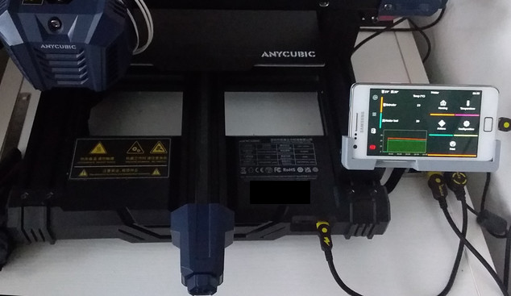

<link rel=”manifest” href=”docs/manifest.webmanifest”>

# Klipper (Mod)  
  
Can you run [Klipper](https://www.klipper3d.org/) on the stock mainboard of the **Go** and **Neo**?  
Oh yes, you can!  

The [Huada HC32F460 MCU](https://github.com/Klipper3d/klipper/commit/72b6bd7efa1ae282220b4bdcfb789075807ebfd2) is officially supported and implemented in the Klipper firmware.  
  
??? tip "Important Informations To Be Aware Of" 

    - It should already be mentioned here that you can always go back to the stock firmware by just re-flashing it, so you might just want to give Klipper a try. 
    - Be aware of the fact that the control unit and display of the printer doesn't work after flashing Klipper due to the fact that the SPI the unit is connected to isn't supported by Klipper yet. See the belonging section further down below for more informations. 
    - You'd need a host to run additional software like OctoPrint or Mainsail for being able to use the printer with Klipper. See the belonging section further down below for some informations and my personal recommendation abput what to use.  
    If you don't have a host running OctoPrint/Mainsail/.. yet, see the chapter ["Printserver"](../printserver.md) for some informations about hardware you could use for that.    
      

??? info "What Is Klipper?"

    Long story short: Klipper is an 'alternative' firmware which gives you way more possibilities and even functions for configuring and using your 3D printer. If you don't know what Klipper is, this may be a good start for your research: [All3DP: Klipper](https://www.all3dp.com/topic/klipper)  

??? info "Discussion Thread About Klipper"

    I opened a [discussion thread about Klipper](https://github.com/1coderookie/KobraGoNeoInsights/discussions/6) just in case any further questions arise or in case you want to comment on certain things without doing so by sending me an email. Keep in mind though that I'm not an expert at all, so if you do have specific questions about Klipper, then it might be better to ask in a special forum like e.g. the [Klipper subreddit](https://www.reddit.com/r/klippers/).  
  
## Installation
Credits to reddit user [xpeng121](https://www.reddit.com/user/xpeng121/) who initially posted how to get Klipper running on the **Go** and the **Neo**: [Install Klipper on Kobra Go or Neo](https://www.reddit.com/r/anycubic/comments/10cwm16/install_klipper_on_kobra_go_or_neo/).  
  
Basically you need to clone the Klipper repository and compile the necessary `firmware.bin` file.  
Referring to the beforementioned post of xpeng121, you need to change the MCU to "HC32F460" and the serial to "Anycubic Kobra". For further informations about the installation steps please read the chapter ["Installation"](https://www.klipper3d.org/Installation.html) of the official Klipper documentation.  

Besides the `firmware.bin` of Klipper you also need a file named `printer.cfg` which contains the specific sttings for your model.  
You'll also find links to `printer.cfg` files for the **Go** and the **Neo** in the abovementioned reddit post which makes it even easier to get started with Klipper. These files already contain the necessary pin assignement and so on. You still have to adjust these files to your special settings afterwards though.   
  
Once you've created the `firmware.bin` file, copy it to the root directory (means, directly onto the card, not in a subfolder!) of your mSD card. I personally would suggest to remove all files from the mSD card and only copy the `firmware.bin` file onto it.  
Then you flash it as you would do with the stock firmware. Means, you turn off the printer, put the card into the cardreader and turn on the printer.  
Note that the screen doesn't update though after the flash procedure is done as the control unit doesn't work with Klipper anymore, it'll stick with the message "Firmware update. Please wait."! So just wait 5-10min to make sure everything had time enough to be installed.  
Then turn off the printer, remove the card, connect your host which has OctoPrint/Mainsail/.. running with the printer using an USB-C cable and turn on the printer again.  
Now you should be able to connect OctoPrint/Mainsail/.. with the printer. If an error message pops up that no connection to the MCU was possible, click on "Restart Firmware" or turn off the printer and switch it on again.  

!!! warning  
  
    - After flashing Klipper's `firmware.bin`, don't try to start printing right away!  
    - Keep in mind that even though the stock mainboard of the **Go** and the **Neo** is the same, you have to adjust certain settings of the file `printer.cfg` depending on your specific model *before* starting to print or calibrate the printer! So don't just use the beforementioned file from the reddit post and start printing right away!    
    - Proceed with the [configuration checks](https://www.klipper3d.org/Config_checks.html) before you're trying to print anything!      
  
## Stock Control Unit
The stock control unit of both the **Go** and the **Neo** don't work with Klipper. So is that going to be an issue? Actually I thought the same initially and that was the only reason which was holding me back switching to Klipper right away at the beginning. Now that I did switch, I can say that I don't really miss the control unit. 

Just as an example:  

- Klipper *keeps* the z-offset, so you don't have to fiddle arount at the control unit for that before each and every print because the stcok-fw forgot your settings once again.   
- Setting temps for e.g. heating up the hotend to change a nozzle or load/unload filament can be done by using Mainsail.  
- Initiating the ABL procedure is also be done thru Mainsail, just like everything else.  

However, if you really do miss the option to control the printer right at that place later, you have several options to do so:  

- You can use your smartphone, tablet or laptop to just open the mainsail.local page at your browser and use the regular Mainsail frontend (which might be a bit 'uncomfortable' when using a smartphone though).  
- You can use an old smartphone or tablet and install [KlipperScreen](https://klipperscreen.readthedocs.io/en/latest/) onto it, which then gives you a nice adapted UI with control buttons.   
  I also set it up, printed a holder for it and mounted it where the original control unit was as shown in the picture below.      Actually I unplugged the phone again as I just control the printer via my computer and the mainsail.local page anyway though. It also kinda bothers me that I have to boot up the phone all the time as I don't leave the printer on 24/7, so I'll probably go with the next solution I'll mention.   
- If you have a Raspberry Pi or other hardware you could connect a touchscreen to (e.g. by using a HMDI port) running for hosting Mainsail, you can add a touchscreen to that and use [KlipperScreen](https://klipperscreen.readthedocs.io/en/latest/). It's the same UI like using a smartphone or tablet.   
  This is actually a quite handy solution if you're using a RPi as you can set everything up in a dedicated case. I'll probably do that as well, just for the pure comfort of not having to take care about switching the smartphone on and off as the display is powered by the RPi. I just didn't want to spend money again when trying Klipper initially, that's why I used an old smartphone in first place.    
       
## Slicers
Due to the fact that Klipper uses extended g-code and macros, there are a few things to be aware of when using certain slicers like Cura, PrusaSlicer, SuperSlicer etc.  
In the following I'll just go over Cura and SuperSlicer really quick as I used them both and SuperSlicer is a fork (with enhanced functionality) of PrusaSlicer.  

### Cura  
Even though Cura and Klipper work perfectly together, there are a few things to be aware of.  
Certain classic G-code commands aren't directly supported by Klipper as it uses extended G-code and scripts for certain things. As an example the G-code command `M0` (unconditional stop) isn't recognized by Klipper, you'd have to use the extended G-code command `PAUSE` for that.  

Also there are a few functions of Cura which should improve the print quality which interfere with Klipper's own approaches for that (like Pressure Advance or Input Shaping).  

You'll find a good overview of what to be aware of in the tutorial from [All3DP: Cura & Klipper: How to Make Them Work Together](https://www.all3dp.com/2/cura-klipper-tutorial).  
 
### SuperSlicer  
My personal favourite. In SuperSlicer you can set the g-code flavor depending on the firmware of the printer (menu "Printer Settings") as shown in the screenshot below, so it's already everything set up correctly within the g-code of the sliced files.  
  

  
SuperSlicer has many functionalities to finetune and control the output - you can even choose between different patterns for the top layer finish.  
Besides that it comes with a really handy calibration functionality which guides you step by step through the calibration process and allows you to generate calibration models like temperature or retraction towers with individual settings by just a few clicks.  

I personally would suppose to use the "Arachne Edition" of SuperSlicer and enable that function (Print Settings -> Perimeters) as it improves the quality of the printed parts. 

I can't go into all the possibilities of SuperSlicer deeper though as it's just too complex, so just do a research on it.  

## OctoPrint, Mainsail or Fluidd?
To find out what's the best solution for you, either do a little research on that, watch some YouTube videos or just get another mSD card for your RPi, install e.g. MainsailOS onto it and then just give it a try.  
Due to the fact that I personally use and recommend Mainsail, I'll always refer to it when it comes down to describe or show certain things in this chapter.  

### OctoPrint
OctoPrint is mentioned and referred to at the Klipper page, so you can use it just fine.  
You'd need to SSH to the host (e.g. the RPi) to upload edited files like the `printer.cfg` though - if there isn't a plugin for that which allows you to do so within the interface of OctoPrint (I don't know actually).  
  
### Mainsail
I personally prefer to use Mainsail with Klipper as it's tailored for the usage of/with Klipper and gives you more tools made for Klipper rightaway.  
Just to mention a few here: 

- You can edit the `printer.cfg` and every other file just directly within Mainsail and don't have to SSH to the Raspberry Pi.   
- You already have a heightmap function included which allows you to create and display the meshview after executing an ABL.   
- If your slicer does support it (SuperSlicer does), you can have thumbnails of your models displayed.   
- There's also a G-Code viewer already built in.   
- You have the possibilty to create custom macros for e.g. executing backups and activate them with one click.   
- And much more..   
  
### Fluidd
Fluidd is kinda similar to Mainsail, but it doesn't seem to be maintained as much as Mainsail (afaik).  
    
## Special Functions   
In the following I'll list some of the special functions which make Klipper so interesting and outstanding compared to the stock firmware, besides the fact that you can adjust the firmware settings to your own needs.  
  
### G-Codes & Macros
Klipper uses extended g-codes and macros, so not all of the 'regular' g-code commands are known and useable within Klipper. See the [g-codes chapter](https://www.klipper3d.org/G-Codes.html) of the official Klipper documentation for an overview of the specific commands.  
You can also find [command templates](https://www.klipper3d.org/Command_Templates.html) in the official documentation.  
  
Due to the fact that Klipper also uses macros, you can set up your own macros to set up certain routines or to e.g. use scripts to do automatic backups of your Klipper configs. 
  
### ABL and Manual Bed Leveling
You can configure the ABL procedure as well so that it fits your needs. Means, you can change the amount and location of probing points, the probing speed and the amount of probes for each probing point. You can also choose between different probe algorithms.  
  
Besides that, you can also use manual bed leveling in addition to the ABL. This is especially useful for people who replaced the stock spacers of the bed with [adjustable spacers](../hardware/bed/#different-spacers) for being able to tram the bed itself as well. Read the description of the function ["screws_tilt_adjust" with the command "SCREWS_TILT_CALCULATE"](https://www.klipper3d.org/Manual_Level.html#adjusting-bed-leveling-screws-using-the-bed-probe) which tells you exactly how much and in which direction you have to turn each screw to tram the bed after configuring it for your printer.   
  
### Pressure Advance
By using Klipper you can take advantage of using a feature called "Pressure Advance". Please refer to the official Klipper documentation of [Pressure Advance](https://www.klipper3d.org/Pressure_Advance.html) about how to calibrate and use it.  

### Resonance Compensation: Input Shaping
By using Klipper you can take advantage of using Resonance Compensation and a feature called "Input Shaping". You can either calibrate it manually or by using additional hardware like ADXL345 acceleration sensors (recommended). Please refer to the official Klipper documentation of [Resonance Compensation](https://www.klipper3d.org/Resonance_Compensation.html#resonance-compensation) about how to calibrate and use it.

