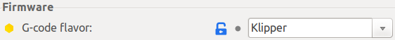

<link rel=”manifest” href=”docs/manifest.webmanifest”>

# Klipper (Mod)  
  
Can you run [Klipper](https://www.klipper3d.org/) on the stock mainboard? Oh yes, you can!  
The MCU is officially supported and implemented in the Klipper firmware now also.  
With Klipper you'll be able to take advantage of the functions "Pressure Advance" (which is similar to the function "Linear Advance" of Marlin but which you can't use with the stock firmware) and "Input Shaping".      
It should be mentioned that you can always go back to the stock firmware by just re-flashing it, so you might just want to give it a shot. 
       
!!! warning  
  
    - Keep in mind that even though the stock mainboard of the **Go** and the **Neo** is the same, you have to adjust certain settings of the file `printer.cfg` depending on your specific model!  
    - After flashing Klipper's `firmware.bin`, don't try to start printing right away! Do all the necessary calibrations and double-check your `printer.cfg`!
    - Be aware of the fact that the control unit/display of the printer doesn't work after flashing Klipper (due to the fact that the SPI the unit is connected to isn't supported by Klipper yet). So you'd need additional software like OctoPrint or Mainsail or so to be able to also control the printer manually. See the chapter ["Printserver"](../printserver.md) if you don't have e.g. OctoPrint installed yet.    

??? tip "What Is Klipper?"

    Long story short: Klipper is an 'alternative' firmware which gives you way more possibilities and even functions for configuring and using your 3D printer. If you don't know what Klipper is, this may be a good start for your research: [All3DP: Klipper](https://www.all3dp.com/topic/klipper)  

## Installing Klipper
Reddit user [xpeng121](https://www.reddit.com/user/xpeng121/) postet a description about how to create the necessary `firmware.bin` file for installing Klipper: [Install Klipper on Kobra Go or Neo](https://www.reddit.com/r/anycubic/comments/10cwm16/install_klipper_on_kobra_go_or_neo/)  
So I won't go over that procedure here once again.  
  
You'll also find links to `printer.cfg` files for the **Go** and the **Neo** in that thread which makes it even easier to get started with Klipper.  
  
## Klipper and Slicers
Due to the fact that Klipper uses extended G -code and macros, there are a few things to be aware of when using certain slicers like Cura, PrusaSlicer, SuperSlicer etc.  
In the following I'll just go over Cura and SuperSlicer really quick as I used them both and SuperSlicer is a fork (with enhanced functionality) of PrusaSlicer.  

**Cura**  
Even though Cura and Klipper work perfectly together, there are a few things to be aware of.  
Certain classic G-code commands aren't directly supported by Klipper as it uses extended G-code and scripts for certain things. As an example the G-code command `M0` (unconditional stop) isn't recognized by Klipper, you'd have to use the extended G-code command `PAUSE` for that.  
Also there are a few functions of Cura which should improve the print quality which interfere with Klipper's own approaches for that (like Pressure Advance or Input Shaping).  
You'll find a good overview of what to be aware of in the tutorial from [All3DP: Cura & Klipper: How to Make Them Work Together](https://www.all3dp.com/2/cura-klipper-tutorial).
 
**SuperSlicer**  
My personal favourite. In SuperSlicer you can set the G-code flavor depending on the firmware of the printer (menu "Printer Settings") as shown in the screenshot below, so it's already everything set up correctly within the g-code of the sliced files.   
  
Besides that, SuperSlicer has many functionalities to finetune and control the output - you can even choose between different patterns for the top layer finish. Besides that it comes with a really handy calibration functionality which guides you step by step through the calibration process and allows you to generate calibration models like temperature or retraction towers with individual settings by just a few clicks.  
I personally would suppose to use the "Arachne Edition" of SuperSlicer and enable that function as it improves the quality of the printed parts. 

I can't go into all the possibilities of SuperSlicer deeper though as it's just too complex, so just do a research on it.  

## OctoPrint, Mainsail or Fluidd with Klipper?

**OctoPrint** is mentioned and referred to at the Klipper page, so you can use it just fine. Especially when you want to use the TimeLapse plugin there isn't really an alternative to OctoPrint.  
  
However, I personally prefer to use **Mainsail** with Klipper as it gives you more tools made for Klipper. Just to mention a few here: you can edit the `printer.cfg` and every other file just directly within Mainsail and don't have to SSH to the Raspberry Pi. You already have a heightmap function included which allows you to create and display the meshview after executing an ABL. There's also a G-Code viewer already built in and you have the possibilty to create custom macros for e.g. executing backups and activate them with one click - and much more.  
  
**Fluidd** is (imho) pretty similar to Mainsail, but it doesn't seem to be maintained as much as Mainsail (afaik).  
  
So to find out what's the best solution for you, either do a little research on that or just get another mSD card, install e.g. MainsailOS onto it and then just give it a try.  
    
