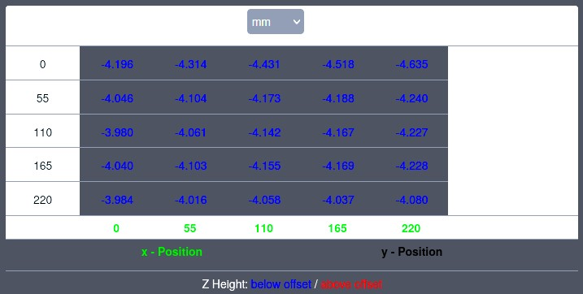

<link rel=”manifest” href=”docs/manifest.webmanifest”>

# Bed
Both of the printers have a heated and magnetic bed with the dimensions of 220x220mm.  
It should reach about ≤230°F/110°C maximum and therefore it should be possible to successfully print ABS, PETG and TPU (by using a housing though) besides PLA.  
Both printers offer a 25-point automatic bed leveling which is called "Anycubic LeviQ".  

??? tip "Bed Leveling Function"

    - Don't get misleaded by the term "automatic bed leveling" - the process does *not* level your bed! It only measures and recognizes the distance towards the sensor at the 25 spots where it measures. You can *not* level the bed itself as it's mounted directly to the construction which leads the bed in the y-axis. However, some people added springs to be able to level the bed, see the section ["Mods"](#mods) below.   
    - When it comes to executing the ABL function of the printer, it's advisable to initially check if the ABL sensor is leveled correctly to get the best results out of the ABL process. See the expandable box "Leveling the ABL Sensor" in the section ["Leveling or Dismounting the ABL Sensor"](printhead.md#leveling-or-dismounting-the-abl-sensor) in the chapter "Printhead".  
      
The bed uses a removable PEI-coated spring steel plate which makes it easy to remove the printed object.  
The plate that comes with the printer is one-sided coated at the **Go** and double-sided coated at the **Neo**.   
The following picture shows the surface of the coated plate from a close-up view.  
  
  
  
When you look at the backside of the bed, you'll notice a black plastic cap which sticks out.  
  

  
Be careful to never break it by accident as it protects the wires which are soldered to the contacts of the board at the bottom side.  
  

  
When you take a look underneath the bed itself, you'll spot a little foam piece secured by kapton tape - don't remove that as it protects and insulates the thermistor of the bed which is positioned underneath it.  
  

  
??? info "Bed Thermistor"

    As you can already conclude from looking at the picture, you can't change the thermistor of the bed as it's built into it - at least right now it appears to me like that. I might be wrong though as it might be just soldered to some contacts - to investigate that, I'd need to take off the foam piece which I refused to do so because I don't have any kapton tape yet.  
  
??? tip "Execute PID Tuning for the Bed"

    To make sure the heating algorithm can work as expected and keeps the fluctuation of the temperature as low as possible, execute a PID tuning. You can find informations about how to do that in the chapter ["PID Tuning"](../pid-tune.md).  
  
??? tip "Clean the Plate of the Bed"

    - Before starting a print, make sure the surface of the plate is clean and without any traces of oil, silicone or other stuff which avoids that the filament sticks to the surface. To clean it, use isopropyl alcohol.  
    - Already touching the plate with your fingers leads to a little amoung of grease left there which already might be enough to cause problems for your print to stick on the bed, so maybe always use disposable gloves when touching it, taking it off or repositioning it.
    - If there's a rest of filament stuck on the plate, *never* try to scratch it off with metal or other sharp materials as you don't want to harm the PEI coating. Heat up the bed and try to peel off the filament instead. If that doesn't work, take off the plate and heat up the area using your hot air gun - sooner or later you'll be able to peel it off. However, be careful to not overheat and maybe harm the coating though.  
  
  
??? tip "Level the ABL Sensor"

    It's advisable to level the ABL sensor initially, you can find informations about it in the hardware section within the chapter ["Printhead"](printhead.md#leveling-or-dismounting-the-abl-sensor).  
    
??? tip "Bed Level Visualization"

    The display of the control unit does *not* show a meshview after you proceeded the bed level function - if you'd like to see that, you'd usually have to use additional software like the beforementioned [Octoprint](https://octoprint.org/) and an additional plugin for visualization like the [Bed Level Visualizer](https://plugins.octoprint.org/plugins/bedlevelvisualizer/). However, it seems that the stock firmware doesn't support that, so even after executing the ABL using the beforementioned Bed Level Visualizer you won't get a *mesh*view but you will get the measured values as the picture below shows (sorry for the colours, they're hard or not even possible to see at all due to the dark UI I'm using).     

??? tip "Spacers of the Bedmount"

    If you find that the bed is not as flat or level as it should be, it might be a good idea to disassemble it and check the four black spacers that connect the metal frame and the bed itself. Measure them with a slide gauge to see if they are really the same height! If they're not, either put some sandpaper on a flat surface and rub them down to make them all the same length, or look for other spacers you might be using.  
  
??? tip "Check the Screws of the Bedplate and the Gantry of the Bed"

    - Check if the screws are all tightened up. Be careful though to not overtighten the screws of the Bedplate as you would compress the little spacers underneath it and therefore the plate may become warped. On the other hand, if you see that your bed is warped somehow or that the bed is much more off in certain areas or at one side, you can check if the screws in that area might be too tightened up.  
    - Check if the bedplate itself is somehow wobbling. Not only sideways/horizontally, but also up and down/vertically. If so, not only check the v-slot wheels and maybe adjust their fitting using the eccentric nuts, also check if the screws of the gantry of the bed where the wheels are mounted to are tightened up. As an example: at my **Neo** the bed was wobbling up and down in one certain area - after checking the screws and tighten them up everything was sturdy as it should be.     
    
    
## Mods

Because you can't level the bed itself due to the construction, some people dismounted the four spacers and replaced them with springs and knobs which allows them to adjust the position of the bed itself. You can look out for a set of springs and knobs suitable for an Ender 3 for example, that should fit. It *might* be a good idea, especially if you find the bed itself completey unleveled which you should be able to see using the mesh visualization by e.g. using the OctoPrint plugin [Bed Level Visualizer](https://plugins.octoprint.org/plugins/bedlevelvisualizer/).     
  
??? tip "Leveling the Bed Itself"

    However, *if* you are trying this solution, make sure you get yourself strong springs (so that the bed won't become wobbly) and make sure the knobs won't turn themselves loose by the vibration. When you want to level the bed then by adjusting the tension of the spring to pull down a side or an edge of the bed, be careful to not bend the bed itself by tightening up just one corner too much. Try to push down one side of the bed and adjust two springs at a time. even then be careful though and keep an eye on the mesh visualizer!  
