<link rel=”manifest” href=”docs/manifest.webmanifest”>

# Bed

| Specifications |
|:---------------|
| Bedplate: 230x230mm, 3mm thick aluminum plate with PCB heating coil |
| Magnetic foil: 230x230mm |
| PEI plate: 230x230mm, spring steel |
| Thermistor: 24V, 100K NTC "EPCOS" type, 22AWG wire |
| Heating coil: 24V, ~180W, ~3.2Ohm resistance, 14AWG wire |
| Bedmount: 9x18mm rigid spacers/bushings, 4x25mm countersunk head screws |

Both printers use the same heated bed (it's actually the same bedplate which is used at the regular Kobra as well).  
The bed consists of a 3mm aluminum [bedplate](#bedplate) with the heating coil being attached to the underside as a PCB. On the top surface there's a [magnetic foil](#magnetic-foil) glued onto it which then holds the [PEI plate](#pei-plate) in place.  
The following picture shows the components.  

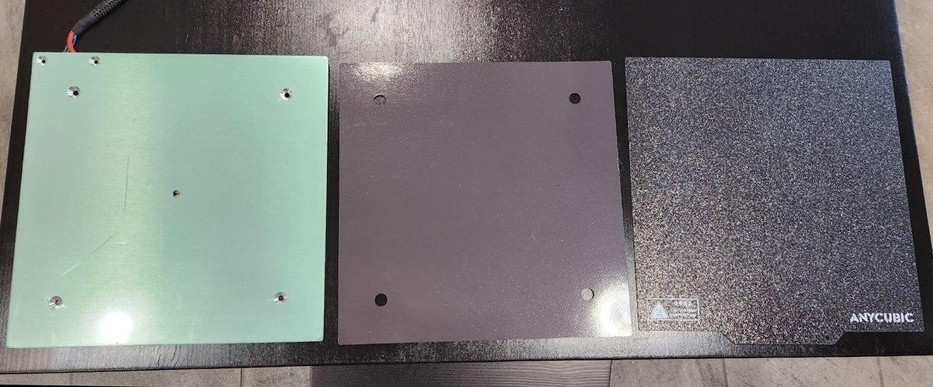

The build volume is 220x220mm.  
Anycubic states in the official specs that the *size* is 220x220mm as well - which is definitely wrong and misleading though, as the *physical* dimension of the bed is 230x230mm.  

!!! warning "Attention: Bed Size"  

    If you're looking for a bedplate, a magnetic foil or just a PEI plate from a third party company, you need to get yourself a *230x230mm* plate, otherwise it would be too small!  
    As it seems that most parts out there are either 220x220mm or 235x235mm, get yourself the 235x235mm version then. There is about 4mm space between the z-axis aluminum frames and the original bedplate, so if you pay attention to position e.g. the bigger PEI plate from the aftermarket correctly, then it'll fit.     

The temperature of the bed should reach about ≤230°F/110°C maximum and therefore it's possible to successfully print e.g. ABS, PETG and TPU (by using a housing though) besides PLA.  
However, it seems to be advisable to not exceed 80° bedtemp if possible, as everything above is said to be a critical temperature for the glue of the magnetic foil.   

Both printers offer a 25-point automatic bed leveling which is called ["Anycubic LeviQ"](#anycubic-leviq-automatic-bed-leveling-function).  

In the following I'll go into the details of each part of the whole bed construction.  

---

## Bedplate

The bedplate itself is a 230x230mm aluminum plate of 3mm thickness.  
When buying the bedplate as a spare part, it'll come without the magnetic foil being attached as the following picture shows.  

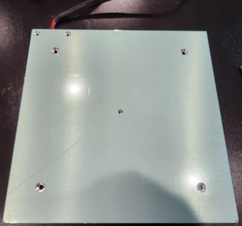  

The surface is covered with a protective foil, which you have to pull off before applying the magnetic foil.   

The heating coil is applied as a PCB to the underside of it as you can see in the following picture.  

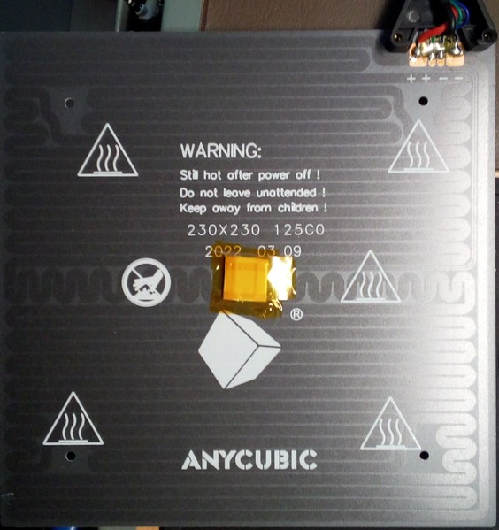  
   
When you look at the backside of the bed, you'll notice a black plastic cap which sticks out.  
  
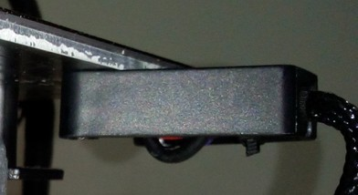
  
Be careful to never break it by accident as it acts as a strain relief and protects the cables which are soldered to the contacts of the board at the bottom side.   
  
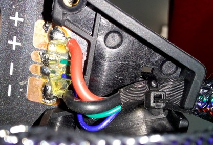
  
When you take a look underneath the bed itself, you'll spot a little foam piece secured by Kapton tape as you can see in the following picture.  
  
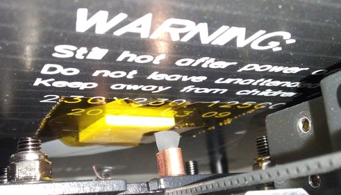

Don't remove that piece of foam as it protects and insulates the thermistor of the bed which is positioned underneath it and rests in a tiny hole in the middle of the bedplate as the following picture shows.  

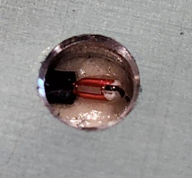

The thermistor is a 100k NTC type which is soldered onto the PCB. According to the settings of the firmware, it's an EPCOS type.  

??? info "What Is A "100K NTC" Thermistor" And How To Check If It's Working"

    A "NTC" thermistor is an electronical components that's changing its resistance when temperature changes occur. "NTC" stands for Negative Temperature Coefficient, which means that the resistance becomes lower when temperature rises.    
    "100K" NTC thermistor means that at a defined temperature of 25°C the resistance is 100K Ohm. The hotter the thermistor gets, the lower the resistance value will be; the colder the thermistor gets, the bigger the resistance will be. So at e.g. 20°C bed temperature the resistance will be ~125K Ohm, at 30°C it'll be ~81K Ohm.  
    There are general data sheets for this kind of thermistor to find with list the different resistance values at given temperatures. However, these values can slightly vary, depending on the manufacturer and the type of the 100K thermistor (e.g.: EPCOS vs. ATC 102 vs. General 3950).   


??? example "Measuring / Checking The Thermistor"  

    You can check if a thermistor is working or if it's broken by measuring the resistance of it using a multimeter. As described above, at a temperature of 25°C the resistance should be ~100K Ohm. If the temperature is lower, the resistance value will be higher; if the temperature is higher, the resistance value will be lower.  

        If you don't know how to measure resistance, you can read [this article](https://www.fluke.com/en-us/learn/blog/digital-multimeters/how-to-measure-resistance) for example which describes the process.  
    
    You can measure by probing the belonging wires at the plug of the mainboard (unplug it!), that would be the white connector labeled as "T1" with the green and blue cable (see the chapter ["Mainboard" -> "TriGorilla V_3.0.6 (Stock)"](mainboard.md#trigorilla-v_306-stock) for a picture of the location). Keep in mind though that by doing so you also measure the wiring itself. Means, if there are e.g. broken wires, the thermistor won't work even if the thermistor itself is still fine. For avoiding this, you could measure at the soldering joints right at the bed - in this case you also check the conductor path of the PCB itself. If you really want to *only* measure the thermistor itself (which is advisable if you're in doubt and are thinking about changing the thermistor), then you'd have to pull off the little foamy piece in the middle of the underside of the bed and measure the resistance right at the soldering joints or legs of the thermistor itself.  
    

??? example "Changing The Thermistor Of The Bed"

    If you need to change the thermistor, you should be able to do so by pulling off the piece of foam for being able to access it. You can then unsolder it and replace it with a new one.  
    If you have problems heating up the solder joints because the plate acts as a conductor and draws the heat of the soldering iron, heat up the bedplate first. Make sure to switch off the bed then, switch off the whole printer and unplug it from the power outlet. The best would be to unplug it from the mainboard as well then before starting to solder.     

??? tip "Execute PID Tuning For The Bed"

    To make sure the heating algorithm can work as expected and keeps the fluctuation of the temperature as low as possible, execute a PID tuning for the bed. You can find information about how to do that in the section ["PID Tuning"](../calibration.md#pid-tuning). 

---

### Insulating The Bedplate (Mod)
What I personally can highly recommend is to insulate the underside of the bed.  
You can get special insulation mats for 3d printers which meet the requirements for this (like being suited for higher temperatures and being flame retardant) for a few bucks. See the expandable textblock below for some tips about the installation.    
Make sure you order the correct size (preferrably a bit bigger) which is 230x230mm as that's the size of the bedplate itself.  

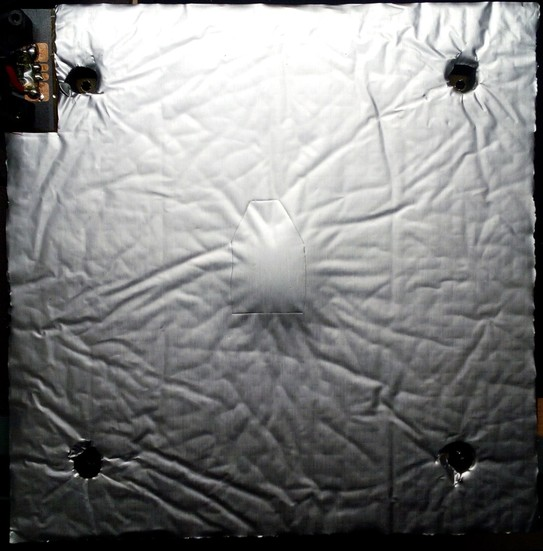

By insulating the bed the temperature won't fluctuate as much as before, it heats up faster and it takes less energy to keep the desired temperature (so you actually lower the power consumption). It also takes longer for the bed to cool down which became impressively clear after doing a PID tune for the bed and comparing the graphs of before and after adding the insulation as the following screenshots will show.  
The first screenshot shows the bed temperature (blue graph) before the insulation while doing a PID tuning. The temperature is set to 60°C, after reaching that temperature the bed cools down to 55°C and heats up to 60°C again (and so on). The second screenshot shows the same process but with installed insulation. You can clearly see that it takes longer to cool down after reaching the 60°C as the blue graph of the second screenshot isn't declining as steep and fast to the 55°C target temperature as the one in the first screenshot.  
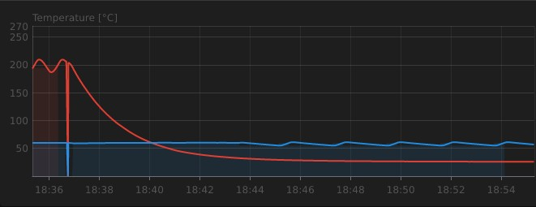   
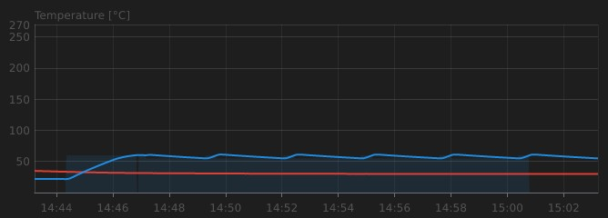  
  
After adding the insulation, the temperature didn't fluctuate anymore at all during a print, even when I opened the window from time to time - the graph was just a straight line. So I'm actually highly satisfied with this and can strongly recommend insulating the bedplate.  
However, I have to mention that I didn't print with higher bed temperatures than 60-70°C yet, so I don't know how good the insulation will stay in place when printing with bedtemps like ~100°, but I hope it'll still work out fine..      

!!! warning "Mind The Gap!"

    When adding insulation, it's extremely important to keep an eye on the clearing underneath the bed!  
    You don't want to risk the insulation hitting the bracket of the y-axis motor mount, so pay attention to that!  

??? example "Adding The Insulation"  

    Before I'll go into the steps about how to apply the insulation, I have to point out a few things first:  
    
    - *You'll need longer spacers and screws due to the thickness of the insulation (which is about 9-10mm most of the time)!*  
    - *You'll need to raise the whole bedplate to avoid contact between the insulation and the motor mount at the back of the construction.* If you use the beforementioned 25mm springs and longer screws, you should be fine as they are longer then the stock spacers anyway. If you'll use the stock spacers or silicone spacers of about the same size, you can add bolt nuts underneath to raise the bed.  
    - *It's also advisable to have Kapton tape on hand to cover the whole underside of the bedplate with it (before you actually apply the insulation) and to secure the edges and sides of the insulation (after applying the insulation)!*     
    
    - For adding the insulation, you need to dismount the bedplate from the gantry by taking out the four screws (remove the PEI coated plate first tho). Be careful with the wires when moving the plate. Put the plate onto the insulation (but don't peel off the protective layer of the adhesive yet!), align it and mark the four holes of the screws.  
    - Then place the bed upside down on a flat and clean surface - wipe the surface beforehand tho to make sure that there's no dirt or even metal chips which would press into or stick onto the magnetic surface. Now use IPA or (which I prefer) silicone remover to wipe the underside of the bed where the insulation should be applied to and clean off any dirt or grease from your fingers.  
    - Now lay down the insulation onto the bed like if you would apply it (*but still with the protective layer on the adhesive!*) and adjust the position. Mark the area where the wires are connected to the bed as well and cut away that part of the insulation. Place the spacers above the premarked holes and cut away the insulation in that area as well, so that the spacers will touch the plate later without any insulation between. I'd recommend to mark the areas that should be cut and then take the insulation away from the bedplate, so that you don't harm the surface when using a sharp knife or so.   
    - When it comes down to finally apply the insulation, *I personally would suggest to cover the whole surface of the bed with Kapton tape first,* just in case you'd have to tear off the insulation in the future. I also added two layers of Kapton tape especially above the contacts and the little piece of foam of the thermistor in the center of the bed and marked that area roughly at the insulation, just in case I'd have to replace the thermistor in the future.  
    - Once everything is done and prepared, you can finally apply the insulation. Make sure you start at one side to avoid any bubbles, you want the insulation to stick on the bed equally. If some of the insulation protrudes beyond the plate, cut it off. The following picture shows the applied insulation. <br>    
    - *I highly recommend to additionally secure the insulation by using some pieces of Kapton tape as well to ensure that the edges and sides of the insulation won't come loose.* Don't skip this step, as the insulation most likely will come off sooner or later at the sides and edges (at least mine did).    
    - Then add the spacers and the screws and mount the bed onto the gantry again. Make sure that the insulation doesn't touch the construction and the motor mount at the back, the bed has to move as free as before. So move the bedplate manually to see if everything is fine and if there's enough clearance between the insulation and the other parts.  
    - If you used adjustable spacers, tram the bed again.  
    - When switching on the printer, make sure you proceed with executing an ABL procedure, adjusting the z-offset due to the raised bed and execute a PID tuning of the bed now and save the new values to the EEPROM.  

---

## Magnetic Foil

On top of the aluminum bedplate there's a magnetic foil applied. If you order a spare part heat bed, then you'll most likely only get the aluminum bedplate, but not the magnetic foil. So you'll have to get yourself a magnetic foil as well.  
If you choose a foil from the aftermarket, make sure to get the correct size. The bedplate is 230x230mm, but actually most of the foils being available on the market seem to be 235x235mm. That's fine though, as you can easily cut off any pieces of foil which are exceeding the dimensions of the bedplate then. Make sure to get yourself a foil which uses 3M glue.   

The following picture shows the magnetic foil that Anycubic shipped together with a replacement bedplate.  

| Magnetic Foil (Spare Part) | Backside |
|----------|-------------|
| 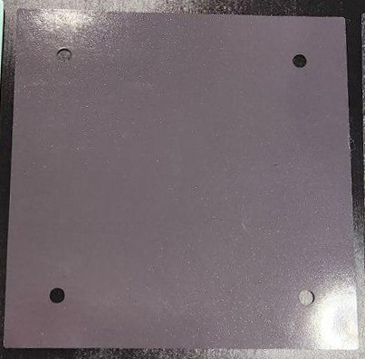 | 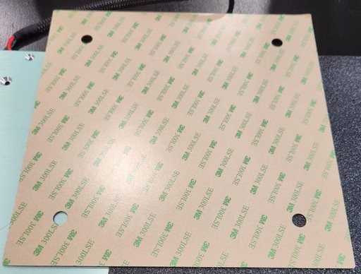 |


??? example "Attaching The Magnetic Foil"  

    If you have to attach the magnetic foil onto a new or even your old bedplate, make sure to rigourously clean the bedplate before applying it.  
    If you use a new bedplate, peel off the protective film.  
    If you use your old bedplate, clean off any rest of old glue (if it's hard to get the glue off, you can use some e.g. WD40 to soften it and rub it off with a paper towel).   
    
    Use IPA to wipe off any oil or grease which already gets on the the bedplate by just touching it. Silicone remover spray actually works even better. You can also use car break cleaner for this, but it leaves minerals on the plate, so better use silicone remover or wipe off the bed with IPA after using the car break cleaner.  
    
    To make sure that everything *really* is clean, I'd suggest to wear disposable gloves, use paper towels and do more than one cleaning routine. Also make sure that no dust or anything else is left on the plate when attempting to attach the magnetic foil then.  
    
    When applying the magnetic foil, start with one side of the bedplate. Peel off about an inch of the protective film of the glued side of the foil and position the foil at one edge/side of the bedplate.  
    *Avoid touching the glued side!*  
    Make sure to position the foil correctly at the first attempt as you don't want to put yourself in the position where you have to pull off the foil again. I personally likke to bend the foil a bit, so that I can start attaching it at the middle of that 'stripe'. Then wipe along that stripe from the middle to the outer edge with slight pressure. Pay attention to get the foil onto the bed smooth and even - there shouldn't be any bubbles of trapped air or even 'wrinkles' of the foil!  
    If everything worked out well for that first stripe, slowly pull off the protective foil of the glued side while attaching it in the described way - means, wipe from the center to the sides for avoiding trapped air.  
    
    Once you're done, wipe from the center of the bedplate to the sides once again while applying a bit of more pressure. Then heat up the bed to about 40-50°C (so that it's still safe for you to touch it without burning yourself) and let it sit for about 5min like that. Then wipe over it once again while applying pressure to make sure the foil is properly attached. Pay attention to the egdes and sides all along the bedplate, so that the foil really is attached well there.  
    
    If you bought a 235x235mm or even bigger foil, cut off the protruding parts by using a scalpel or sharp knife.   

---

## PEI Plate
        
The bed uses a removable 230x230mm PEI-coated spring steel plate which makes it easy to remove the printed object.  
The plate that comes with the printer is  

- one-sided coated at the **Go** and  
- double-sided coated at the **Neo**.  
  
The following picture shows the surface of the coated plate of the **Neo** from a close-up view.  
  
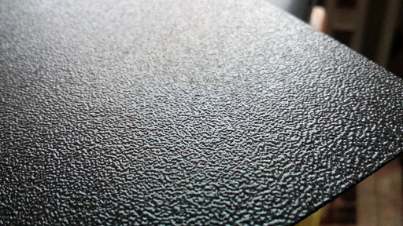  


!!! warning "Attention: PEI Plate Size"  

    If you're looking for a bedplate, a magnetic foil or just a PEI plate from a third party company, you need to get yourself a *230x230mm* plate, otherwise it would be too small!  
    As it seems that most parts out there are either 220x220mm or 235x235mm, get yourself the 235x235mm version then. There is about 4mm space between the z-axis aluminum frames and the original bedplate, so if you pay attention to position e.g. the bigger PEI plate from the aftermarket correctly, then it'll fit.
  

??? tip "Clean The PEI Plate Of The Bed"

    - Before starting a print, make sure the surface of the plate is clean and without any traces of oil, silicone or other stuff which avoids that the filament sticks to the surface. To clean it, you can   
        - wash the plate using *regular dishwasher soap and water* (don't use the kind of 'soft', 'creamy' or 'balm' soap though), 
        - use *isopropyl alcohol (IPA)* or 
        - use *silicone remover spray* (it's the stuff the guys use to clean the surface before spraypainting a car, I personally use this and can highly recommend it).  
    - Already touching the plate with your fingers leads to a little amoung of grease left there which already might be enough to cause problems for your print to stick on the bed, so maybe always use disposable gloves when touching it, taking it off or repositioning it.
    - If there's a rest of filament stuck on the plate, *never* try to scratch it off with metal or other sharp materials as you don't want to harm the PEI coating. Let it cool down completely and try to peel it off. If that doesn't work well (depends on the materiall you were using), heat up the bed and try to peel off the filament then. If that also doesn't work, take off the plate and heat up the area using your hot air gun - sooner or later you'll be able to peel it off. However, be careful to not overheat and maybe harm the coating though.  

    *If you cleaned the bed properly, got your z-offset dialed in and use the correct bed temperature for the type of filament you're using, there's* ***no need to mess around with gluesticks, hairspray, blue tape or whatever!*** *The PEI plate really does work great!*

    !!! warning "Don't Use Acetone For Cleaning The PEI Plate"

        Some people seem to be using Acetone on a regular basis for cleaning the PEI plate - this isn't advisable as Acetone does harm the PEI coating.  
        It won't completely destroy it *immediately*, but it will harm it when being applied more often. Acetone seems to somehow 'attack' the PEI coating and makes it soft in the first place, like it dissolves it.  
        However, I heard from people who had serious problems with new PEI plates to get prints to stick on them even after thorough cleaning. They solved that issue by wiping off the bed *one time* using Acetone - which I think is the better solution than pulling out the grinder and sanding down the the surface of the PEI coating.  

---

## Spacers / Bushings Of The Bedmount

The bedplate is mounted onto the gantry with 4mm countersunk screws and rigid plastic spacers between the bedplate itself and the gantry.  
Even though this is a somewhat rigid construction (if the material of the bed gantry would be thicker..), the culprit of this solution is that you can't manually tram the bedplate if needed. Besides that, a huge problem is that the stock spacers aren't all of equal height.  

So it's very advisable to dismount the bed, take the stock spacers out and check if they're all of the same height. I'd suggest to use a digital caliper for doing so, but it you don't have one, you can also place them next to each other onto a *flat* surface and place something thin and straight ((e.g. a ruler) onto them to check and compare the height.  
Most likely they're not of equal height, which leads to a somewhat warped bed then. If you encounter this problem, I'd suggest to sand them down to the height of the shortest one. If you do so, pay attention to sand them down perpendicular - you don't want to end up with a tilted surface/spacer.  
You could also try to shim it out of course, but especially if the differences are pretty small, then this can be a real hassle.  

---

### Adjustable Spacers (MOD)

Because you can't tram the bed itself due to this rigid construction, you may want to replaced the stock spacers with springs or silicone spacers which allows tramming of the bed itself.  
It's advisable to make sure that the bolt can't turn itself loose due to the vibration, so add some sort of nut acting as a lock nut (like a nylon lock nut, a regular counter nut, a wingnut or so) to the tip of the screw underneath the bed gantry as well.  

The following picture shows the stock spacers on the left, springs in the middle and silicone spacers on the right.  


!!! warning "Mind The Gap!"

    When using adjustable spacers, it's extremely important to keep an eye on the clearing underneath the bed while tramming the bed and therefore adjusting the height of the whole bedplate itself. You don't want to get the bed too low so that it hits or scratches the bracket of the y-axis motor mount!  
    This is extremely important when using silicone spacers as they most likely come in about the same height (18mm) of the regular stock spacers but will compress while tramming the bed!  
    Also when adding insulation to the underside of the bed, the clearance has to be checked!  

---
        
#### Springs (MOD) 
Mounting springs instead of rigid spacers allows you to tram the bed itself. You'd have to get yourself some longer M4 type screws as well as the stock ones will be too short.  
Get yourself some nylon washers as well which you place between the underside of the bed and the springs to prevent scratching the surface.  
Add a lock nut / counter nut underneath the gantry to the end of the screws as well after tramming the bed.    
However, as springs are made from metal which underlies the temperature changes of the heated bed, it'll probably be necessary to check the level once in a while.    
  
I personally used 8x25mm springs (the yellow ones shown above) and M4x40mm countersunk head screws as that allowed me to add some bigger lock nut knobs I had laying around. So if you go with regular M4 lock nuts, 35mm (or *maybe* even 30mm) screws should be fine as well I guess. Those springs were part of a bundle from Capricorn, they came together with 1m of the Capricorn tube and a cutter (and a sticker) for a really fair price (about 11€ for everything together).  

!!! warning "Mind The Gap!"

    When using adjustable spacers, it's extremely important to keep an eye on the clearing underneath the bed while tramming the bed and therefore adjusting the height of the whole bedplate itself. You don't want to get the bed too low so that it hits or scratches the bracket of the y-axis motor mount!  
    This is extremely important when using silicone spacers as they most likely come in about the same height (18mm) of the regular stock spacers but will compress while tramming the bed!  
    Also when adding insulation to the underside of the bed, the clearance has to be checked!  

---

#### Silicone Spacers (MOD) 
You could also use silicone spacers of about the same length as the stock spacers for being able to use the stock screws and still being able to tram the bed. They are adjustable as well due to the flexible material and they don't expand and shrink with changing temperatures like metal springs will do in a minor range. I'd suppose to add a lock nut underneath the gantry to the end of the screws as well after tramming the bed though.  
  
Keep in mind that the silicone spacers (I used 18mm long ones shown below) compress when tramming the bed. Therefore it *might* happen that you'll get into trouble because the position of the whole bedplate will be lowered a bit, so make sure that the bedplate doesn't somehow hit the motor mount at the back of the y-axis. *Especially when adding insulation to the underside of the bed, you'll need to raise the bedplate a bit, so I highly recommend using the abovementioned 25mm springs in that case anyway!*   
  
!!! warning "Mind The Gap!"

    When using adjustable spacers, it's extremely important to keep an eye on the clearing underneath the bed while tramming the bed and therefore adjusting the height of the whole bedplate itself. You don't want to get the bed too low so that it hits or scratches the bracket of the y-axis motor mount!  
    This is extremely important when using silicone spacers as they most likely come in about the same height (18mm) of the regular stock spacers but will compress while tramming the bed!  
    Also when adding insulation to the underside of the bed, the clearance has to be checked!   

---    

## Bed Gantry

The bedplate itself is mounted to the bed gantry which runs along the y-axis shown in the following picture.  

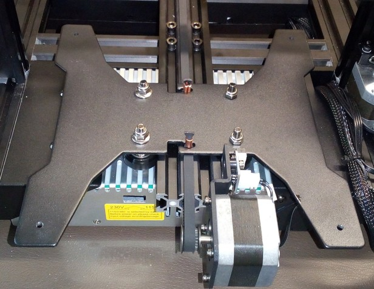

The gantry is made of 2.5mm steel - which unfortunately seems to be pretty flimsy to me. If I touch one of those arms of that X-shaped gantry and apply pressure with a finger, I can easily make it wiggle up and down a bit.  
The screws that hold the bedplate are screwed into 4mm threads of the gantry.   

As you can see in the picture above, also the v-slot wheels which are running along the y-axis are mounted onto that plate.  
The belt is also attached to the gantry.  
The y-axis limit switch is being triggered by the gantry when it's moving completely to the back.  
  
!!! warning "Important: Check The Screws Of The Bedplate And The Gantry Of The Bed"

    - Check if the screws are all tightened up. Be careful though to not overtighten the screws of the Bedplate as you may compress the little spacers underneath it and therefore the plate may become warped. On the other hand, if you see that your bed is warped somehow or that the bed is much more off in certain areas or at one side, you can check if the screws in that area might be too tightened up or too loose.  
    - Check if the bedplate itself is somehow wobbling. Not only sideways (horizontally), but also up and down (vertically). If so, not only check the v-slot wheels and maybe adjust their fitting using the eccentric nuts, also check if the screws of the gantry of the bed where the wheels are mounted to are tightened up.     

---

### 3 Point Bed Mount (MOD)

I did a bit of tinkering and modded the bedmount to a 3 point bed mount instead of the classic 4 point mount.  

The reason for that is simple, but let me explain it a bit.  
When I started with 3d printing and noticed how the bedplates are mounted to the gantry using 4 mounting points, I was actually a bit irritated. I got even more irritated after I discovered that this seems to be a common method at bedslingers, even when they offer manual bed tramming like at an Ender 3 for example.  
Afaik, the best method to tram a rigid and flat surface is by using three points with two points being located along one axis (let's say the y-axis) and the third point being located perpendicular to that axis (so this is the x-axis in this example) at the (opposite) side in the middle of those two points:    
- One of those two points located along the same axis is then used as the reference - you mount the plate there and never touch it again.  
- The second point at this axis is then used for adjusting the tilt along this axis (in this example along the y-axis), it's called "pitch".  
- The third point at the (opposite) side which is located in 'between' those first two mounting points is then used to adjust the tilt along that axis being perpendicular towards the first one (so in this example along the x-axis). This point is referred to as "roll".
So when attempting to tram/level that surface then, you only have to adjust the pitch first and then adjust the roll. By doing so, you (should) end up with a perfectly trammed/leveled surface.

So seeing all those bedslingers having the bed mounted to the gantry using four mounting points, one in each corner, I actually got really confused and started doubting and thinking about what I've learned in the past before I started to get my hands on a 3d printer.  
Maybe it was a 4 point mounting because of the bed being heated up? Maybe it was because the plate was pretty thin? But then the effect of heating it up and tramming it by tightening 4 screws in a somewhat 'pattern' must result in a weird warped surface withe the effect and outcome would be pretty much unpredictable!?  
So I did a bit of a research and thankfully discovered an [article where exactly this circumstance is being described and explained](https://drmrehorst.blogspot.com/2017/07/3-point-print-bed-leveling-vs-4-point.html) for 3d printers. *I highly recommend reading it!*  

So, long story short: I decided trying to mod my printer's gantry and bedmount to a 3 point system.  
I gathered through my workshop and found an aluminum pofile which seemed to be useful for this attempt. I cut two pieces and drilled the belonging holes (the distance was about 164mm and I used a 5mm drill which gave me a bit of a play while installing it): one at each end for mounting the profiles to the bedplate and the gantry using the existing holes and threads, and one in the exact middle for the screw which then would be my 'roll' mounting point. The holes in the middle had to have a bit of an offset to each other as I used L-shaped aluminum profiles for better stability, so that the profiles won't hit each other when lowering the bed.    

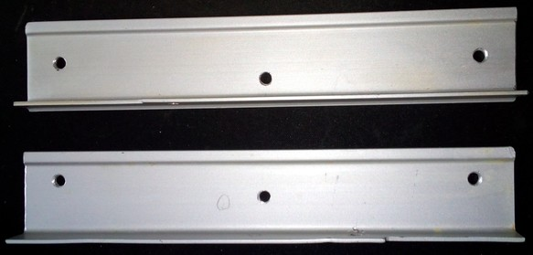  

After mounting a screw to the middle of the part which will be attached to the bedplate, I then mounted the parts to the bedgantry and the bed itself.  
As I have insulation added to the bedplate, I had to use bushings/spacers so that the insulation won't be compressed at the two mounting holes. I used some slightly too short spacers here first, which immediately lead to a bent bedplate due to the insulation pushing against the bed, especially in the middle section. After swapping out those spacers and using longer ones, everything worked out fine.  
Of course I didn't found screws with the perfect length, but as I didn't want to drive t o the hardware store just for two screws and I didn't want to cut the original screws, I ended up using those. I also drilled the existing holes in the bedplate a tiny bit bigger for allowing a bit of movement which should take care of the expanding material while heating up.   
After adding a spring to that screw in the middle, I then mounted everything together.  

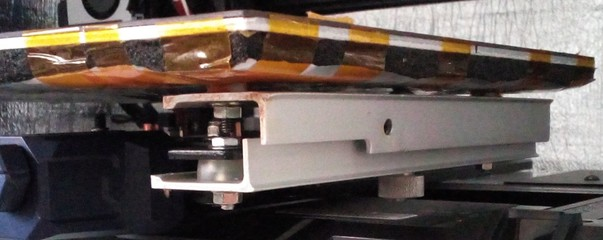

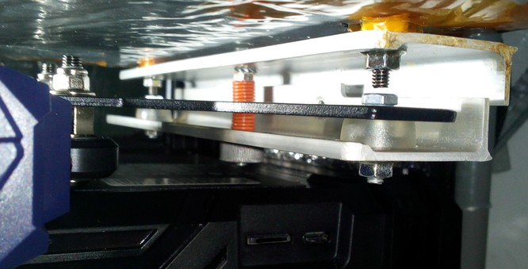

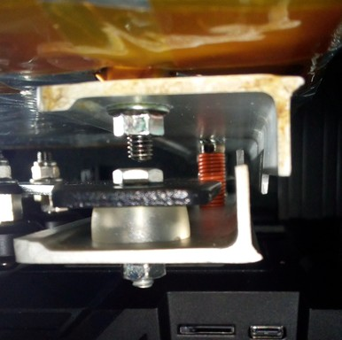

This is how it looks like in total from the front. I took the picture with the construction being untrammed to show the tilt (which will be adjusted by the 'roll' then) of the right side better.  

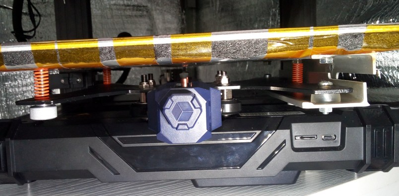

Right now I still have to take off the PEI plate (or at least lift the left front corner) for accessing and adjusting the screw for the pitch (because that one is still screwed into the thread of the gantry) which I chose the front left screw should be (the back left screw is my reference), the screw for the roll (which is now the screw in the middle at the right side) I can access from underneath the bed though which makes it easy to adjust. I'll probably end up changing the setup for the screw of the pitch as well. 

I then continued with a rough tramming without the PEI plate being applied, adjusting only the 'pitch' and then the 'roll' after having the 'reference' set to the desired height.  
After that, I put on the pEI plate and excetuted the probing for a bedmesh (7x7 grid using Klipper) with the bed being cold - the result looked promising.  

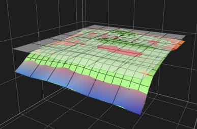

Then I heated up the bed and *immediately* did a new bedmesh - and I was actually kinda shocked, as I've never seen a heavily warped bed like that before. The promising thing though was, that the warp was somewhat consistent - it looked like a wave instead of a crooked pillow like before when being mounted at the 4 points.  

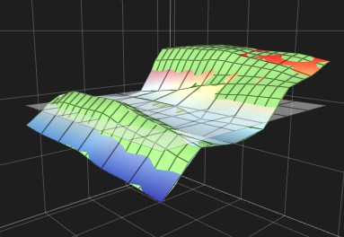

I then let it settle for about 10-15min before executing another probing sequence.  

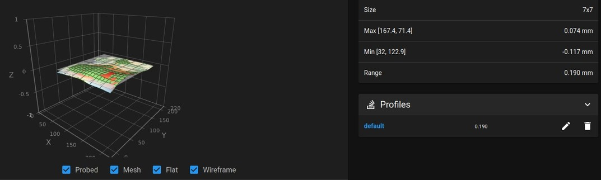

As you can see, there is still some room for finetuning, like lowering the front by adjusting the pitch and adding some Kapton tape to certain spots as well for getting the bed as flat as possible overall, but as I was too lazy at that point and had stuff to print, I didn't do it then.  

Conclusion: so, will I do this mod at my second Neo as well and can I recommend it? Yes, absolutely.  
I might try to get a gantry from the aftermarket which already offers the option for this kind of 3 point mounting system and which is (hopefully) more rigid overall though, as the whole gantry itself really appears pretty flimsy to me. I'm not sure about that yet though, as I like to tinker and modify it with spending the less money I can - but if I'll end up buying such a gantry, I'll add pictures here and let you know how it went.  

  
---    

## Anycubic LeviQ - Automatic Bed 'Leveling' Function

The printers come with an automatic 25 point bed 'leveling' function called "Anycubic LeviQ".  
This function measures the distance of the inductive [ABL sensor](printhead.md#abl-sensor) to the PEI plate in a 5x5 grid, therefore at 25 points.  
The data will then be used to compensate any deviations in the distance of the surface which then (in a perfect setup and under perfect conditions) during printing by moving the printhead up and down along the z-axis.  

However, there are some limitations to this.  
First of all, this compensation while printing isn't 100% precise due to the 5x5 grid (even though the data is interpolated). At the **Neo** this problem is even amplified due to the fact that Anycubic didn't set the y-offset for the ABL sensor in the firmware. Means, the firmware 'knows' that the ABL sensor at the **Neo** is positioned 37.5mm to the right side of the nozzle, but it doesn't know that the sensor is positioned about 4mm to the back in relation to the nozzle as well (`#define NOZZLE_TO_PROBE_OFFSET { 37.5,0, 0 }`). Therefore the compensation while printing can't be as much as accurate as possible.   
Next, this compensation is somewhat limited by the amount of deviation and (imho) by the printing speed as well. So if you have a massively warped bed and a tilted x-axis gantry as well and you have variances of a few milimeters, you'll most likely still see a heavily imperfect initial layer.  
So - what can you do to at least get the best results out of the measunring and compensation process? Well - make sure to set up the printer as square and perpendicular as possible, [tram your bed](#tramming-the-bed), [tram your x-axis gantry](axes.md#tramming-the-x-axis-gantry) and [level the ABL sensor in relation to the nozzle](printhead.md#abl-sensor). If you use Klipper, you can enhance the amount of probing points and (for the **Neo**) set the y-offset of the ABL sensor as well.  

So, to make this clear: **don't get misleaded by the term "automatic bed leveling" - the process does *not* level or tram your bed!**  
It only measures and recognizes the distance towards the sensor at the 25 spots where it measures. You can *not* level/tram the bed itself without tinkering, as it's mounted directly to the bed gantry with rigid spacers/bushings.    

When it comes to executing the ABL function of the printer, it's advisable to initially check if the ABL sensor is leveled correctly to get the best results out of the ABL process. You can find information about how to do it for your specific model in the section ["ABL Sensor"](printhead.md#abl-sensor).     

To make the measured values of the ABL come into account later when it comes down to printing, you should add a certain g-code command to the start g-code section of your slicer. Even though this shouldn't be necessary as we have the belonging definement in the firmware (`#define ENABLE_LEVELING_AFTER_G28`), it seems to be advisable to do so.  
So: enter the settings in your slicer and search the place where this section is located. Then add the command `M420 S1` in a new line *after* the last `G28` command (which is the homing command) being in there. This will load the specific mesh values from the printer's EEPROM and activate the function of the ABL, so that minor height variations of the bed's surface will be compensated while printing.     

*Keep in mind that every time you proceed an ABL process, you'll have to set the z-offset again!*
     
??? tip "Bed Level Visualization"

    The display of the control unit does *not* show a meshview after you proceeded the bed level function - if you'd like to see that, you'd usually have to use additional software like the beforementioned [Octoprint](https://octoprint.org/) and an additional plugin for visualization like the [Bed Level Visualizer](https://plugins.octoprint.org/plugins/bedlevelvisualizer/).  
    To get a visualization out of the data, you need to add some code though, otherwise you won't get that nice graphic you can always see everywhere. So I don't know if the following code is 100% correct or if there's anything obsolete in there or whatever, but at least I got the visualization done at the end (Thanks to reddit member [one-without-zero](https://www.reddit.com/user/one-without-zero/) for pointing out M503 to me!).  
    
    - Tab "Collection":  
        ```
        M140 S60 ; starting by heating the bed for nominal mesh accuracy 
        M117 Homing all axes ; send message to printer display 
        G28 ; home all axes 
        M420 S0 ; Turning off bed leveling while probing, if firmware is set ; to restore after G28 
        M104 S0 ;Turn-off hotend 
        M117 Heating the bed ; send message to printer display 
        M190 S60 ; waiting until the bed is fully warmed up 
        M300 S1000 P500 ; chirp to indicate bed mesh levels is initializing 
        M117 Creating the bed mesh levels ; send message to printer display 
        M155 S30 ; reduce temperature reporting rate to reduce output pollution
        @BEDLEVELVISUALIZER ; tell the plugin to watch for reported mesh 
        G29 T ; run bilinear probing 
        M155 S3 ; reset temperature reporting 
        M140 S0 ; cooling down the bed 
        M104 S0 ; cooling down extruder
        M500 ; store mesh in EEPROM 
        M503 ; report mesh values
        M300 S440 P200 ; make calibration completed tones 
        M300 S660 P250 M300 S880 P300 
        M117 Bed mesh levels completed ; send message to printer display
        ```
    - Tab "Commands", click the "+ Add" button. There you create two new command scripts: "Create mesh" and "Pull latest mesh" (you can name them however you like though).  
        "Create mesh" has the same code like at the "Collection" tab above (to be honest: I actually think this one is obsolete but because now it's working for me here and I don't want to mess around, I'll just add it here to show you my solution):  
        ```
        M140 S60 ; starting by heating the bed for nominal mesh accuracy 
        M117 Homing all axes ; send message to printer display 
        G28 ; home all axes 
        M420 S0 ; Turning off bed leveling while probing, if firmware is set ; to restore after G28 
        M104 S0 ;Turn-off hotend 
        M117 Heating the bed ; send message to printer display 
        M190 S60 ; waiting until the bed is fully warmed up 
        M300 S1000 P500 ; chirp to indicate bed mesh levels is initializing 
        M117 Creating the bed mesh levels ; send message to printer display 
        M155 S30 ; reduce temperature reporting rate to reduce output pollution
        @BEDLEVELVISUALIZER ; tell the plugin to watch for reported mesh 
        G29 T ; run bilinear probing 
        M155 S3 ; reset temperature reporting 
        M140 S0 ; cooling down the bed 
        M104 S0 ; cooling down extruder
        M500 ; store mesh in EEPROM 
        M503 ; report mesh values
        M300 S440 P200 ; make calibration completed tones 
        M300 S660 P250 M300 S880 P300 
        M117 Bed mesh levels completed ; send message to printer display
        ```
        
        "Pull latest mesh" has the following code:  
        ```
        @BEDLEVELVISUALIZER
        M420 T0
        M420 V
        ```
        
    - To create a meshview now, click on the blue info-button "Update Mesh Now". This will start the probing. After it's done, click on "Pull latest mesh" and the graphic should be rendered.  
    - To see a table with the collected data, click on the little configuration wheel again and then click on the tab "Data".  
    - Images will come soon.. ;)

---
    
## Tramming The Bed  

!!! warning "'Tramming' vs. 'Leveling' The Bed"  

    Because I got attacked, harrassed, insulted and called names for using the correct term "tramming" instead of the misleading and technically wrong term "leveling", let me make something clear at this point.  
    
    What we do here is a procedure called "tramming". 
    We (try) to get the machine and certain parts of it aligned perfectly, like axes and parts being suqare, parallel, perpendicular and equidistant *towards each other*.  
    For example, we try to set up the frame being mounted perfectly square, the z-axis frame being perpendicular to the base frame, the x-axis gantry being perpendicular to the z-axis frame and the bed being parallel and equidistant to the x-axis gantry and the printhead/nozzle.  
    It's a technical term which is also used at CNC machines for example and this is the correct nomenclature. And as a matter of fact, this is also the case with 3d printers. Point.  
    
    "Leveling" though is the process of bringing something like a shelf, a table or a framed picture hanging at the wall into the position that it's *perpendicular to gravity* so to say. Most of the time you do so by taking a bubble level or a self-leveling laser. But this is NOT how you 'level' the bed of your 3d printer for example.  
    Yes, I'm highly aware of the fact that the majority of the 3d printing community uses the term 'leveling', that people say "Level your bed!" and that the marketing guys and gals of the companies even use the (even more misleading!) term "Automatic Bed Leveling" (which is even worse as it suggests that the process will actually 'level' the bed itself - which it obviously doesn't). But that doesn't mean that I have to follow that misleading road.    
    So besides the fact that this isn't the correct nomenclature (seriously, I'm not the grammar police - I'm a German guy who speaks a little bit of English..), my 'problem' with this term is that it's just really misleading!  
    How many beginners are pulling out their bubble level, put it on the bed to check if it's leveled and maybe even shim out the table the printer stands on - just to come to the conclusion that their bed is leveled? Believe it or not: many - whether you came across those users while trying to help them or not. You can use a 3d printer on a tilted table - if the printer is trammed, it'll still print fine.   

    So to all those haters out there: yes, I will continue to use the correct term "tramming", no matter how much you'll attack and try to insult me.  
    And no, I don't do it because I want to show the world that I know the correct term, I do it because I want to avoid that beginners become frustrated because they just get it wrong.  
    

Even though "tramming" the bed isn't really possible when using the rigid stock spacers of the bedplate these printers come with, there is something one can and should do though: check if those spacers are all of the same height. *This is really important, so better don't skip this step!*   

If you're using [adjustable spacers](#different-spacers), then you'll be able to actually tram the bed itself.  

If necessary, you can add Kapton tape on the magnetic surface of the bed underneath the PEI plate later to equalize warped or dented areas as much as possible.  

I'll describe the belonging process for each case in the following.  

??? example ""Tramming" When Using The Rigid Stock Spacers"

    When using the rigid stock spacers the printer came with, dismount the bedplate from the bedgantry and take out those four black spacers. Then put them next to each other on a flat surface and/or measure them using a caliper. Most likely they aren't all of the same height, which will lead to a somewhat crooked, tilted or 'warped' bed.  
    
    Now you could either look for other spacers you might be using, put washers or other suitable material (e.g. gasket material) of the needed thickness under them when remounting or (what I'd recommend to do) *sand them down to the smallest of the four spacers for achieving an equal height*.  
    When doing so, put the sandpaper on a flat surface and carefully rub the spacers across it - *pay attention that you do this while holding the spacer absolutely perpendicular! You don't want to end up with a spacer where one end is sanded off tilted!*  

    Once you're done and all four spacers are of equal height, reassemble everything. Then proceed with [tramming the x-axis gantry](axes.md#tramming-the-x-axis-gantry) in relation to the bed.   

??? example "Tramming When Using Adjustable Spacers"
  
    You could also use [adjustable spacers](hardware/bed.md#different-spacers) like silicone spacers or springs instead of those rigid spacers. That'll put you in the position of really being able to tram the bed.  
    However, if doing so you not only need to be precise when tramming the bed, but you should *proceed with [tramming the x-axis gantry](axes.md#tramming-the-x-axis-gantry) in relation to the frame first*. This is really important as it will ensure that the x-axis gantry is parallel to the base frame.  
    Once this step is done, you can proceed with tramming the bed itself.     
    
    When you want to tram the bed by adjusting the tension of the springs or silicone spacers to pull down a side or an edge of the bed, be careful to not bend the bed itself by tightening up just one corner too much. Try to push down one side of the bed and adjust two screws at a time.    
    I personally tram the bed by adding just a little bit of load to the spacers, so that the bed doesn't wobble.  
    
    For actually tramming the bed now, you'll have to move the printhead to all of the four corners and adjust the height of the belonging edge of the bed by tightening or loosening the belonging screw. I'd suppose to start with the left backhand corner and rotate clockwise.  
    Take off the PEI plate and place an object onto the edge of the bed. It doesn't matter if this object is like 5mm or 5cm high as you're not setting the z-offset yet. It's just being used to ensure that the bedplate will be at the same height in relation to the printhead at all four corners. You need to make sure that you'll still be able to access the screw form the top though, so don't place the object right above the screw.  
    Then lower the printhead manually until the nozzle or the ABL sensor just touches that object. Then move the object to the next corner and move the printhead across it. Make sure that you absolutely *don't* move the head along the z-axis by accident, so that you don't somehow change the height of it!  
    If the head is positioned too low and there isn't enough space to fit the object between the bed and the head, tighten the screw for lowering the bedplate. If there's too much space, loosen the screw a bit until the nozzle/ABL sensor touches the object again.  
    Proceed with the other corners like that. Once you're done with all four corners, do another round and check if everything still fits. Most likely it won't as it affects the other edges when adjusting the height of one edge. When you're done with this round as well, put on the PEI plate, move the lead screw manually for raising the head and place the object in the first corner again. Lower the head and check all four edges once again if everything is correct.   
    When you're done, make sure the screws won't turn themselves loose due to the vibration, so add e.g. an additional lock nut as well.    
    Also remember to check your z-offset as it'll most likely has to be adjusted.  
    
    In case you're using Klipper like me, you can use the macro ["screws_tilt_adjust with the command SCREWS_TILT_CALCULATE"](https://www.klipper3d.org/Manual_Level.html#adjusting-bed-leveling-screws-using-the-bed-probe) to finetune the tramming of the bed if necessary.  
    


   
    

    
