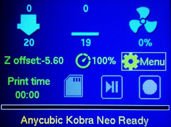

<link rel=”manifest” href=”docs/manifest.webmanifest”>

  

---  

# Control Panel  
Both printers come with the same control panel. It's a 2.4" LCD screen with a control knob at the right side next to it.  
There is no additional microSD card slot located at this panel.  
The following picture shows the main screen after you turn on the printer.  

The control panel allows you to control the printer manually, so you don't necessarily need an additional computer connected to the printer running e.g. [Octoprint](https://octoprint.org/) (even though it's advisable to do so).  
You can e.g. initiate the bed leveling process, heat up the extruder, load and unload filament, adjust your z-offset or home one or all axes.  
The usage is pretty easy and self-explaining - you turn the knob to the desired icon of the menu or function and press it to enter the menu or initiate the function.  
You can also upload gcode files directly onto your microSD card and start printing them by choosing the file using the control knob. Besides that, you can also pause or stop a printing process.  
See your manual for further information of the possible actions you can take.  
  
It also displays status information like the current temperatures and the temperatures that should be reached due to a certain function or during the printing process as well as error messages if they occur. 
  
The display also displays error messages if any severe errors occur. See the section ["Error Messages"](../problems.md#error-messages) for further information.  
  
??? tip "Bed Level Visualization"

    The display does *not* show a meshview or the values of the measured points after you proceeded the bed level function when using the stock firmware. If you'd like to see that, you'd usually have to use additional software like the beforementioned [Octoprint](https://octoprint.org/) and an additional plugin for visualization like the [Bed Level Visualizer](https://plugins.octoprint.org/plugins/bedlevelvisualizer/).  
    However, you mght find this function activated within a modified version of the stock firmware, made by users. See the section ["Mods"](../firmware/fw_marlin.md#mods) in the chapter ["Stock Firmware (Marlin Based)"](../firmware/fw_marlin.md) for some links.    
  

---

  

