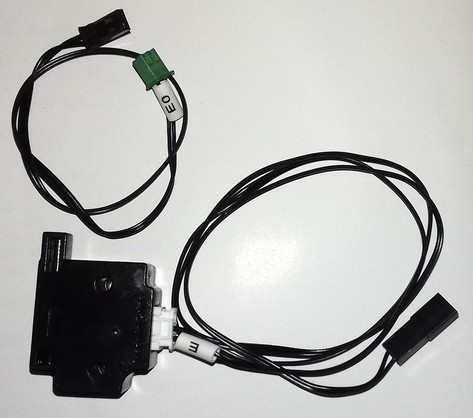
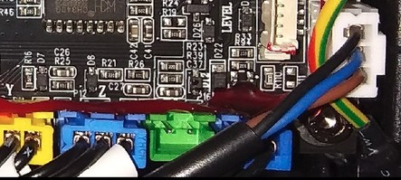
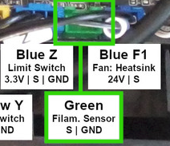
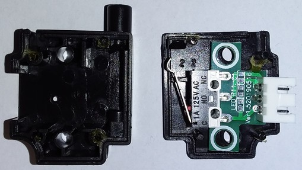

<link rel=”manifest” href=”docs/manifest.webmanifest”>

# Filament Sensor

| Specifications |
|:---------------|
| Switch: NO (normally open) |
| Voltage: 24V DC |
| Connector: JST-XH 2.54 (male, 2 pins) |  

The filament runout / break detection sensor available from Anycubic is optional, it doesn't come with the printer right away.  

The sensor is basically a switch inside a housing, which will be triggered and closes the contact when filament is fed through.  
The switch is NO (normally open) and the connector for plugging it into the mainboard's connector is a JST-XH2.54 (male, 2 pins).  

It is pretty much plug&play as it comes with the specific wires and plugs.   

  

## Installation  

After stripping in the wires and lead them down to the mainboard, you then have to plug it into the corresponding socket which is this green two pinned one in the following picture. It's easy to find as it's the only one available.  

  

  

See the chapter ["Mainboard"](mainboard.md#trigorilla-v_306-stock) for a picture of the whole mainboard for getting a better overview where the connector is located.  

After you connected and mounted the sensor, you lead the filament through it which then moves the little lever of the switch to trigger it and the electrical circuit will be closed. If the filament runs out because it broke or the spool is empty, the switch will open and the printer will pause.  

Anycubic has a more detailed installation instruction on their blog available, so maybe check that out as well if the installation procedure isn't clear yet:  

- [Installation at the **Go**](https://www.anycubic.com/blogs/3d-printing-guides/how-to-install-filament-runout-sensor-for-anycubic-kobra-go)  
- [Installation at the **Neo**](https://www.anycubic.com/blogs/3d-printing-guides/filament-sensor-upgrade-for-anycubic-kobra-neo)  

## Spare Part

You don't have to get this sensor directly from Anycubic (which is about 15 to 20 bucks there), as this is actually some kind of 'generic' sensor. You can find this type of sensor for really small money at AliExpress as well for example. Just pay attention to the wiring then and that you get the correct type of the two-pinned connector.    

  
## False Positive Detections And How To Fix Them 

After using the filament runout sensor for a certain time, it may happen that you'll face false positive detections and therefore paused prints even though there was filament loaded.  
   
This might just be a small problem which probably could easily be fixed by bending the little lever of the switch inside of the sensorbox a bit more outwards, so that there's more pressure onto the filament.  
If you do so, make sure that you only bend it slightly and that the lever still triggers the switch when you lead filament through it - you don't want to bend it too much and in a way that it won't be able to trigger the switch anymore.   

You can open the case with a small flathead screwdriver or a knife. Be careful and patient when doing so though, as there's some glue applied which needs some time to come off.  
The following picture shows the inside of the sensor so that you can see the little metallic lever of the switch.  
    
  
    

If bending the lever a bit more outwards doesn't solve your issue, use your multimeter and verify that the switch itself is actually still working correctly. If it's not and you do have some compressed air available (like in a can or if you have a compressor), try to blow into the switch a bit as it might be that some abrasion of filament got inside the switch and causing problems.  
If also that doesn't solve the issue and the switch still isn't working, you'll have to replace it. You could get yourself a spare switch and replace the broken one, or you can just get yourself a whole new filament runout sensor.      

---

  
  

