<link rel=”manifest” href=”docs/manifest.webmanifest”>

  

---  

# Other

Here you can find whatever didn't seem to fit in one of the other chapters.  

---
  
## MicroSD Card
The printers are shipped with a 8GB microSD card.  
If you need to replace that card with a new one, make sure to format it as FAT32.  
Even though Anycubic recommends to keep 8GB as a limit, cards up to 32GB have been reported to work.  
However, it might happen though that several cards won't be accepted and the error message "SD init fail" will be reported. In that case, try to completely format it again (full format, not fast format) as FAT32. If that still doesn't solve the problem, try a different card. I personally had to try five(!) different cards of different sizes until the printer finally accepted one (actually the oldest 4GB I had laying around). See this blog article from Anycubic for some further possible solutions: https://store.anycubic.com/blogs/3d-printing-guides/fix-anycubic-3d-printer-not-reading-sd-card   

---

## Filament Spool & Amount Of Filament Left 
Ever wondered how much filament might be left on your spool?  
If you'd know the weight of the empty spool, you could (more or less precise) calculate the amount in meters left on the spool by just putting the spool on a kitchen scale.  

So if you have a favoured brand and an empty spool already, measure the weight of it and keep it in mind (or on a Post-It note ;) ).  
But what if you don't have an empty spool you could measure? In that case I have your back covered - check out [this Wiki](https://3dprintingwiki.mywikis.wiki/wiki/Spool_weight) which lists many brands and the weights of the belonging spools. (If your specific type isn't listed, please reach out to the creators of that Wiki once your spool is empty and you were able to get the specific weight!)  

??? example "Calculating The Amoung Of Filament"  

    It's said that a regular 1kg spool of 1.75mm filament contains about 330m of filament.  
    To be on the safe side, I personally calculate with 300m per 1kg. That means 1000g = 300m, 100g = 30m and 10g = 1m.  
    So when you wanna roughly calculate the amount of filament left on the spool before or even while printing, put the spool on a kitchen scale and read the weight. Then substract the spool's weight and you have the amount of filament left in grams. Convert that to meters and you'll get an idea if you're on the safe side or if you should have a new spool on hand.  
    
    Example:  
    I'm using AzureFilm filament which comes with the newer spool design, those black ones with the holes. The spool's weight is 220g.  
    The actual spool's weight with some filament left on there is 390g.  
    So we can do the math: 390-220=170 - ok, so I have 170g filament on there.  
    How many meters are that now? 100g of filament is about 30m, 10g about 3m. So: 30+(7*3)=51 - means, I have about 51m filament left on the spool, which would allow me to start my 3hrs print which uses 27m without the need to worry if I'll run out of filament. 

---
  
## Spool Holder
The spool holder of both models is mounted to the top frame.  

However, due to the construction of the frame itself, the additional weight being put on top of it, the resulting impact of the (changing) weight on vibrations while printing (especially at higher speeds) and because of the poor roll-off behavior of the spool itself I'd suppose to create a spool holder which isn't attached to the printer itself and which uses ball bearings as well.  

If you don't have the space for it or want to keep the spool being attached at the top of the frame because of other reasons, then at least print a holder which uses ball bearings, so that the spool can turn better while the filament gets pulled off of it. Look around at e.g. Thingiverse, there are many models to find.  

??? tip "Boxed Spool Holder"

    If you'd use a box with a lid which closes really well (best would be this kind of plastic box with the silicone sealing in the lid) and put a bag of desiccant in the box as well, you could also can keep the filament dry and dust-free.  
    Just print yourself one of those ball bearing spool holders where you place the spool onto, drill a hole in the side of the box and feed the filament through. Then place it next to the printer or onto a shelf above it and you're good.  
    Putting one of these cheap digital hygrometers in the box as well helps keeping an eye on the actual humidity inside of the box.  

    I personally used a cakebox with a lid which I mounted to an adjustable construction to the wall (cuz I couldn't get my hands on a decent box and ran across that cheap cakebox, so I couldn't resist). The spool itself is held by a bolt with some ball bearing spool holder.  
    Of course I put a bag of desiccant and a cheap hygrometer in there as well.  
    This solution isn't as air-tight as a box with a silicone sealed lid, but it does the job in my room fine. Plus, it keeps dust and my cats away from the filament as well.  

    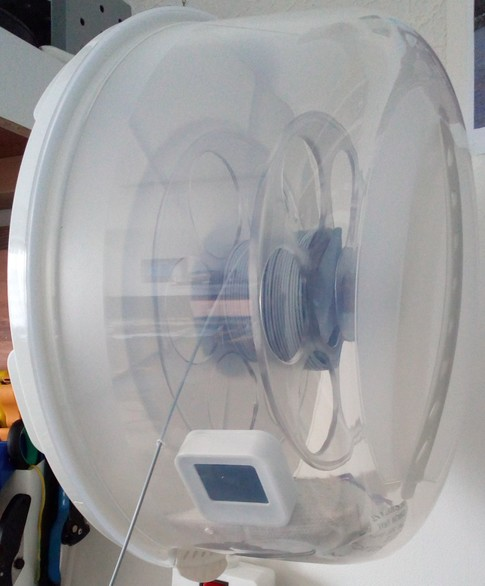

    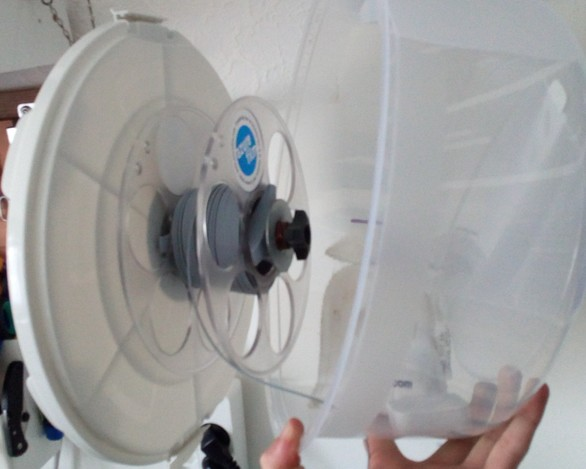

    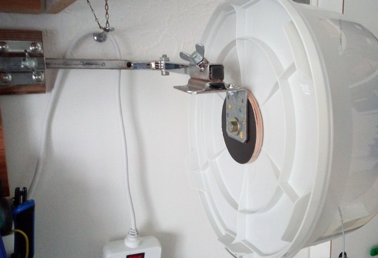

??? info "Influence Of The Spool Weight On Vibrations"  

    I personally don't like the spool being attached to the top of the frame. Even though I do see the 'value' of it in saving space around the printer, I personally think that adding 1kg (or even 2kg as some people mount a second one on top as well) to this kind of construction isn't the best idea.  
    
    The construction itself isn't the most rigid one anyway, and the higher the x-axis gantry rises along the z-axis, the stronger the vibrations become which are caused by the moving parts. Adding another kilogram or even more to the top now will enhance this effect, which will become even bigger when printing with higher speeds. Plus, the changing weight of the spool (due to the filament being used) causes a changing pattern of these vibrations.  
    
    By using Klipper and the Input Shaper functionality, we can measure the vibrations and apply certain algorithms to compensate them. But due to the fact that the patterns of these vibrations alter with the changing weight of the spool(s), it's kinda counterproductive to mount the spool(s) on top.  
    As I didn't had an empty and a full spool to test the vibrations for investigating this problem, a friend of mine was so kind to run these tests. Even though he uses a Creality Ender3 V2 Neo and not a Kobra Go or Neo, the results are pretty impressive and allow to assume that the behaviour will be somewhat similar due to the same constructions of the printers.  
    
    I don't know *how much* this affects the outcome of the printed model in real life at the end, but as we try to eliminate factors that might have a negative effect anyway, I just wanted to show you this for making you aware of it.  
    
    So the following images show the outcomes of the Input Shaper measurements with an ADXL345 sensor being used. The first two images show the vibrations of the x-axis test with a full 1kg spool and an empty spool, the next two images show the belonging results for the y-axis.  
    
    | X-Axis, Full Spool (1kg) |
    |---|
    | 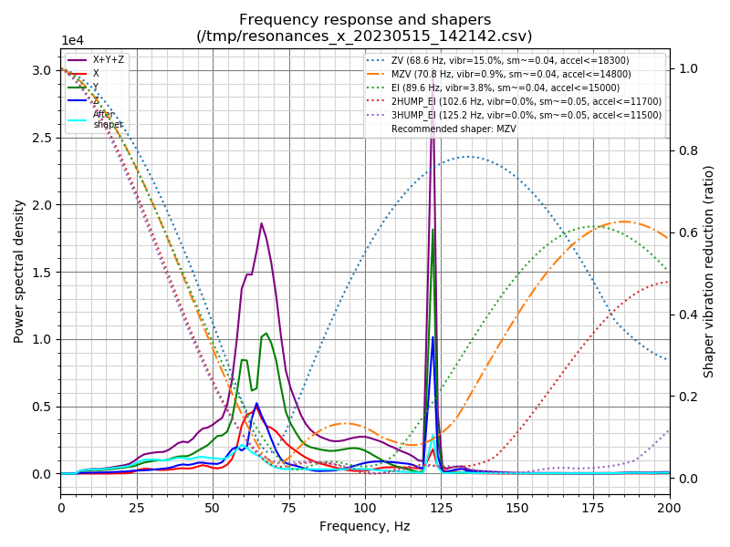 |  
    
    | X-Axis, Empty Spool |
    |---|
    | 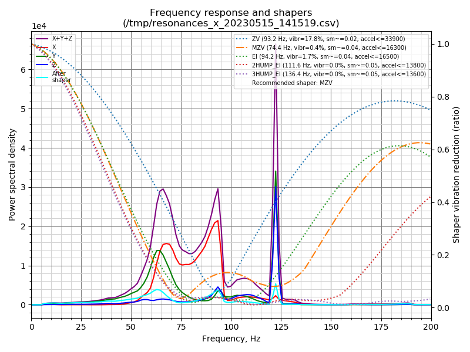 |
    
    | Y-Axis, Full Spool (1kg) |
    |---|
    | 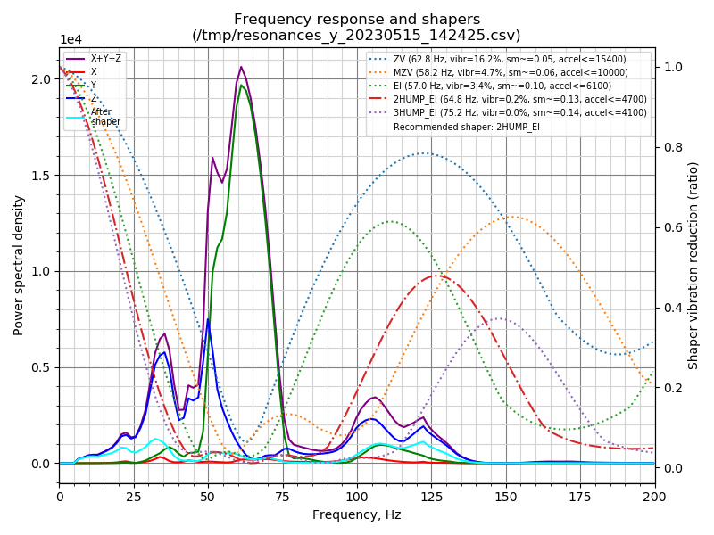 |
    
    | Y-Axis, Empty Spool |
    |---|
    | 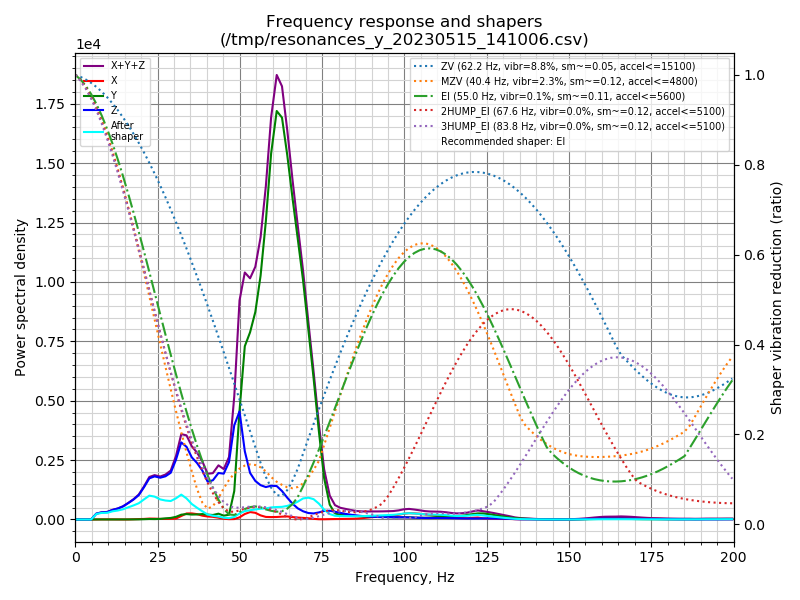 |

---

## Filament Dryer
Using dry filament is crucial for a successful print.  
Since some sorts of filament like PETG, TPU and Nylon are prone to take up moisture more than others (like PLA), you often need to actively dry it to avoid printing problems like artifacts and heavy stringing.  
Using a fresh spool which comes right out of the sealed bag from the manufacturer isn't a guarantee for dry filament as well, since moisture is often being taken up during the cooling process when manufacturing it.  
The following picture shows the skirt of a fresh spool of high quality filament - on the left it's straight out of the sealed bag, on the right it's after being dried.  

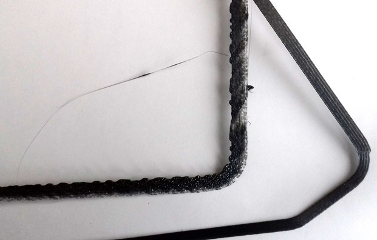

To actively dry filament, you need to heat up the entire spool for a few hours and let the mositure evaporate.  
You can either do so by using a dedicated filament dryer, a modified food dehydrator or just the heated bed of your printer.  
*You should not use your kitchen oven though!*   

Whichever solution you use in the end, you have to make sure that the temperature for drying does fit the specific type of filament, and that you *never* reach the glass transition temperature.  
You can find various charts across the web where temperatures and times are being listed one should use for drying.  
However, some of those charts sometimes show drastic differences for temperatures, so be careful. When in doubt, better choose the lower temperature and dry it longer. It's also smart to look up the typical glass transition temperature of the specific type of filament first of all.  

After you dried your filament, make sure to store it somewhat airtight - like in a sealed bag or a sealed cereal container as you can see in the specific section further down below.  

??? info "Types Of Filament"  

    The following article gives you a nice overview of the different types of filament available and what they're being used for: [Best 3D Printer Filament: The Main Types in 2023](https://all3dp.com/1/3d-printer-filament-types-3d-printing-3d-filament/)

In the following I'll show some solutions for drying your filament.  

---

### Typical Filament Dryer
Since I don't have one of those typical filament dryers you can buy, I can't show you a picture of those, but a quick internet search will show you various models.  
However, if you're looking out for a filament dryer, you should check for two things:  
1) Check the maximum temperature the device can generate. This is especially important if you want to dry filaments which need higher temperatures.  
2) Make sure to get yourself a dryer which comes with an inbuilt fan, so that the hot air can circulate in the drier. Cheap units often lack a fan and just have a heating element at the bottom. This then leads to the problem that the bottom of the spool gets warm (or even too hot) while the upper part of the spool doesn't reach the desired filament.  

---

### Food Dehydrator
I personally use a food dehydrator since they're intended to dry food and herbs, come with a built in fan already and are usually also cheaper than a 'dedicated' filament drier.   
Instead of cutting the original stacking units, I printed a 'spacer' which then takes up the spool and the top lid as shown in the following picture.  

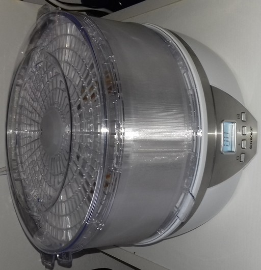  

You can find various models for different dehydrators at e.g. Printables, so maybe look around before you purchase a specific model.  

---

### Heated Bed 
If the firmware of your printer allows to have the bed staying heated throughut several hours without actually printing something, you can also use your heated bed to actively dry your filament.  
The cheapest and esiest solution is to place two long, thin and flat (~5mm) pieces of wood across the bed. On there, you put the spool flat/horizontally (= not standing upright) and then put a cardboard box over the spool. Make sure both the spool and the cardboard box are resting on the wooden sticks to allow circulation of the air. Poke some holes in the top of the cardboard box to allow that the moisture can evaporate.  

---
    
## Filament Storage  

Storing your filament in a way that it's not only protected from dust and UV light, but also from moisture is the way to go. As always, you have plenty of options. You could put the used spool back in a bag and vaccum and seal it, use re-usable plastic bags with a zipper and a hole for using a pump to create a vaccum, put all of your spools in a big box which is as much sealed as possible or use individual sealed containers for each spool - just to name a few.  
After doing some tests with different storage solutions and measuring the humidity over time, I personally decided to go with the last option I just mentioned - and after observing the stability of the humidity and the filament, I really can recommend it. So let me go a bit into details about it.  

I got myself some of those sealed cereal containers in the size of 4l (size is about ). The 1kg spools fit in there perfectly (at least the ones I tested - I didn't test the brands with those spools made from cardbox though and therefore I don't know if those may vary in the size), 2kg spools don't fit. These containers come with a sealed lid you can clip on the container.  
I printed a little mount for those cheap rectangular hygrometers and printed a mini spool holder as well, just to keep the spool in place a bit better (this isn't necessary though). I then also bought a big amount of silica gel (desiccant) and put 200g of it into some thin lady socks (I also tested those small packages which come with the spools, but those ones just don't take enough moisture imho). I got the orange version of the silica gel which turns to a dark green when being moist (don't get the stuff that turns blue as that's toxic) as it makes it easier to judge by a quick glance if the desiccant is still good to use.  
Adding some labels to the box helps identifying the different types of filament without the need to open the box and thake out the spool. I didn't type the colour, as I'm able to identify that through the box.  

So, adding that 200g bag into an empty container got the humidity down to 10%. That was stable across time. After adding a fresh spool right out of the sealed bag, the humidity usually raised up to something between ~40-50%, which then dropped down to 10% again over time. This value was stable then over time. In my opinion this method doesn't only keep the humidity inside of the container low but it also dries the filament over time.   

The following picture shows a setup like that.  

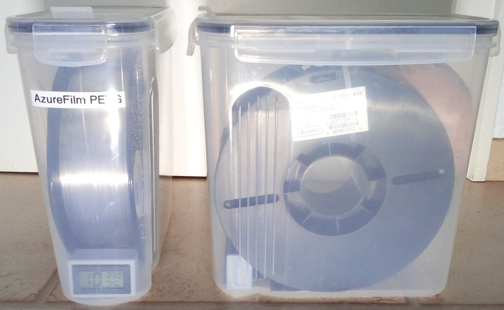

I designed a cap/insert for the lid's opening as I couldn't find any model that fit the specific triangle-like shaped opening. I made it in different variants, like with and without a hole to feed the filament through and with and without a cutout for the typical cheap hygrometer/thermometer units. The following picture shows one of those caps which I personally am using to feed filament right out of the container, it's the version with the hygrometer/thermometer unit and the 4mm hole.  

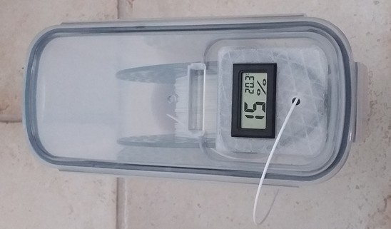  

You can find the models here: [Caps/inserts for the lids of 4l cereal containers (filament storage & feeding filament), 'triangle' shaped type ](https://www.printables.com/de/model/619339-capsinserts-for-the-lids-of-4l-cereal-containers-f)  
If you want to feed the filament right out of the box, I'd suggest to add a ball bearing mount for holding the spool. If you don't have any other feeding system, then I'd suggest to modify one of those containers for this purpose. You can also find guides about this solution and find models for printing different mounting solutions.  
   

??? info "Types Of Filament"  

    The following article gives you a nice overview of the different types of filament available and what they're being used for: [Best 3D Printer Filament: The Main Types in 2023](https://all3dp.com/1/3d-printer-filament-types-3d-printing-3d-filament/)

---

## Printer Enclosure

Using an enclosure has clear advantages and is even necessary for succesfully print certain types of filament.  
However, it might cause some problems as well.  
So here are a few things I'd like to mention about enclosures in general.   

Let's talk about the downsides first, as there are only a few:   

- When you're only printing PLA, an enclosure which traps the heat might be counterproductive. PLA needs a proper cooling, therefore a heated chamber can cause some thermal issues like insufficient cooling of the printed parts. So when you're printing PLA and using an enclosure, it's best if you leave the enclosure as open as possible.  
- An enclosure usually takes more space than the printer itself just standing somewhere. You need additional space in the enclosure for being able to reach certain parts of the hardware comfortably.  
- The trapped heat in an enclosure puts some additional thermal stress on the printer itself. The active cooling of parts like the mainboard, the PSU, the heatsink and the printed part itself won't be as sufficient as if the the printer won't be trapped in a heated chamber. Besides that, motors might get hotter and parts like the POM wheels and the belts might be negatively affected by the heat as well. Depending on the design and size of the enclosure and the temperatures of the bed and the hotend being used for printing, the temperature inside of an enclosure can easily reach 40°C.  
- The risk of a fire hazard might be higher. Especially when using flammable material for building the enclosure.  

The upsides though can clearly make up the beforementioned issues:  

- Your machine is protected from dust, pet hair and so on.  
- Depending on the design of the enclosure, you'll achieve a reduction of the noises and the fumes.  
- Printing certain types of filament will not only become easier (like PETG for example which is already pretty sensitive to a cool airstream hitting the bed), some even require the usage of an enclosure, like ABS for example.  
- You can integrate certain security functions like a smoke detector and even a fire distinguisher, which can reduce the risk of a fire hazard massively. This is highly dependant on the material the enclosure is built from though - if you're using highly flammable material for insulating the inner parts of the enclosure of if you're building the enclosure from wood, then of course the whole enclosure itself will increase the risk as mentioned above. So make sure you're using proper material.  

When thinking about using an enclosure, you'd have to think about the design itself, the size and the materials.  
If you have no idea to start from, you can find countless solutions as an inspiration across the web (a pretty popular and easy to build solution is the "IKEA Lack enclosure").  
There are also prebuilt enclosures available as well as enclosures which I personally call "tent style enclosures" (or just "tents").  

I personally ended up with getting myself two of those tent style enclosures, just because I like the idea of being able to fold it together and put it in the closet if I don't need it anymore.  
There are quite a few of these tents available, but when taking a closer look at the various offers you'll see that most of them are actually the same, just being branded differently. I call them "generic" ones.  
Only some of the tents available on the market seem to really differ from those "generic" ones, here the ones from Creality and SainSmart have to be mentioned as you'll most likely come across them when you're searching for these tent style enclosures.  
I got myself one of those "generic" ones which was branded by Sunlu and one from SainSmart which I'll show in the following and mention some pros and cons I personally consider worth mentioning (pictures will be added soon).  
I didn't get the one fromm Creality as it was the smallest among those offers (width ~47.5cm) - even though it would be sufficient and the Go and Neo would fit in there, I personally like a bit of additional space as I often get my hands on the hardware anyway and therefore don't need to always take the printer out of the enclosure.  

**Sunlu (imho "generic")**  
The size of this generic tent style enclosure one is about 55x64x74cm.  
Due to it's height, the enclosure allows the usage of the filament spool holder mounted to the top of the frame.    

| Sunlu closed | Sunlu open |  
|:------------:|:----------:|
| 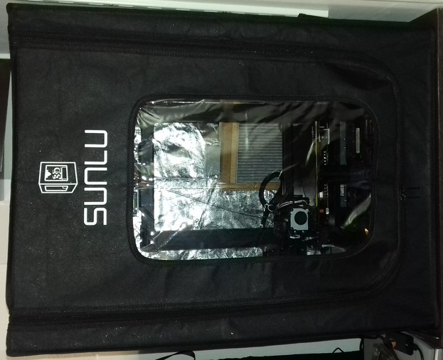 | 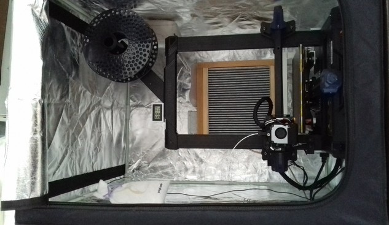 |

When looking at the generic tent which in my case was branded by Sunlu, it hits the eye right away how thin the material is.  
The 'aluminum' is applied as some sort of sprayed on layer, there is no insulation between the outer material and the aluminum foil at the inside as there's just one layer of material.   
If you place a lamp inside the enclosure, you can see the light shining through the material (in the picture of the closed tent above you might be able to tell the reflecting spots, this is the aluminum coating shining through the outer material!) - I think this already speaks for itself. As expected, the insulating effect on noise, temperatures and fumes therefore is only small.  
The zipper isn't covered in any way and it doesn't appear to be made of a high quality anyway.  
The rods are made from fibreglas, the parts where the rods are being stuck into are made from plastic.  
The following pictures show some close-up views of the material and the zipper.  

| Zipper | Material | 
|:------:|:--------:|
| 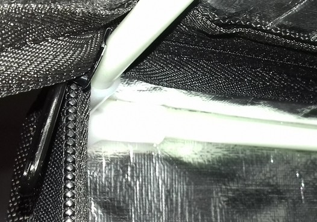 | 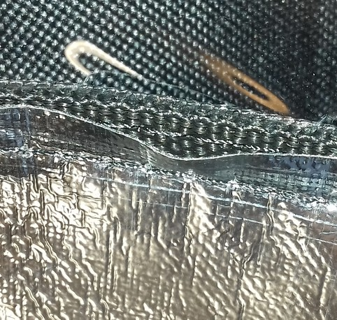 |  

You can open that front door completely all across the top.  
There's an additional opening at the left side which allows accessing the machine or feeding filament from outside - keep in mind though that this will lead to the fact that the heat won't be trapped inside anymore and airstreams could hit the bedplate.  
On the right side some pocketss for storing smaller parts are applied.   
The following picture shows the left side of the enclosure with the part which can be opened.   

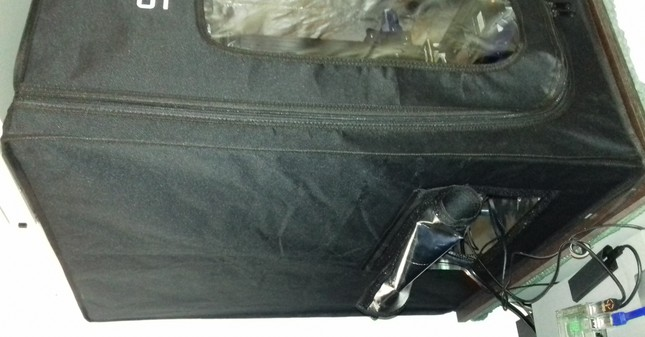

I personally used this enclosure for one of my Kobra Neos which I use for only printing PLA.  
When printing, I completely opened it. When not printing, this enclosure acted as a protection against dust and hairs of my cats.  
However, due to the fact that the following enclosure from SainSmart is just so much better, I ended up getting more of those and stowed away this thin generic one in my closet.  

UPDATE: I gave this one away to a friend and got myself some more of the SainSmart enclosures when they were on sale. The quality is just outstanding compared to the 'generic' one I showed. 

**SainSmart "Upgraded Large Volume 3D Printer Enclosure"**   
The size of this tent style enclosure from SainSmart one is about 54x62x72cm.  
Due to it's height, the enclosure allows the usage of the filament spool holder mounted to the top of the frame.  

| SainSmart closed | SainSmart open |
|:----------------:|:--------------:|
| 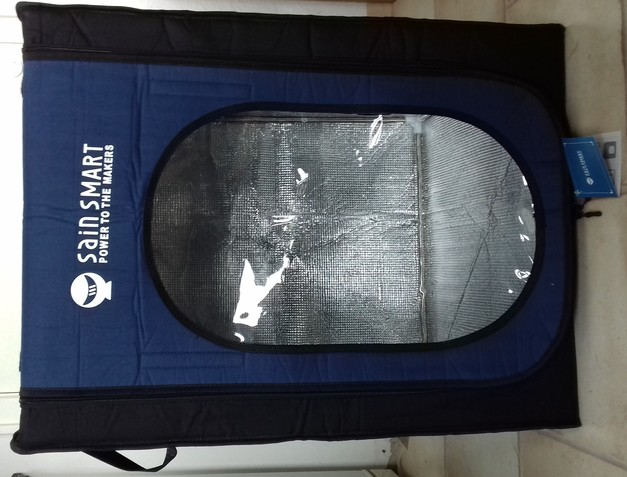 | 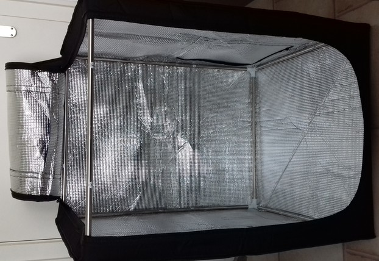 |

When looking at the tent, you can tell the much better quality right away.  
The material itself isn't only thicker and more dense, it also consists different layers. There is the outer material, then you have some sort of foam insulation and an aluminum foil covering the inside. This results in a *much better* reduction of the noise and fumes and traps the heat inside the enclosure better as well. The risk of a fire hazard should be reduced much more significantly than at the generic tent, as we have a 'real' aluminum layer here instead of just some sort of sprayed-on aluminum-looking substance.   
The zippers seem to be made of a better quality as well and they're somewhat covered.  
The rods of the frame are made from metal, the pieces where the rods get stuck in are plastic as well though.   
The following pictures show some close-up views of the material and the zipper. You can clearly see the foam padding.   

| Zipper | Material | 
|:------:|:--------:|
| 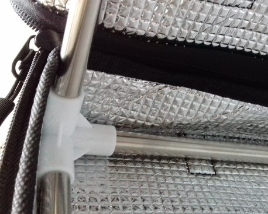 | 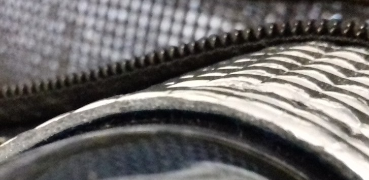 |  

The front door can be opened all across the top as well and there is an additional opening at the top which can be used while the tent is closed.  
On the left side some pocekts for storing smaller parts are applied as well as some belts for e.g. hanging up filament spools.  
On the right side there's an additional oopening as well which allows you to access the machine from the side.  

| Left side | Top side | Right side |
|:---------:|:--------:|:----------:|
| 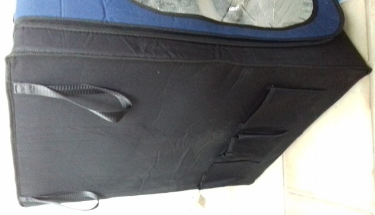 | 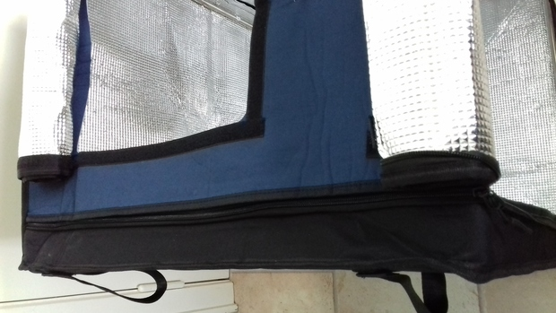 | 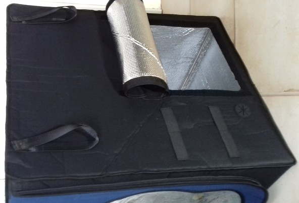 |

Due to the better quality, I personally used this tent for one of my Kobra Neos which only prints other types of filament than PLA in the first place.  
But because the quality is just so much better than the quality of the generic one mentioned above, I ended up getting more of these enclosure from SainSmart and only use these ones now. Compared to the generic one, it's really impressive how much quieter the printer is and how much better the fumes are being kept iniside.  

UPDATE: I gave the 'generic' one away to a friend and got myself some more of the SainSmart enclosures when they were on sale. The quality is just outstanding compared to the 'generic' one I showed. I even got myself more than I actually needed - just in case I'll get another machine. My cat loves them as well - she immediately seized the packages when I was setting up a new one..  

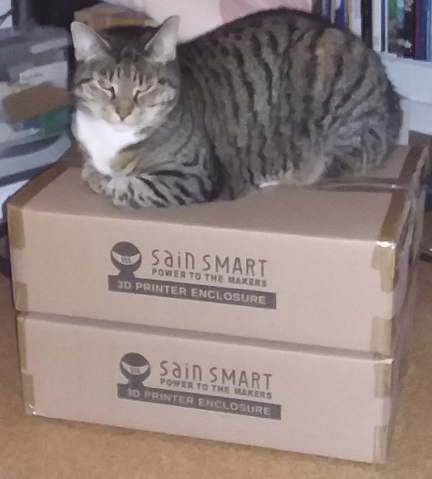  

**Final thoughts on tent style enclosures**  
My bottom line here about these two types of tent style enclosures would be: if you plan to use the enclosure for *printing* more demanding types of filament like ABS for example and not just like using it as a better dust protection cover, then I highly recommend getting the one from SainSmart.  
The difference in quality compared to the "generic" one from Sunlu shown above is like day and night and it's really impressive how much quieter the printer is and how much better the fumes are being kept inside with the enclosure from SainSmart compared to the generic one.    
The enclosure from SainSmart usually is a bit more expensive that the cheapest generic ones you could get, but the much better quality is worth every buck.  
Sure, the generic one also works, and I used it for printing PETG as well (where using an enclosure isn't necessary, but it helps avoiding any cold airstream hitting the bed) as it was the first tent I got myself. When I then got the one from SainSmart and the difference in quality became obvious, I kind of did regret spending the money on the generic one though as it was only 20€ less than the one from SainSmart.  
Judging by the product images being available, I *assume* the quality of the enclosure from Creality is comparable to the one from SainSmart, but as mentioned before the slightly smaller size of it made me not buying it.    
  
---
  
## Mods
In the following I'll list mods or STL files I found which could be interesting in general. Keep in mind that they mostly should fit for both printers in general due to the identical design and contruction itself, so (right now) I don't separate them into **Go** and **Neo** like usually.    

- [Gregg Bennett](https://www.printables.com/de/social/221278-greg-bennett) created [risers](https://www.printables.com/de/model/394918-anycubic-kobra-neo-risers) which slip on the feet of the printer to rise up the whole construction allowing a better airflow for the fans of the mainboard and the power supply unit.  
- [Lohtex](https://www.printables.com/de/social/546846-lohtex) created [bed spacers](https://www.printables.com/de/model/376710-anycubic-kobra-go-bed-spacers) which could be used to replace the stock ones if they're completely different in their size.  
  However, keep in mind though that also the bottomside of the bed will get warm and therefore the spacers might become deformed if using PLA, so make sure you're printing them with e.g. ABS. Also keep in mind that prints aren't 100% correct in their dimensions, so that printing spacers won't be the final solution to get your bed perfectly trammed.   
- [Stellar5](https://www.printables.com/de/social/407998-stellar5) created a [purge/drip tray](https://www.printables.com/de/model/351007-anycubic-kobra-go-purgedrip-tray) which can be mounted to the frame and prevents filament from falling underneath the printer while heating up in home position.
- [ZAch Goldberg](https://www.printables.com/de/social/457330-zach-goldberg) created a [sidemount](https://www.printables.com/de/model/334261-anycubic-kobra-go-side-mount) which can be mounted underneath the holder of the control unit and offers some mounting options for e.g. a Raspberry Pi.   

---

  
