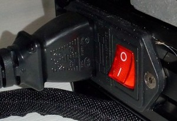

<link rel=”manifest” href=”docs/manifest.webmanifest”>  
  
# Power Supply Unit
The printer comes with a 400W power supply which can take 110V and 230V as well.  

  
The powerswitch and the plug are located at the left hand corner in the back at the side of the frame.  

  
!!! danger 

    Before plugging in the cable and switching on the printer, make sure that you set the little switch for choosing the voltage to the correct value! You can either set it to 110V or 230V - so make sure everything is set correctly first!     
  

The housing of the power supply is mounted at the back of the base frame underneath the bed. You can spot it from the front when you move the bed completely to the back as the following picture shows.  

  
!!! note 

    I'll add pictures of the housing form an underneath-point of view as well as I'll open the housing to provide pictures of it. At my Neo the fan is really loud as it seems to run on 100% as soon as I power up the printer. So I'll see if I'll get rid of the stock fan and replace it with a better one.   
  

