<link rel=”manifest” href=”docs/manifest.webmanifest”>  
  
# Power Supply Unit

| Specifications |
|:---------------|
| **Input Voltage**: 115V and 230V AC (choose the correct voltage by setting a switch before turning on the printer!) |
| **Output Voltage**: 24V DC |
| **Power Rating**: 400W, 17A max. |
| **Fuse**: glass tube type, replaceable, located between the power plug and the power switch |
| **Fan**: 24V, 0.10A, 60x60x15mm, model "Cheng Liang CHA6024RL-15B" |  

---

The printer comes with a 400W power supply unit which can take 110V and 230V AC as well.  

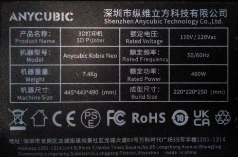
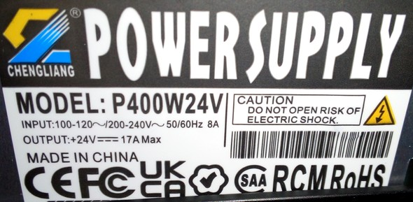  
  
The powerswitch and the plug are located at the left hand corner in the back at the side of the frame. There is also a fuse integrated in the powerswitch box which you can pull out and exchange if necessary. 

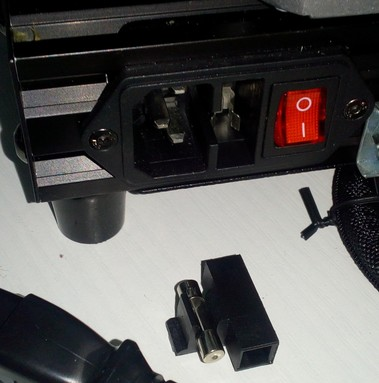  
  
!!! danger 

    Before plugging in the powercord and switching on the printer, make sure that you set the little switch for choosing the voltage to the correct value! You can access it from the back of the printer and either set it to 110V or 230V - so make sure everything is set correctly first!   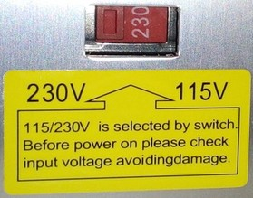  
  
The housing of the power supply unit is mounted at the back of the base frame underneath the bed. You can spot it from the front when you move the bed completely to the back as the following picture shows.  

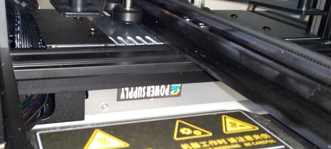
  
The following picture shows the location of the PSU (in the back) and the mainboard (in the front) at the **Neo** (should be similar at the **Go**).  

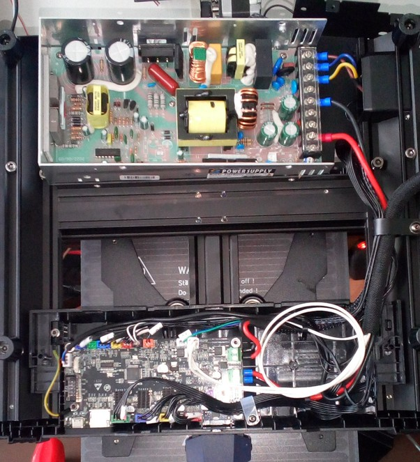  
  
The following picture shows the connectors of the PSU with the three 115V/230V AC wires on the right side (L = brown, N = blue, earth = yellow/green) and the 24VDC on the left side (V+ = red and V- = black).  

  

On the very left side you can see a green LED and right next to it a white potentiometer. With this potentiometer you can adjust the output voltage - so if you measure the voltage at the 24V DC connectors and you don't have 24V there, you can adjust the voltage to the correct value.  

The following picture shows the PCB of the PSU - the fan isn't plugged in, the belonging connector is the white two-pin connector in the upper left edge area of the board.    

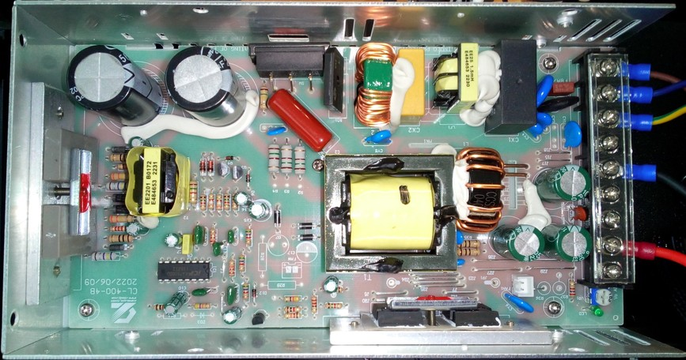  

---

## PSU Fan

The fan is a 60x60x15mm, 24V, 0.10A type ("Cheng Liang CHA6024RL-15B").  
  
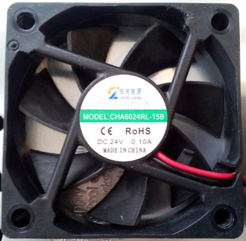 

---

### How To Add A Step-Down Converter For Using 12V Fans (MOD)

When you want to add components which need a different voltage than the 24VDC the PSU offers, you can do so by using a step-down converter (or a step-up converter if you need a higher voltage than 24VDC). Simply connect the IN of the converter to one of the free 24VDC connectors of the PSU, dial in the voltage you need and then connect the belonging part to the OUT of the converter.  
The following picture shows a typical "LM2596S" type step-down converter which can be used.  

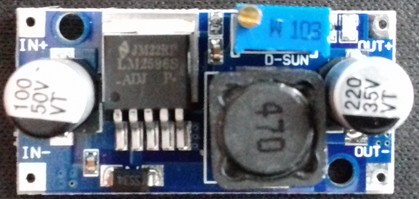
 

However, when you want to use e.g. 12V fans which speeds are usually controlled by PWM of the mainboard, you have to connect them differently. The following drawing shows how to proceed in that case, so that the PWM will still work.  

!!! warning 

    The following circuit diagram about how to connect a step-down converter wasn't tested by me yet. It's assumed that the mainboard controls the PWM of the fans by switching the belonging GND of the connector.  

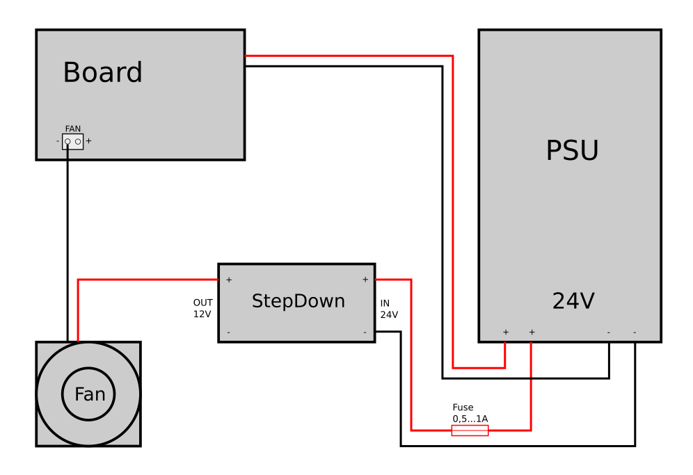  

!!! warning "Add An Additional Fuse"

    It is highly recommended to add a suitable fuse to the 24V line, right after the connector of the PSU. If your additional parts like the converter will fail, the fuse will melt - which can save you from burning down your house. 

---

## Add Additional Fuses To The 24V DC Wiring (MOD)

It is highly recommended to add a fuse or a fusebox to each of the 24V lines. Pay attention to choose the correct 'size' of the fuse for the belonging part (ampere rating).  
Doing so can save you from burning down your house if components fail or if the wires somehow overheat and start to burn due to broken strands (which causes a higher resistance) or a shortcut.  

(..need to add pic..)

---

## Add An External MOSFET (MOD) 

It's adviseable to add an external MOSFET for driving the heated bed (if you like, you can also add one for the heater cartridge as well of course). Even though the MOSFET on the mainboard is sufficient, it's an upgrade worth doing as it not only leads to the fact that the bed will be heated up slightly faster, but it also increases the security of the hole printer.  
The MOSFET of the mainboard doesn't have a heatsink and it *may* caused by overheating due to an excessive amount of current being drawn, especially when using higher bed temperatures. Due to the low clearance between the fan of the moainboard and the ground the printer stands on, the cooling isn't the best as well. When using an enclosure which then heats up as well, cooling gets even worse.  
If the board's MOSTFET dies, you most likely have to get a whole new mainboard then. Even though it's possible to solder a new one onto the board (if you're skilled to do that), additional components might have been harmed.  
To avoid that, it's therefore adviseable to add an external MOSFET which then takes the load - the one on the mainboard only acts as a signal for the external one to switch.  

The 24V DC of the PSU will be connected to the belonging connector of the external MOSFET. The 24V DC line from the heated bed screw terminals will be connected with the belonging connector of the external MOSFET and the 24V DC wires of the heated bed will then be connected to the outlet of the external MOSFET. When the mainboard switches the onboard MOSFET, it will then trigger the external one to switch and lead the current to the heated bed.  
There are a few external MOSFETs on the market, most of them only have a "signal" connector. When using a mainboard with a dedicated 'signal' connector for this, it's then connected to that one. When using a mainboard that doesn't have this 'signal' connector like the one being used at these printers, then it's said to connect the 24V from the bed's connector of the mainboard to that.  

I personally prefer a certain type of MOSFET which also offers a dedicated connector for the 24V line besides the 'signal' connector as shown in the following picture.  

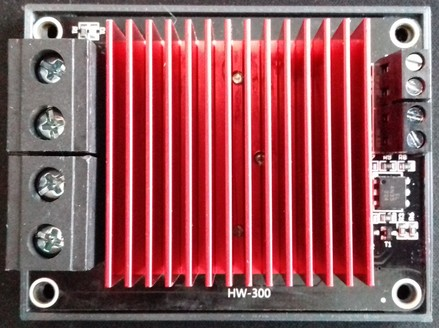  

The PSU and the wiring of the bedplate are connected to the belonging connectors shown in the following picture: 24V from the PSU belongs to the connector labeled as "Power", the 24V for the wiring of the bedplate belongs to the connector "Hotbed".  

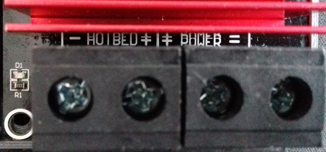  

The 24V of the bed's connector of the mainboard will then be connected to the belonging connector "Bed" at the MOSFET (positioned next to the connector labeled as "Sig").  

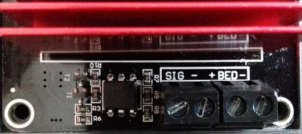  

!!! warning "Mind The Polarity"  

    Pay attention to the polarity when connecting the components!  

!!! warning "Add An Additional Fuse"

    It is highly recommended to add a suitable fuse to the 24V line, right after the connector of the PSU. If your additional parts like the converter will fail, the fuse will melt - which can save you from burning down your house.  
    

    
---

  
