<link rel=”manifest” href=”docs/manifest.webmanifest”>

# Printhead

| Specifications |
|:---------------|
| **Go**: Bowden Drive |
| **Neo**: Direct Drive |
| **Thermistor**: 24V, 100k NTC, ATC Semitec 104GT-2/104NT-4-R025H42G type, capsuled, dimensions 3x6mm, ~150cm wire length, two pinned JST XH 2.54 connector |
| **Heater Cartridge**: 24V, 40W, ~14.5Ohm, dimensions 6x18mm, ~150cm wire length, two pinned JST VH 3.96 connector |
| **Nozzle**: E3D V6 type |
| **Heater Block**: E3D V5 type |
| **Heatbreak**:   **Go**: M6 thread (to fit in the V5 heater block), overall length ~26mm, 6mm OD / 4mm ID, PTFE tube   **Neo**: M6 thread (to fit in the V5 heater block), overall length ~24.6mm, 7mm OD / 4mm ID, PTFE tube |  
| **PTFE tube**:   **Go**: ~400mm bowden, ~4mm OD / ~2mm ID bore   **Neo**: ~41-44mm inliner for the heatbreak, ~4mm OD / ~2mm ID bore   *The PTFE tube at both printers can/should be repaced with a "Capricorn XS" tube (for 1.75mm filament).* |  
| **Silicone Sock**: E3D V5 type |
| **Part Cooling Fan**:   **Go**: 24V, 0.08A, 40x40x10mm, model "Coolcox BF4010H24S"   **Neo**:   - older versions: 24V, 0.08A, 45x45x10mm, model "Coolcox BF4510H24S"   - newer versions: 24V, 0.10A, 45x45x10mm, model "HSC BCY4510D24E" |
| **Heatsink Cooling Fan**: 24V, 0.03A, 40x40x10mm, model "Coolcox CC4010L24S" (both printer models)  |
| **ABL sensor**: PNP-NO type (imho!), connection: brown = VCC 24VDC; blue = GND; black = LEVEL/signal |  

---

The printheads of the **Go** and the **Neo** aren't identical because of the different type of extruder they're using:  

- the **Go** uses a bowden drive feeder system while 
- the **Neo** uses a direct drive feeder system.   
  
If you look at both printheads from the front and compare their size, you'll notice that the one of the **Go** is a bit smaller (and lighter) and more square than the wider (and heavier) and more rectangular shaped one of the **Neo**.  

The printhead itself is running along the [x-axis gantry](axes.md#x-axis-gantry).  
  
---  
  
## Go
The following picture shows a new printhead for the **Go** as it comes as a spare part.  
  

The following picture shows a close up view of the printhead of the **Go** from the front view. At the bottom you can see the nozzle in the center and the orange tip of the ABL sensor at the left side.  
  
    
  
The following picture shows the head of **Go** from the backside.  

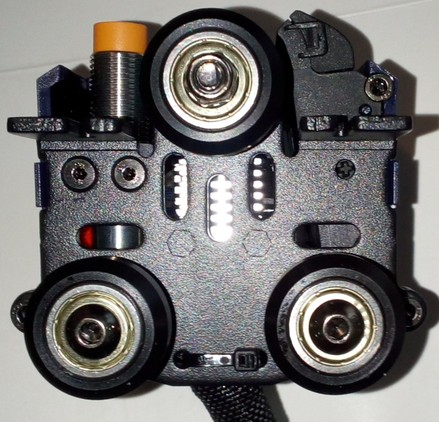  

---

### Disassembling
  
Disassembling the printhead isn't really complicated. Just make sure you're careful and put the screws in a place and order that makes it easy for you to reassemble everything later. The following steps are just a rough guide through so that you know what you'll be confrontated with. I'd recommend to take a picture of each step, so that you can look at them later when reassembling - just in case you don't know how to proceed at a certain point or if you're not sure where certain screws belong.    
  
!!! warning  

    - If you need to disassemble the printhead for e.g. changing the hotend, *unload the filament first!* 
    - For changing the nozzle or disassembling the heatbreak from the heater block, you have to *heat up the parts first!*   The main reason for that is to melt the filament which most likely entered little gaps there. Usually it's said that it should be around 200°C but that's probably not sufficient because (in my opinion) it depends on the material of the filament. So my suggestion is to heat up the extruder about 5-10°C more than the temperature you're printing with, then you should be on the safe side.   So either do that using the pre-heat function of the printer or by using a sufficient heat gut. However - don't burn yourself by touching the hot metal parts!
    - Before starting to tinker *turn off the printer* and *unplug it from the power outlet!*
    - *Use the sufficient tools!*   So please don't try to loosen the nozzle with a pair of pliers for example, use e.g. a wrench for that.   I also strongly recommend to *not* use a pair of pliers for the heater block, also for that you should use a wrench (if you don't have one of that size, use an adjustable one). A wrench has a smooth surface and therefore won't scratch the surface or even put dents into the block.  
    - Make sure you *don't lose a screw* and make sure you'll *know where the screws belong* later when you want to reassemble everything again.   You might will be able to remember the belonging screws and positions if your tinkering lasts only an hour, but if anything crosses your plan and therefore you have to pause tinkering, you maybe won't remember one week later. So maybe start sorting the screws and take notes where they belong and/or take pictures right away from the start.
    - *Be patient and careful.* Generally speaking, if you unscrew something and it doesn't come off easy, don't start pulling too hard as you might have overseen a screw or clip, so better watch twice. 
    - *Don't harm or rip off any wires* as it may cause severe damage to your mainboard or might be complicated to fix later on.  

Whatever you want to do, like if you want to change the hotend, the heater block, the heatbreak, a fan or even want to disassemble the whole feeder system, you have to remove the plastic cover of the printhead first.  
It's secured by two hexagon socket screws at the top of the metal back plate and a plastic clip at each side at the lower bottom. Be gentle and careful to not break one of the clips - the best way to get them out of their fittings is to gently push together the whole plastic cover at the bottom sides.   
  
After the plastic cover is gone, you can see the fan and the fanduct inside the plastic cover, the proximity sensor at the left side, the aluminum cooling element of the hotend/heatbreak in the middle and the heater block down at the bottom.
  
   
  
*You'll find further disassembling instructions for the ABL sensor, the feeder gear system and the hotend in the specific sections.*  
  
---  
  
## Neo  
The following picture shows a new printhead for the **Neo** as it comes as a spare part.  
  

The following picture shows a close up view of the printhead of the **Neo** from the front view. At the bottom you can see the blue silicone sock of the heater block with the nozzle in the center and the orange tip of the ABL sensor at the right side.  
  
 
  

---

### Disassembling
  
Disassembling the printhead isn't really complicated. Just make sure you're careful and put the screws in a place and order that makes it easy for you to reassemble everything later. The following steps are just a rough guide through so that you know what you'll be confrontated with. I'd recommend to take a picture of each step, so that you can look at them later when reassembling - just in case you don't know how to proceed at a certain point or if you're not sure where certain screws belong.    
  
!!! warning  

    - If you need to disassemble the printhead for e.g. changing the hotend, *unload the filament first!* 
    - For changing the nozzle or disassembling the heatbreak from the heater block, you have to *heat up the parts first!*   The main reason for that is to melt the filament which most likely entered little gaps there. Usually it's said that it should be around 200°C but that's probably not sufficient because (in my opinion) it depends on the material of the filament. So my suggestion is to heat up the extruder about 5-10°C more than the temperature you're printing with, then you should be on the safe side.   So either do that using the pre-heat function of the printer or by using a sufficient heat gut. However - don't burn yourself by touching the hot metal parts!
    - Before starting to tinker *turn off the printer* and *unplug it from the power outlet!*
    - *Use the sufficient tools!*   So please don't try to loosen the nozzle with a pair of pliers for example, use e.g. a wrench for that.   I also strongly recommend to *not* use a pair of pliers for the heater block, also for that you should use a wrench (if you don't have one of that size, use an adjustable one). A wrench has a smooth surface and therefore won't scratch the surface or even put dents into the block.  
    - Make sure you *don't lose a screw* and make sure you'll *know where the screws belong* later when you want to reassemble everything again.   You might will be able to remember the belonging screws and positions if your tinkering lasts only an hour, but if anything crosses your plan and therefore you have to pause tinkering, you maybe won't remember one week later. So maybe start sorting the screws and take notes where they belong and/or take pictures right away from the start.
    - *Be patient and careful.* Generally speaking, if you unscrew something and it doesn't come off easy, don't start pulling too hard as you might have overseen a screw or clip, so better watch twice. 
    - *Don't harm or rip off any wires* as it may cause severe damage to your mainboard or might be complicated to fix later on.   
    
Whatever you want to do, like if you want to change the hotend, the heater block, the heatbreak, a fan or even want to disassemble the whole feeder system, you have to remove the plastic cover of the printhead first.  
It's secured by two hexagon socket screws at the top of the metal back plate and a plastic clip at each side at the lower bottom as you can see at the following picture (well, you don't really see the plastic clip though but you can see the belonging notch of one of them). Be gentle and careful to not break one of the clips - the best way to get them out of their fittings is to gently push together the whole plastic cover at the bottom sides.  
  
  
  
After the plastic cover is gone, you can see the fans, the proximity sensor at the right side and the heater block at center down at the bottom and so on. Depending on what you want do do now, you need to follow different steps. But first let's have a look at the coverless head from different points of view, starting with the view from the front with a straight look at the little fan for cooling the printed part.  
  
 
  
  
Now we look at the left side where you can see the motor of the feeder gear. You can spot three hexagon socket screws there - two at the top and one at the bottom close to the motor housing, which are holding the entire feeder system onto the metal backplate.    
  

  
From the right side view you see the fan for cooling the heatsink and the ABL sensor with the orange tip at the very right side of the construction.    
  
 

  
Looking at the head from the bottom right side, you can see the fan outlet on the left, the hotend with the stock silicone sock and the orange tip of the ABL sensor.    
  
   
The following picture shows the whole metal plate where the feeder construction (the marked tips of the three screws on the right side) and the bracket of the ABL sensor (the two marked screws on the left side) is mounted onto - I took these pictures when the head wasn't mounted to the carrier of the x-axis so you can have a better look at the deatails.   
  

*You'll find further disassembling instructions for the ABL sensor, the feeder gear system and the hotend in the specific sections.*  

---

### MOD: Voron StealthBurner

[Zdeněk Krupička](https://www.printables.com/de/@ZdenekKrupick_612132) remixed an adapter for being able to use a [Voron StealthBurner](https://vorondesign.com/voron_stealthburner) printhead at the **Neo** while still using the stock ABL sensor: [Voron StealthBurner adapter for Anycubic Kobra Neo ](https://www.printables.com/de/model/553841-voron-stealthburner-adapter-for-anycubic-kobra-neo).  
  
---

## ABL Sensor
Both printers come with an inductive proximity sensor for automatic bed levelling (ABL) which detects the metal of the spring steel PEI plate.  
The ABL sensor is the part with that round orange tip, you can see a picture of it in the following sections for the specific printer model. At the **Go** it's located at the left hand side of the hotend, at the **Neo** it's located at the right hand side of the hotend when looking at the printhead from the front.  

The sensor itself seems to be the same as the one being used at the regular Kobra, so if you need a replacement and can't find it for the Go/Neo, look out for the one of the Kobra as well (you'll have to extend the wiring then though!).  
In a German 3d forum someone measured the sensor of the regular Kobra and it gives +24VDC on the black signal wire when the LED lights up, so imho that's a PNP-NO type then (as the level is HIGH then).  
The connections are:  

- brown = VCC 24VDC
- blue = GND
- black = LEVEL/signal 

The position of the sensor (the height) should be adjusted in relation to the nozzle.  
Therefore you can either use the ABL height gauge which sometimes comes with the printer or you can use the bigger one of the two-sided open ended wrench that comes in the toolset.  
The following picture shows the height gauge that sometimes comes with the printer - if you don't have it and don't want to use the mentioned wrench, you can download [the gcode file](https://cdn.shopify.com/s/files/1/0245/5519/2380/files/Height_gauge.rar?v=1667814312) from Anycubic's support page and print it.  

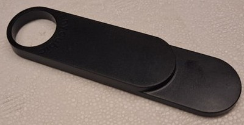

The procedure about how to adjust the position will be described for the specific printer model in the following sections as well. 
  

---  
  
### Go
The following picture shows the location of the ABL sensor at the printhead of the **Go**, looking at it from a bottom view angle - the ABL sensor is the part at the left side with the round orange tip.   
  

    
The ABL sensor itself is mounted in a plastic bracket which is the mounted to the metal backplate. You can adjust the height of the position by loosening the screw at the left side of the clamp which then allows you to move the sensor.  
  

  
---  
    
#### Leveling The ABL Sensor

Check if you need to level your ABL sensor in relation to the nozzle (which should be done after every maintenance at the hotend as well as when you got the printer brandnew from the manufacturer).  

!!! warning "Attention"  

    After adjusting the height of the ABL sensor, adjust your Z offset before starting to print!  

The following picture shows a sensor that should/has to be leveled (don't mind the tiny rest of filament at the tip of the nozzle which touches the paper instead of the nozzle itself though, I chipped it away before leveling everything).        

  

As I didn't get the plastic heihght gauge from Anycubic with my printers, I used the bigger one of those two-sided open ended wrenches. Check the parts that came with your printer, maybe you got the gauge shown in the following picture.  

If you didn't get this tool, you can also print yourself one: [ABL height gauge](https://cdn.shopify.com/s/files/1/0245/5519/2380/files/Height_gauge.rar?v=1667814312).  

See the expandable textbox below for further instructions about the leveling procedure.  

??? example "Leveling Procedure"

    - Take the [height gauge](https://cdn.shopify.com/s/files/1/0245/5519/2380/files/Height_gauge.rar?v=1667814312) from Anycubic.  
      If you don't have the height gauge, take a sheet of paper and the bigger two-sided open-end wrench that came with your printer.  
      If you also don't have that, take something with a flat surface that is 1.95mm thick as this is the thickness of the wrench that came with the printer (2mm will be fine also I guess).
    - Put on the spring steel plate on the heater bed and place the printhead about the center of the bed.
    - If you're using the height gauge, put it under the printhead and lower the head by turning the z axis rod manually. The nozzle should then touch the lower/thinner part of the gauge while the proximity sensor should touch the higher/thicker part of it as the following picture illustrates.  
      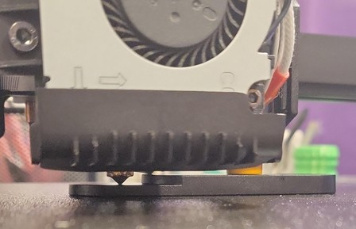  
    - If you don't have/use the height gauge, place a sheet of paper under the printhead now. Then lower the head to make the nozzle touch the sheet of paper. You should still be able to move the paper but you should feel a minimum amount of resistance as a sign that the nozzle is touching it.   Now place the wrench flat under the ABL sensor. The sensor should touch the wrench.  
    - If you need to adjust the height of the sensor, loosen the screw at the left side of the clamp that holds the sensor in place.      Move the sensor and tighten up the screw again once you found the correct position.  
    - After completing the beforementioned steps, take the parts away from the bed, set your Z offset to zero (0) if you didn't do it yet and home all axes. Then execute the ABL process and dial in your z-offset.          

---

#### Dismounting The ABL Sensor

See the expandable textbox below for further instructions.  

??? example "Dismounting Procedure"  

    If you want to change the ABL sensor, you have to completely dismount the bracket/clamp that holds the sensor from the metal backplate. I'm not really sure about it as I didn't do it myself yet, but if the bracket is shaped like a U then that should be the way to go. Here you can see the two screws that hold it in place, looking at the metal plate from the back.     

??? example "Remounting Procedure"

    For remounting, just put everything back together by proceeding the steps of dismounting in reverse. Make sure you're using the right screws and don't forget any of them.  
    Don't overtighten the screws though - as my father (R.I.P.) used to say: "After tight comes loose!" (roughly translated ;) ).  

!!! warning "Attention"

    If you dis- and remounted the ABL sensor, make sure to level the ABL sensor again and control your Z offset!  

  
---  
    
### Neo
The following picture shows the location of the ABL sensor at the printhead of the **Neo**, looking at it from a bottom view angle - the ABL sensor is the part at the right side with the round orange tip.   
  

    
The ABL sensor itself is mounted in a plastic bracket which is the mounted to the metal backplate. You can adjust the height of the position by a little spring supported screw located at the top.  
  

  
---  
      
#### Leveling The ABL Sensor

Check if you need to level your ABL sensor in relation to the nozzle (which should be done after every maintenance at the hotend as well as when you got the printer brandnew from the manufacturer).  

!!! warning "Attention"  

    After adjusting the height of the ABL sensor, adjust your Z offset before starting to print!  

The following picture shows a sensor that should/has to be leveled (don't mind the tiny rest of filament at the tip of the nozzle which touches the paper instead of the nozzle itself though, I chipped it away before leveling everything).      

As I didn't get the plastic heihght gauge from Anycubic with my printers, I used the bigger one of those two-sided open ended wrenches. Check the parts that came with your printer, maybe you got the gauge shown in the following picture.  

If you didn't get this tool, you can also print yourself one: [ABL height gauge](https://cdn.shopify.com/s/files/1/0245/5519/2380/files/Height_gauge.rar?v=1667814312).  

See the expandable textbox below for further instructions.  

??? example "Leveling Procedure"  

    - To adjust the height of the ABL sensor and level it, check out the video from Anycubic ["Leveling Operation for Anycubic Kobra Neo"](https://www.youtube.com/watch?v=25x84AaiUpQ) how to do so. However, I'll also list the steps in the following.  
    - Take the [height gauge](https://cdn.shopify.com/s/files/1/0245/5519/2380/files/Height_gauge.rar?v=1667814312) from Anycubic.  
      If you don't have the height gauge, take a sheet of paper and the bigger two-sided open-end wrench that came with your printer.  
      If you also don't have that, take something with a flat surface that is 1.95mm thick as this is the thickness of the wrench that came with the printer (2mm will be fine also I guess).
    - Put on the spring steel plate on the heater bed and place the printhead about the center of the bed.
    - If you're using the height gauge, put it under the printhead and lower the head by turning the z axis rod manually. The nozzle should then touch the lower/thinner part of the gauge while the proximity sensor should touch the higher/thicker part of it as the following picture illustrates.  
         
    - If you don't have/use the height gauge, place a sheet of paper under the printhead now. Then lower the head to make the nozzle touch the sheet of paper. You should still be able to move the paper but you should feel a minimum amount of resistance as a sign that the nozzle is touching it.   Now place the wrench flat under the ABL sensor. The sensor should touch the wrench.  
    - If the sensor is too high or too low, adjust the height by turning the little M2 hexagon socket screw at the top of the bracket that holds the sensor.       You're only able to move it a few milimeters by doing so though!   
    -  If you need to adjust a bigger height, you'd need to disassemble the sensor from the bracket itself first to already change it's position in the bracket (see the pictures of it in the "dismounting" section above.  
    - After completing the beforementioned steps, take the parts away from the bed, set your Z offset to zero (0) if you didn't do it yet and home all axes. Then execute the ABL process and dial in your z-offset.

---

#### Dismounting The ABL Sensor
If you want to change the ABL sensor, it's advisable first to take off the whole printhead from the carriage of the x-axis by taking out the four hexagon socket screws at the back that hold the plate.  

See the expandable textbox below for further instructions.  

??? example "Dismounting Procedure"

    - Then loosen the two hexagon socket screws at the backplate which holds the plastic bracket in place (where the ABL sensor sits in). They are located at the left side of the back plate if you look at it from the back (see pictures above). The following picture shows the screws from a side view angle to give you a better impression about the location. At the bottom you see one of the little plastic clips - there are two of them on each side.   
    - The bracket itself is designed as a sledge which can be adjusted by turning the M2 hexagon socket screw at the very top of this construction as you can see at the following picture.    
    - Be careful when you want to take out the sensor from the plastic bracket and therefore have to release the tiny plastic clips which close the bracket - don't break them!    
    - The following picture shows once again the two plastic clips on one side - they're on both sides, but it's sufficient to unclip them at one side as the other side will come loose as well then. Just be careful when you unclip one side and move the top of the bracket as it's still clipped in at the other side, so don't be rough here.   Now you can replace the sensor or readjust the position in the bracket. Be aware that there is something like a tiny thread on the little plastic lip located towards the lower end of this lid of the bracket (see red mark on the picture to the right) - make sure this thread fits into the thread of the sensor. If everything sits just right you don't need much pressure to close the lid, so be aware and careful here to not break anything.             
    
??? example "Remounting Procedure"

    For remounting, just follow the steps of dismounting in reverse. Make sure you're using the right screws and don't forget any of them.  
    Don't overtighten the screws though - as my father (R.I.P.) used to say: "After tight comes loose!" (roughly translated ;) ).  

!!! warning "Attention"

    If you dis- and remounted the ABL sensor, make sure to level the ABL sensor again and control your Z offset!  
       
---  
  
## Extruder / Feeder Gear System
The **Go** uses a bowden drive extruder/feeder, while the **Neo** is using a direct drive extruder/feeder.  
The main difference here (from a hardware perspective) is that at the the **Go** the feeder gearbox and the extruder motor are mounted to the left side of the x-axis gantry and are connected to the printhead/hotend with a PTFE bowden tube which leads the filament, while at the **Neo** these components are part of the whole printhead.  

??? tip "Can't Load New Filament?!"

    For loading new filament, you need to have the hotend heated up to the belonging temperature first - you can't load filament in a cold hotend, as it won't melt in there.  
    
    If you can't load new filament, first of all check if you pulled the lever on the feeder gear.
    If you did so and were able to insert the filament but it seems that it's getting stuck lower down in the hotend, then you might hit the end of the nozzle with an edge of your filament. It helps when you cut the filament in a 45° angle and bend the part you're manually feeding into the hotend so that it's pretty straight.  
    If you still can't get your filament loaded, it's most likely that the PTFE tube inside of the hotend is clogged or deformed or that you have a clog in or above the nozzle somewhere. To clean, inspect and maintain it, you need to disassemble the hotend. Check the section ["Disassembling The Hotend"](#disassembling-the-hotend) further down below for more information.   
  
---
  
### Go
  
The following picture shows the bowden drive feeder system of the **Go**. The feeder gear box is mounted onto the extruder motor with the holding bracket in between. It's located on the left backhand side next to the z-axis lead screw. It's connected with the white PTFE bowden tube (which leads the filament) to the printhead. The bowden tube is about 40cm long.  

  

A closer view of the feeder gear box mounted onto the extruder motor:  

  

The following picture shows the feeder gear box itself.  

  

The next picture shows the position of the different screws being used.  

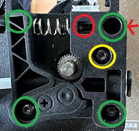

The mounting dimensions of the outer screws which hold the gear box onto the motor (marked with *green* circles) are NEMA17 specific 31mm. The screw on the bottom left corner here also holds the lever in place.  
The *yellow* circle marks the screw which is used for mounting the cover of the box onto the box itself.  
The *red* circle marks the position of the screw for adjusting the feeder gear (spring) tension - you can reach that screw form the right sied which is marked with a red arrow.  

The following picture shows the dimensions of the gear box and the lever itself, just in case one wants to get a replacement from a different manufacturer (like a metal gear box).  

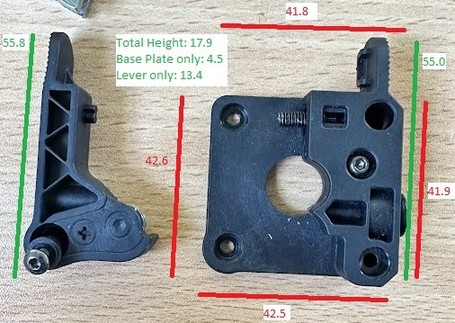  

The gear is about 9.2mm outer diameter, approximately 11mm thick and has 31 teeth. There are two set screws for holding it in place when mounted onto the 5mm motor shaft, which therefore is flatted on one side.   

??? tip "Feeder Gear Pressure"

    When adjusting the pressure of the feeder gear, make sure you don't tighten it up too much as it could squeeze and deform the filament. On the other hand it shouldn't be too loose though as it should transport the filament reliably.  
    When pulling out the filament of the extruder system, you should notice little dents on the surface of the filament from the teeth of the feeder gear, the filament itself shouldn't be squeezed and deformed though, it should still be "round" so to say. You don't want the feeder gear to "bite" too much into the filament as well though, as this may lead to inconsistentites of the filament flow. I personally like to extrude a bit so that the gear actually has to pull it in. Then I do a cold pull and check the marks of the gear on the filament itself. If you can see and feel little marks of the teeth of the gear on the surface of the filament, then it should be ok. If you don't feel and see any marks, then it's too loose. PLA is pretty hard, so the pressure can/should be a bit higher as well, but if the marks are pretty deep, then it already might be too much. If the filament is already a bit squeezed and kinda flat, then it's definitely way too much pressure (you'll most likely experience some weird artefacts, inconcisties and patterns at your prints as well then). 
    The filament should be fed reliably, which especially comes into account while retracting. So keep an eye on the shaft of the motor by looking at the back of the motor - if you notice that it's slipping while retracting, you definitely need to increase the tension.  
    As a rule of thumb you can keep in mind that the pressure should be higher when using hard filament like PLA and lower when using soft filament like TPU.    

---

#### Disassembling The Feeder Gear

You can disassemble the feeder gear box for maintenance of if you experience broken parts.  

See the expandable textbox below for further instructions.  

??? example "Disassembling Procedure"  

    - Disassemble the feeder gear box by removing the screw of the gear box cover which is marked with a yellow circle in the following picture. You also have to remove the one screw in the lower right corner (marked with a green circle) for taking off the cover then. You don't have to dismount the whole gear box from the motr itself though.  
    - If you just want to remove the lever, you'd need to remove the green marked screw in the lower left corner.     
    - After removing the cover of the gear box, you'll then be able to access the metal sleeve where the bowden tube runs through.   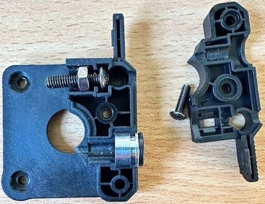  

  
??? example "Reassembling Procedure"

    For reassembling, just put everything back together by proceeding the steps of disassembling in reverse. Make sure you're using the right screws and don't forget any of them.  
    Don't overtighten the screws though - as my father (R.I.P.) used to say: "After tight comes loose!" (roughly translated ;) ).  

---

#### MOD: Bowden Drive Upgrade

As the stock extruder/feeder system is mounted onto the extruder motor directly, it's possible to upgrade to a better one. The following pictures show a MicroSwiss bowden drive feeder system.  

| MicroSwiss frontview | MicroSwiss sideview |
|:---------------------|:---------------------|
| 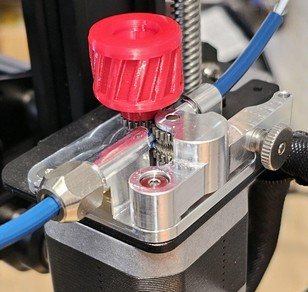 | 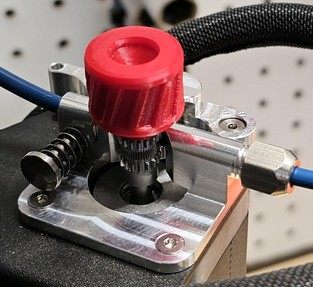 |

---

#### MOD: Direct Drive Conversion

??? note "General Advice When Converting To A Direct Drive"

    If you're going to mod to a direct drive using the stock hardware, consider using a pancake stepper motor then (if it's not already being used at the **Go**, I'm not sure about that right now) for reducing the weight.  
    Also keep in mind to lower your retraction distance then!  
    It might be smart to flash the firmware of the **Neo** then as well.  

- Reddit member [zyssai](https://www.reddit.com/user/zyssai/) created a sturdy bracket for turning the **Go** into a ***direct drive system*** as shown in the following picture.
  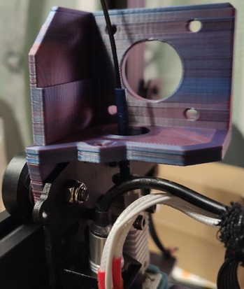  
  It fits together perfectly with a different model for a 5015 blower fan duct as mentioned in the project's description.  

- Reddit member [xpeng121](https://www.reddit.com/user/xpeng121/) posted his mod for the Kobra **Go** to a ***direct drive extruder*** using the stock parts: [Kobra Go direct drive mod. Yes it's Neo now...](https://www.reddit.com/r/anycubic/comments/10howol/kobra_go_direct_drive_mod_yes_its_neo_now/)
- The belonging bracket designed by user [Clay_47](https://www.printables.com/de/@Clay_47_396870) can be found here: [DIRECT Extruder Anycubic Kobra Go](https://www.printables.com/de/model/366079-anycubic-kobra-go)

- User [Justad](https://www.thingiverse.com/Justad) made a [mount for a Bondtech BMG BMG-M](https://www.thingiverse.com/thing:5954007).

- Reddit member [OriginalNames687](https://www.reddit.com/user/OriginalName687/) posted his solution for mounting a **MicroSwiss NG Direct Drive** here: [Micro Swiss NG Direct Drive Extruder on Kobra Go (Instructions in comments)](https://www.reddit.com/r/anycubic/comments/14ucd09/micro_swiss_ng_direct_drive_extruder_on_kobra_go/) 

- Reddit member [MeckeMecke](https://www.reddit.com/user/MeckeMecke) posted his solution of using an **E3D Revo CR hotend** plus an **Orbiter V.2** pancake motor here: [Kobra Go with E3D Revo CR & Orbiter V.2](https://www.reddit.com/r/anycubic/comments/15s44m7/kobra_go_with_e3d_revo_cr_orbiter_v2/)  
  The following picture shows this impressive mod:  
  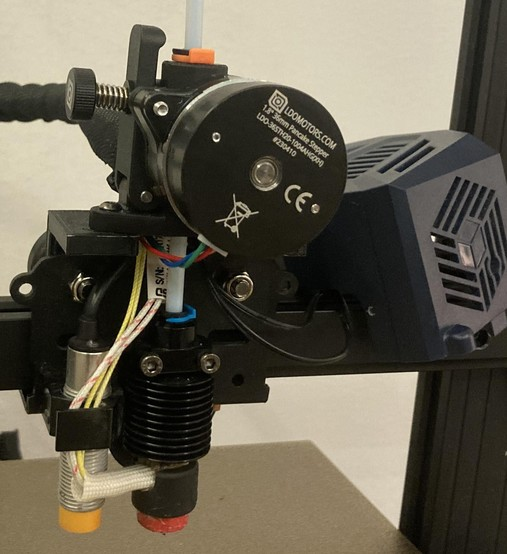
  
---  
  
### Neo
The following picture shows the extruder/feeder of the **Neo** with the mounted plastic cover of the printhead.  
  

  
At the top in front of the little hole where the filament is inserted you find a little lever for manual release of the tension while loading/unloading the filament. The screw in the front adjusts the pressure of the feeder gear which is brought onto the filament. The following picture shows the mechanism without the plastic cover.  
  

  
You can access the inside of the feeder system by dismounting the heatsink, which is located at the right side underneath the heatsink fan. The following picture shows the inside of the system.  

  

??? info "Titan Aero Clone"

    The extruder seems to be a clone of the "E3D Titan Aero", apparently made by "XCR3D" (look out for "XCR3D Titan") - besides the fact that a different kind of heatsink and hotend is being used here.    
    Therefore one can have a look at the [official E3D assembly instruction of the E3D Titan Aero](https://e3d-online.zendesk.com/hc/en-us/articles/360016764817-Titan-Aero-Assembly-Guide-Edition-2-) when it comes down to solving issues or taking it apart.  

??? warning "Important Notes On The Extruder"

    @[jokubasver](https://github.com/jokubasver) reached out (Thanks!) and wrote some important notes about the extruder. So I'll just quote his notes in the following:   
    "XCR3D Titan clone has some differences compared to the original E3D Titan Aero, and it's mostly due to the screws, and imo the XCR3D clone is flawed and is not as good as the original design.  
    The most important part is to make sure that the screws are not overtighened - it's part of the assembly process to make sure that the hobb gear runs smooth and that it does not bind.  
    Also, it's very important to align the pinion gear mounted on the stepper motor to be flush with the hobb gear - otherwise the lever arm will be out of alignment, or it will bind on the hobb gear.  
    So I'm not sure if Anycubic is not properly assembling the extruders, or if the screws get loose overtime causing issues with the lever arm going out of place etc, as I'm starting to see more and more posts on reddit of people complaining about extruder clicking noises on retracts, or the lever being slanted to the side.  
    So imo it's important people check their extruders and make sure to assemble them correctly.  
    Therefore I don't recommend the Titan metal arm and gear set upgrade kit, as it just doesn't fit exactly right in the XCR3D clone extruder used in the Kobra Neo.
    The good news is that one upgrade path is to install an original E3D Titan Aero, which also upgrades you to a proper E3D v6 hotend, or it's also possible to upgrade to a proper, high quality clone, such as one made by TriangleLabs (can be found on AliExpress).  
    I should also mention that the XCR3D clone is also sold by other names, such as 3DSWAY and LERDGE, and that bimetal heatbreak I'm using is sold by 3DSWAY which is a 1:1 drop in replacement and is a perfect fit - makes sense when you consider that they also sell the exact Titan Aero heatsink clone used in the Kobra Neo :)"
  
!!! warning "Retraction Settings"

    Make sure that you set the retraction distance and speed to the correct values for a direct drive!  
    In general, it's supposed to be something around 1mm retraction distance for direct drive systems like the **Neo**. The profile from Anycubic has this setting set to 6mm though, which is *way* too much for the direct drive! If you set the distance to a value which is too high (e.g. the default 6mm for the **Go** as a bowden drive), the melted filament might be pulled back too far and reaches the PTFE tube which might get clogged then.  
    You can find some more information about this topic in the section ["Retraction Settings"](../calibration.md#retraction-settings).
  
??? tip "Feeder Gear Pressure"

    When adjusting the pressure of the feeder gear, make sure you don't tighten it up too much as it could squeeze and deform the filament. On the other hand it shouldn't be too loose though as it should transport the filament reliably.  
    When pulling out the filament of the extruder system, you should notice little dents on the surface of the filament from the teeth of the feeder gear, the filament itself shouldn't be squeezed and deformed though, it should still be "round" so to say. You don't want the feeder gear to "bite" too much into the filament as well though, as this may lead to inconsistentites of the filament flow. I personally like to extrude a bit so that the gear actually has to pull it in. Then I do a cold pull and check the marks of the gear on the filament itself. If you can see and feel little marks of the teeth of the gear on the surface of the filament, then it should be ok. If you don't feel and see any marks, then it's too loose. PLA is pretty hard, so the pressure can/should be a bit higher as well, but if the marks are pretty deep, then it already might be too much. If the filament is already a bit squeezed and kinda flat, then it's definitely way too much pressure (you'll most likely experience some weird artefacts, inconcisties and patterns at your prints as well then).   
    The filament should be fed reliably, which especially comes into account while retracting. So keep an eye on the shaft of the motor by looking at the back of the motor - if you notice that it's slipping while retracting, you definitely need to increase the tension.  
    As a rule of thumb you can keep in mind that the pressure should be higher when using hard filament like PLA and lower when using soft filament like TPU.  
  
??? tip "Print A Filament Guiding Sleeve"

    I printed a [filament guiding sleeve](https://www.thingiverse.com/thing:5720072) made by ["fredfeuerstein2"](https://www.thingiverse.com/fredfeuerstein2/designs) which sticks in the hole of the feeder gear system where the filament enters. It's guiding the filament and makes sure that the filament will be fed centered.   [!Filament guiding sleeve](../assets/images/head_neo_filguide_web.jpg)   It's originally designed for the regular Kobra, but it does fit and works great on the **Neo** as well.   

---

#### Disassembling The Feeder Gear

In case you dropped something tiny like a screw or so in the holes at the top of the feeder or if you need to check the feeder gear system due to problems like stuck filament or a bad gear, it's probably sufficient to disassemble the system from the metal backplate by taking out the three hexagon socket screws and shake the whole thing around a bit. There are enough holes and openings at the back where you also could try to reach the lost thing using a pair of tweezers.  

If that doesn't work, see the expandable textbox below for further instructions about how to disassemble the gear box.   

??? info "Titan Aero Clone"

    The extruder seems to be a clone of the "E3D Titan Aero", apparently made by "XCR3D" (look out for "XCR3D Titan") - besides the fact that a different kind of heatsink and hotend is being used here.    
    Therefore one can have a look at the [official E3D assembly instruction of the E3D Titan Aero](https://e3d-online.zendesk.com/hc/en-us/articles/360016764817-Titan-Aero-Assembly-Guide-Edition-2-) when it comes down to solving issues or taking it apart.  

??? warning "Important Notes On The Extruder"

    @[jokubasver](https://github.com/jokubasver) reached out (Thanks!) and wrote some important notes about the extruder. So I'll just quote his notes in the following:   
    "XCR3D Titan clone has some differences compared to the original E3D Titan Aero, and it's mostly due to the screws, and imo the XCR3D clone is flawed and is not as good as the original design.  
    The most important part is to make sure that the screws are not overtighened - it's part of the assembly process to make sure that the hobb gear runs smooth and that it does not bind.  
    Also, it's very important to align the pinion gear mounted on the stepper motor to be flush with the hobb gear - otherwise the lever arm will be out of alignment, or it will bind on the hobb gear.  
    So I'm not sure if Anycubic is not properly assembling the extruders, or if the screws get loose overtime causing issues with the lever arm going out of place etc, as I'm starting to see more and more posts on reddit of people complaining about extruder clicking noises on retracts, or the lever being slanted to the side.  
    So imo it's important people check their extruders and make sure to assemble them correctly.  
    Therefore I don't recommend the Titan metal arm and gear set upgrade kit, as it just doesn't fit exactly right in the XCR3D clone extruder used in the Kobra Neo.
    The good news is that one upgrade path is to install an original E3D Titan Aero, which also upgrades you to a proper E3D v6 hotend, or it's also possible to upgrade to a proper, high quality clone, such as one made by TriangleLabs (can be found on AliExpress).  
    I should also mention that the XCR3D clone is also sold by other names, such as 3DSWAY and LERDGE, and that bimetal heatbreak I'm using is sold by 3DSWAY which is a 1:1 drop in replacement and is a perfect fit - makes sense when you consider that they also sell the exact Titan Aero heatsink clone used in the Kobra Neo :)"

??? example "Disassembling Procedure"  

    - There is a metal part with cooling fins underneath the 'big' fan at the right side, this is the heatsink.     
    - This heatsink is secured by three screws as you can see at the following picture.     
    - If you unscrew those three hexagon socket screws and take the heatsink off, you can get a closer look at the gears of the feeder system.     
    - The following picture shows the feeder gear properly assembled.   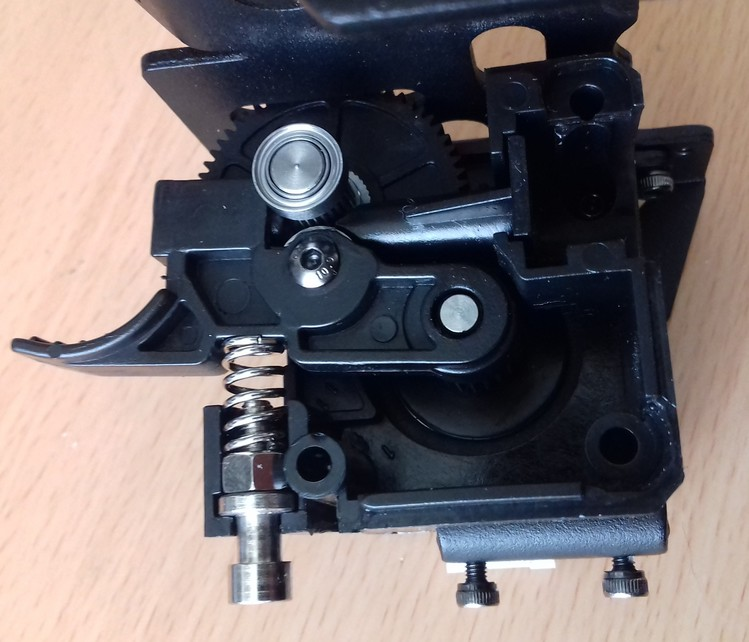  
    - The following picture shows the feeder gear being completely disassembled with the parts arranged at their (approximately) position where they belong.   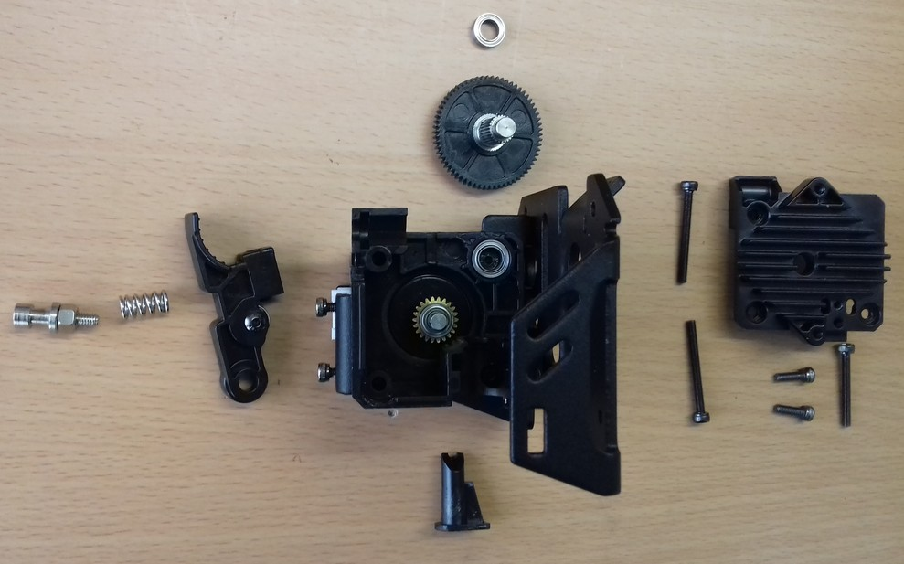  
    - The following picture shows the disassembled feeder gear, the heatsink fan and the ABL sensor next to each other with the belonging screws placed at the (roughly) belonging position of the components.   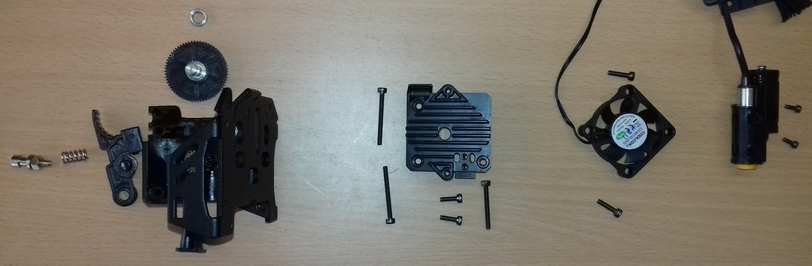   So from right to left this is how it'll look when you disassemble the belonging parts. The two little screws below the heatsink are the ones which hold the heatbreak in place. Mind the three long screws for that heatsink - the two longer ones are used at the left side, the slightly shorter one is used in the bottom right corner.

    ??? info "Dimensions Of The Spring"

        As the question arised about the dimensions of the spring being used which applies the tension to the feeder gear (in case you lost it and need to find a suitable replacement), here are the dimensions of it:  
    
        - overall length: ~12-12.5mm
        - length completely compressed: hard to tell as it's pretty stiff, I'd say around 6-7mm
        - spring steel thickness: 1mm
        - windings (except the 'closed' loops at both ends): 4
        - outer diameter: ~7.1mm
        - inner diameter: ~5.1mm
  
??? example "Reassembling Procedure"

    For reassembling, just put everything back together by proceeding the steps of disassembling in reverse. Make sure you put all the belonging parts in the correct position and that you're using the right screws and don't forget any of them.  
    
    Make sure to *not* tighten up the screws too much - not only can it affect the correct functioning of the parts negatively, but you can also crack the heatsink when doing so!  
    
    *Please also mind the notes in the expandable texboxes above and refer to the [official E3D assembly instruction of the E3D Titan Aero](https://e3d-online.zendesk.com/hc/en-us/articles/360016764817-Titan-Aero-Assembly-Guide-Edition-2-) where this extruder is a clone of.*  
    
---  
  
## Hotend 
In the following, the specific hotends will be shown. Before jumping to the specific section, mind the notes in the expandable textboxes as well.  
  
!!! warning

    - Too high temperatures may harm the PTFE tube - it may become deformed!   
    - If you dismounted the hotend and you put it back into the printhead, make sure you check and adjust the position of the ABL sensor in relation to the nozzle and that you check and set your new z-offset afterwards!  
    - If you replaced your old hotend or parts of it with (a) new one(s) (regardless of whether you also replaced the thermistor and/or cartridge heater with a new one or keep using the existing ones), execute a PID tuning afterwards!  

!!! danger "Check The Grub Screws From Time To Time"

    Check the grub screws/set screws of the heater block and the position of the cartridge heater and the thermistor from time to time!  
    Due to expansion and contraction of the aluminum heater block and the vibrations that occur, those screws can come loose - which then can result in a part being slipped out!  
    *This is a serious potential of a fire hazard!*    
    See the following picture of a user where the cartridge heater slipped out of the heater block.  
    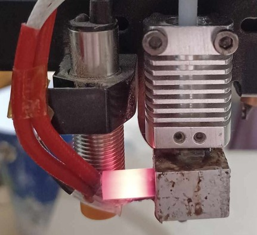  
  
??? tip "Can't Load New Filament?!"

    For loading new filament, you need to have the hotend heated up to the belonging temperature first - you can't load filament in a cold hotend, as it won't melt in there.  
    
    If you can't load new filament, first of all check if you pulled the lever on the feeder gear.
    If you did so and were able to insert the filament but it seems that it's getting stuck lower down in the hotend, then you might hit the end of the nozzle with an edge of your filament. It helps when you cut the filament in a 45° angle and bend the part you're manually feeding into the hotend so that it's pretty straight.  
    If you still can't get your filament loaded, it's most likely that the PTFE tube inside of the hotend is clogged or deformed or that you have a clog in or above the nozzle somewhere. To clean, inspect and maintain it, you need to disassemble the hotend. Check the section ["Disassembling The Hotend"](#disassembling-the-hotend) further down below for more information.     
         
??? example "Large Clump Of Melted Filament Built Up"

    Sometimes it may happen that melted filament builds up on top of the heater block to a large clump. The reason for that is that the heatbreak isn't screwed into the heater block tight enough so that the melted fiolament can squeeze out. It also may be caused by bad and cheap parts where the thread isn't just as good as it should be.      So if you encouter this problem, here is what I recommend to do (based on my own experience with this dilemma).  
    
    - Take off the plastic cover first to get better access to the whole area.  
    - Heat up everthing - I did this by using the preherat function for PLA at the control unit.
    - Once the filament starts to melt and gets soft, grab a wooden stick and take away as much as possible carefully. *Don't* use a screwdriver or something like that to do so as you might harm the wires and/or cause a shortcut at e.g. the contacts of the cartridge heater.   *Be really careful when taking away the clumps to not harm or rip off any of the wires!* You can also use a cloth to wipe off the melted filament from the heater block and so on, just make sure you don't burn yourself!  
    - For the next steps you need to be a bit quick in proceeding them, so if this is the first time you're diassembling the hotend, take a look at the sections here at the page and read them first so you'll know where the screws are located and which steps you need to take. Then proceed with the following steps.
    - So, once everything is as clean as possible, turn off the printer and loosen the grub screws inside the heater block to take out the thermistor and the cartridge heater. Give it a quick wipe with the cloth if they're covered by a lot of filament, too (but don't waste too much time here as the filament is becoming hard again now pretty quick!). 
    - Then take out the nozzle from the heater block and unscrew the heater block from the hotend. Pay attention if you can feel that the heatbreak was loose in the heater block to check if that was the reason for the filament being able to squeeze out and build up. 
    - Dismount the fan on the right side and loosen the two hexagon socket screws which are holding the heatbreak in place. If it doesn't fall out by itself, pull it out. When using the **Neo**, make sure the little PTFE tube also comes out, take it out of the heatbreak.  
    - If you were using a cheap nozzle and have a spare one, just throw away the old one. If it's a good or your only nozzle, try to get it back to work again by giving it a proper cleaning and doing some cold pulls when it's installed again. 
    - Now put all the metal parts (heatbreak, heater block and probably the nozzle) in a glass with acetone. close the lid and let it sit there for about 24hrs. The acetone won't dissolve PLA filament or so automagically like it does with ABS, but it'll make it soft and easier to clean. 
    - In the meantime you can take care of the thermistor and the cartridge heater. Scratch off the hardened filament from the metal parts by using a cutter for example, but be *really* careful to not slip off and harm any wires! I personally didn't take care of the little clump at the part where ther wires are coming out of the metal part because I didn't wanted to risk harming the wires, so I just let it sit there.  
    - When you're about to clean the meatal parts which soaked in the acetone, I'd recommend wearing disposable gloves as acteone isn't really healthy for your skin. So put on those gloves and start cleaning the parts by carefully scratching off the rest of the filament. Use a cutter, a brass brush etc., but always be careful to not really harm anything. Pay special attention to all the threads and the holes of the heater block where the thermistor and the cartridge heater will take place. If you don't get everything cleaned up at the first time, just put it back in the acetone, wait again and then repeat the cleaning steps. 
    - Once everything looks nice and clean, rinse off the acetone with clear water and let it dry. This is especially important for the inner side of the nozzle - you don't want to have acetone in there.  
    - Then reassemble everything and put it back in place. Read the notes in the specific sections here about how to reassemble the specific parts and what to pay attention to.  
    - At the end when everything is reassembled and you heated up the hotend to finally mount the nozzle and load the filament, extrude filament to see if everything is ok. 
    - If so (I hope it will be!), don't start printing right away - execute a PID tuning for the hotend first.  
    - Also check if you need to re-level the ABL sensor in relation to the nozzle due to a probably different position of the hotend now.  
    - Execute an ABL and take care of your Z-offset, most likely the position of your nozzle will be different due to a different position of the whole hotend.  
  
---  
   
### Go
  
The hotend of the **Go** is shown in the next pictures.  
The bowden tube from the feeder gear to the hotend is about 40cm long.  
The first picture shows the hotend completely assembled as it comes as a spare part (I don't own the **Go**, so I had to buy a spare part hotend for taking these pictures), the second picture shows the hotend being dismounted from the aluminum heatsink.  

  
  

---

#### Disassembling The Hotend
If you need to dismount the hotend from the printhead to change it or if you need to disassemble it, check out the expandable textbox below for further instructions. 

!!! warning  

    - When pulling out the hotend at the **Neo**, *make sure the PTFE tube placed in the heatbreak comes out, too!*  
    - Inspect the PTFE tube if it's burned, deformed  or clogged - if so, get a new one as a replacement (I'd recommend using a Capricorn bowden tube). Make sure the filament runs through the tube nice and easy and without any friction.   
    - When pulling out the hotend, *be careful to not break any wires or rip them off from the sensor and heater catridge* - so better unscrew the tiny hex screws a bit and take out the thermistor and the heating cartridge first as mentioned above. 
    - Check the wires and contacts if they aren't harmed and if everything is ok. 
    - ***Never try to unscrew the heatbreak and/or the nozzle from the heater block while the parts are cold!*** 
      Melted filament or some kind of screw lock glue might make it hard or even impossible to unscrew these parts and you risk to shear them off!  

!!! danger  

    *If you can see bare wire shining through the isolation of the wires of either the thermistor or the cartridge heater, I'd strongly recommend to replace the component to not risk a shortcut and therefore a broken mainboard!*   
  
??? example "Disassembling Procedure"
 
    - When you look at the hotend, you'll see two bigger hexagon socket screws at the top left and right corner of the cooling element and two tiny hexagon grub screws at the lower end.      The ones at the bottom secure the heatbreak and therefore the whole hotend, the ones at the top hold the heatsink in place.  
    - Before you start to disassemble the hotend, heat it up to about 220-230°C first. Once it reached the temperature, turn off the printer.  
    - Loosen up the grub screws at the heater block which hold the thermistor and the cartridge heater in place and pull both parts out of the heater block.      Be careful to not rip any wires!  
    - Loosen the nozzle and the heatbreak. You can already take out the nozzle completely and unscrew the heater block from the heatbreak as well - just make sure you don't burn yourself. 
    - Now loosen the two grub screws located at the bottom part of the heatsink and pull out the heatbreak.      
    - If you want to take off the heatsink as well, unscrew the two grub screws located at the top part.   
    - Unscrew the nut at the top of the heatsik where the long PTFE tube runs through that leads the filament.   

??? example "Reassembling Procedure" 
  
    - Screw the heatbreak into the heater block to the corresponding depth and screw in the nozzle from the other side until they touch. Don't tighten up the nozzle yet!    
    - Put back the cleaned or renewed PTFE tube into the heatsink element, let the tube stick out about 5cm at the bottom, don't tighten up the nut yet.  
    - Then push the heatbreak back into the heatsink part - make sure you push it deep enough until the little 'ring' of the heatbreak touches the heatsink part. The PTFE tube should touch the bottom of the heatbreak - because you let it stick out more than necessary, it should therefore come up a bit out of the cooling element at the top.
    - Watch out to put the hotend in place the right way: the 'bigger' part of the heater block should be located at the front. Everything should be aligned. 
    - Then tighten up the tiny grub screws to secure the heatbreak, so that the hotend doesn't turn or wiggle anymore (but don't overtighten the screws though). Tighten up the nut of the PTFE tube then.
    - Mount the whole hotend/cooling element back on the metal plate by using the two bigger hexagon socket screws.  
    - Put the thermistor and the heater cartridge back in place and secure them by *carefully* tighten the tiny hex screw - *don't overtighten them as you could harm the thermistor and the heater cartridge!*  
    - Turn on the printer and heat up the nozzle to ~230-240°C. Once the temperature is reached, tighten up the nozzle with about 1.5NM force. Make sure to hold the heater block in place and strictly avoid any movement of it! Don't touch or harm any wires!  
    - Reassemble the fan and the plastic cover. 

---

#### MOD: Different Hotend

- Reddit member [MeckeMecke](https://www.reddit.com/user/MeckeMecke) used an **E3D Revo CR** as a drop-in replacement before he made his direct drive conversion mod for using an **E3D Revo CR hotend** plus an **Orbiter V.2** pancake motor. See his comments here: [Kobra Go with E3D Revo CR & Orbiter V.2](https://www.reddit.com/r/anycubic/comments/15s44m7/kobra_go_with_e3d_revo_cr_orbiter_v2/)  

 
  
---  
  
### Neo  
  
The hotend of the **Neo** is shown in the following picture.  
  
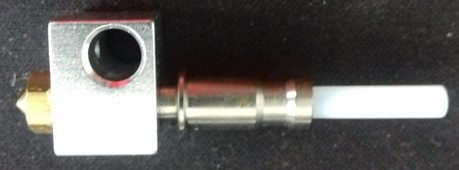  
    

??? info "Spare Part Hotend"

    - If you need a new hotend because your heater block or the heatbreak needs to be changed, you can get yourself the spare part hotend for the regular *Kobra* as shown in the picture below.   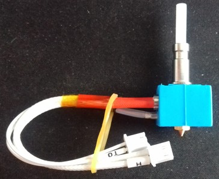   If you look at the picture of it and compare it with the one from the **Neo** I've shown above, you'll notice that the shape of the heatbreak is the same.   You can *not* use the thermistor and the cartridge heater that come with it thought, as the wires aren't long enough - at least not without tinkering.   
    - If the old thermistor and/or cartridge heater are still good and the wires aren't harmed, you don't have to look around for getting new ones! Just take the existing ones out of the old heater block and install them into the new one.    
    - However, scroll down and check out the "Disassembling" section below to see how to dis- and reassemble it. *Maybe you don't need new parts, so try to clean up everything first and reassemble it before ordering new parts right away.*  

---

#### Disassembling The Hotend
If you need to dismount the hotend from the printhead to change it or if you need to disassemble it, check out the expandable textbox below for further instructions. 

!!! warning  

    - When pulling out the hotend at the **Neo**, *make sure the PTFE tube placed in the heatbreak comes out, too!*  
    - Inspect the PTFE tube if it's burned, deformed  or clogged - if so, get a new one as a replacement (I'd recommend using a Capricorn bowden tube). Make sure the filament runs through the tube nice and easy and without any friction.   
    - When pulling out the hotend, *be careful to not break any wires or rip them off from the sensor and heater catridge* - so better unscrew the tiny hex screws a bit and take out the thermistor and the heating cartridge first as mentioned above. 
    - Check the wires and contacts if they aren't harmed and if everything is ok. 
    - ***Never try to unscrew the heatbreak and/or the nozzle from the heater block while the parts are cold!*** 
      Melted filament or some kind of screw lock glue might make it hard or even impossible to unscrew these parts and you risk to shear them off!  

!!! danger  

    *If you can see bare wire shining through the isolation of the wires of either the thermistor or the cartridge heater, I'd strongly recommend to replace the component to not risk a shortcut and therefore a broken mainboard!*   
  
??? example "Disassembling Procedure"  

    - Before you start to disassemble the hotend, heat it up to about 220-230°C first. Once it reached the temperature, turn off the printer.  
    - Loosen up the screws which hold the thermistor and the cartridge heater in place and pull them out of the heater block.      Be careful to not rip any wires!  
    - Loosen the nozzle and the heatbreak. You can already take out the nozzle completely and unscrew the heater block from the heatbreak as well - just make sure you don't burn yourself.   
    - Disassemble the fan on the right side by taking out the two hexagon socket screws at the top and bottom of the fan frame.     
    - Then you'll see two hexagon socket screws at the side which are holding the hotend - loosen them until you can gently pull out the hotend.      You could've seen the heads of the screws already earlier before disassembling the fan, but you wouldn't have been able to reach them as the following picture shows.     
    - You can now pull out the heatbreak. Make sure the PTFE tube comes out as well.   

??? example "Reassembling Procedure" 
  
    - Screw the heatbreak into the heater block to the corresponding depth and screw in the nozzle from the other side until they touch. Don't tighten up the nozzle yet!  
    - Put back the cleaned or renewed PTFE tube.  
    - Put the thermistor and the heater cartridge back in place and secure them by *carefully* tighten the tiny hex screw - *don't overtighten them as you could harm the thermistor and the heater cartridge!*  
    - Then push the heatbreak back into the specific hole of the heatsink - make sure you push it deep enough (I personally push it as far into it as it goes).  
    - Turn the hotend so that the wires which are coming from the heater block are hanging freely and aren't bent too much.  
    - Then tighten up the two hexagon socket screws at the heatsink which hold the heatbreak in place, so that the hotend doesn't turn or wiggle anymore (but don't overtighten the screws though) and mount the heatsink fan back into place.  
    - Turn on the printer and heat up the nozzle to ~230-240°C. Once the temperature is reached, tighten up the nozzle with about 1.5NM force. Make sure to hold the heater block in place and strictly avoid any movement of it! Don't touch or harm any wires!  
    - Mount the plastic cover.   

---
    
#### MOD: Different Hotend 
Besides the stock hotend you can also just get or build yourself your own hotend by using a V5 compatible heatbreak and heater block which fits just fine. When doing so, pay attention to the dimensions though, as e.g. a lower position of the nozzle due to a longer heatbreak requires adaptation of the position of the part cooling fan duct!  

Genereally speaking, it's also possible to upgrade to a completely different system, like a V6, a Volcano or a MK8 - if you're willing and capable of tinkering. In that case I assume you already know what you should pay attention to, so I won't go deeper into this.  

The following pictures show two hotends I built myself from third party manufacturer parts. In both cases I used an original E3D V6 nozzle, a plated copper V5 heater block and a Capricorn XS PTFE tube for 1.75mm filament. Then I used a heatbreak for V5 compatible heater blocks where the PTFE tube goes all the way down to the nozzle (like the stock one) for printing PLA, and a bi-metal heatbreak where the PTFE tube only sticks into the top of the heatbreak for ~4mm for printing PETG and other material that needs higher temperatures.  

  

The following pictures show each hotend being disassembled. You can clearly see the shorter PTFE tube of the hotend with the bi-metal heatbreak.  

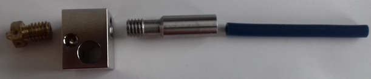  

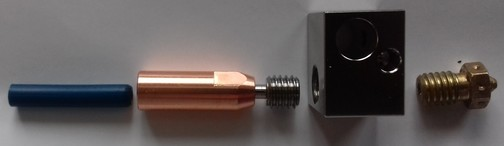

!!! warning "Adjust The Position Of The Part Cooling Fan"  

    If you're going to use a heatbreak which is longer than the stock one, pay attention to the part cooling fan duct / fan duct outlet. As the whole hotend setup will be slightly longer and the nozzle will be positioned a bit lower, you need to adjust the position of the fan duct (outlet), so that it doesn't point the airstream onto the nozzle, but onto the printed part.  
    As the fan duct models being available at Thingiverse, Printables etc are made for the stock setup, you'll have to modify the design, so that the outlet will come lower.  
    I did this for two models, but as I want to finetune that a bit and don't have an account there yet, I didn't put those modified version online yet. Once I did that, I'll link to them, so that you can just print them without the need of extra modification.  

!!! warning "Lower Your Retraction Distance When Using A Bi-Metal/All-Metal Heatbreak"

    When using a bi-metal/all-metal heatbreak, keep an eye on your retraction distance setting. Generally speaking, you should decrease/lower that value.
     
---  

## Heatbreak

The stock heatbreaks aren't the worst out there, but they aren't the best either. So you might reach the point that you want to upgrade to one from the aftermarket.  

??? info "Spare Part Heatbreak"

    If you need a new heatbreak, you should be able to use whichever V5 compatible heatbreak you'd like to use, you just have to *pay attention to the dimensions*. It should be about the same length as the stock one, so don't buy anything significantly shorter or longer. Make sure to pay attention to the surface at the top part - that should be even and smooth, so don't get yourself the ones with the thread on the outside.   

---

### Go

The heatbreak of the **Go** is plugged into the heatsink and secured by two screws.  
It has a M6 thread to fit the V5 type heater block.  
The overall length is about ~26mm; the length from that 'ring' until the end of the heatbreak is ~17mm.  
The outer diameter is 6mm.  

The following picture shows the heatbreak of the **Go** as it's screwed into the heater block.  

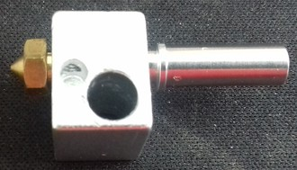

---

##### MOD: Different Heatbreak
As nobody reached out to me yet, I can't show or suggest any solutions of alternative hotends for the **Go** - sorry about that. From my perspective (I don't own the **Go** though!) it should be possible to replace the existing hotend with one from the aftermarket though, if you pay attention to the specific dimensions.  

---

### Neo

The heatbreak of the **Neo** is plugged into the heatsink of the direct drive and secured by two screws.  
To fit the V5 type heater block, it has an M6 thread.  
The outer diameter of the heatbreak is 7mm at the thick part (top and bottom), at the smaller part between it's 6mm. The inner diameter is about 4.2mm.  
The length measured from the top until the 'stop ring' before the thread is 15.5mm and the length in total is about 24.6mm.
As this isn't a bi-metal/full metal heatbreak, there is a little PTFE-tube inside of it which goes all the way down to the nozzle, which is about 4cm long and 4mm thick with a 2mm hole inside of it to guide the 1.75mm filament.  

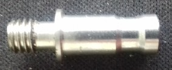

---

#### MOD: Different Heatbreak

The following picture shows three heatbreaks next to the stock one from third party manufacturers which I use in my **Neos**.  
At the very left hand side the stock heatbreak is shown. Next to it is a ~27mm heatbreak from the aftermarket which takes a PTFE tube as an inliner just like the stock one does. Next to it, you see a 24mm long version and a 27.5mm long version of a copper bi-metal heatbreak.  

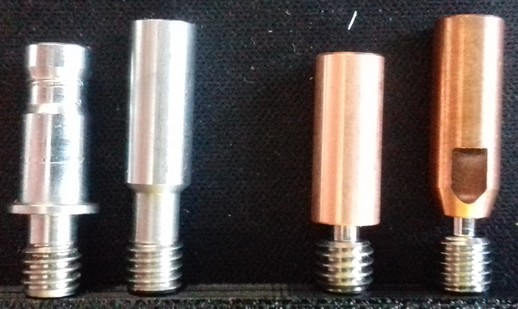

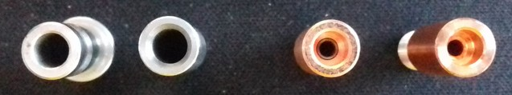

*You can use all of them due to the same outer diameter of the heatbreak's throat which is 7mm, but you have to adjust the position of the fan duct outlet accordingly.*  

!!! warning "Adjust The Position Of The Part Cooling Fan Duct (Outlet)"  

    If you're going to use a heatbreak which is longer than the stock one, pay attention to the part cooling fan duct / fan duct outlet. As the whole hotend setup will be slightly longer (or shorter if you use the 24mm heatbreak) and the nozzle will be positioned a bit lower (or higher if you use the 24mm heatbreak), you need to adjust the position of the fan duct (outlet), so that it doesn't point the airstream onto the nozzle, but onto the printed part.  
    As the fan duct models being available at Thingiverse, Printables etc are made for the stock setup, you'll have to modify the design, so that the outlet will come lower.  
    I did this for two models, but as I want to finetune that a bit and don't have an account there yet, I didn't put those modified version online yet. Once I did that, I'll link to them, so that you can just print them without the need of extra modification.  

!!! warning "Lower Your Retraction Distance When Using A Bi-Metal/All-Metal Heatbreak"

    When using a bi-metal/all-metal heatbreak, keep an eye on your retraction distance setting. Generally speaking, you should decrease/lower that value.
     

!!! warning "Bi-Metal/All-Metal Heatbreak And PLA"

    When using a bi-metal or all-metal heatbreak, it may cause and increase clogging problems when printing PLA. So up to me always go with a heatbreak that uses a PTFE inliner all the way down to the nozzle in case you're only or mostly printing PLA.  
    If you've changed the PTFE tube to a Capricorn one, then you still can print PETG, as those Capricorn tubes can take slightly higher temperatures than the cheap ones. 

---

## PTFE tube  
Both printers use a PTFE tube for 1.75mm filament. The outer diameter is ~4mm, the inner diameter of the stock tube is ~2mm.  

!!! warning "Pay Attention When Installing A New PTFE Tube" 

    When installing a new PTFE tube (either at the **Go** as a bowden or at the **Neo** as an inliner for the heatbreak), make sure it runs down through the heat break to the end of the nozzle and touches it.  
    *Pay special attention to make a clean and perpendicular cut at a 90° angle to avoid any small gaps between the nozzle and the end of the tube!*  
    You can use a special cutter that comes in certain sets with a Capricorn XS tube, print one of the many available cutting guides or just cut along the end of the heatbreak, using it as a guide for the knife.  
      

??? info "Spare Part PTFE Bowden Tube"

    If you need a new PTFE bowden tube, I'd recommend to get the 4mm "Capricorn XS" tube for 1.75mm filament at the length of 1m. Then just cut the belonging length and replace the old bowden tube. You can also get it in a set with a cutter.  
        

---

### Go  
The PTFE tube at the **Go** is about 400mm long as it's a bowden drive system.  

When installing a new bowden tube or cutting off a bit at the end to get rid of a deformed and/or clogged part, make sure to always cut it perpendicular and that it reaches all the way down to the nozzle.  

---

### Neo
The PTFE tube at the **Neo** is about 41-44mm long as it's a direct drive system. Here the PTFE tube only is an inliner for the heatbreak.  

  

*At all of the eight printheads with the stock hotends I examined, the PTFE tubes not only were too short, they also were all of a different length and none of them was cut perpendicular which will cause clogging issues later when printing.* So pay attention to that.  

The one replacement tube for the stock hotend setup I cut with the heatbreak being pushed into the heatsink completely was about ~43.7mm long. As I replaced the stock hotend parts right away, I only made a few prints with that setup for test purposes though.  

When you need to cut a new inliner and you're not sure about the correct length, the best would be to actually disassemble the hotend, so that you can install the heatbreak only. Push it into the heatsink as far as you can. Then push the replacement tube into the heatbreak from the bottom, until you can't stick it in any further. Then either cut along the end of the heatbreak or mark that spot and cut it perpendicular afterwards. Then the length should fit - at least it should fit better than the stock inliner.  

!!! warning "Check The PTFE Tube"  

    The stock PTFE tube which acts as an inliner for the heatbreak isn't the best quality. It will deform, burn and melt at certain temperatures. These inliners can also clog and especially the stock one adds friction to the whole filament feeding system.  
    So it's adivsable to check the state of this inliner from time to time to make sure everything is fine here. If you notice that the quality of your prints decreases, that you have to run higher retraction settings or that more stringing occurs, you might face a deformed or clogged inliner.  

    I personally can highly recommend using Capricorn XS tube instead of the stock one, as those can stand higher temperatures as well as the surface itself is smoother and therefore friction is lowered.  

---
  
## Heater Block
Both printers use an E3D **V5** type heater block.  
Both the thermistor and the cartidge heater have to be plugged into the specific holes and should be fixed with at tiny grub screw (HEX 1.5).  
  
  

!!! danger "Check The Grub Screws From Time To Time"

    Check the grub screws/set screws of the heater block and the position of the cartridge heater and the thermistor from time to time!  
    Due to expansion and contraction of the aluminum heater block and the vibrations that occur, those screws can come loose - which then can result in a part being slipped out!  
    *This is a serious potential of a fire hazard!*    
    See the following picture of a user where the cartridge heater slipped out of the heater block.  
      

---

### MOD: Different Heater Block

!!! warning "Execute A PID Tuning"

    Whenever you change something at your hotend setup, remember to execute a PID tuning.  

You can pick any V5 type of heater block you want if you have to exchange or want to mod/upgrade your existing hotend.  
However, it might be smart to not get the cheapest one available as they sometimes lack of precision and therefore may cause problems with leaking filament.  

Usually the heater blocks are made of aluminum, but you can also get them made of plated copper (which I personally use and highly recommend) as shown in the following picture.  

    
There are also ceramic heater blocks on the market which come with M6 threads - those ones can be used as well. The following picture shows one of these already being mounted.  

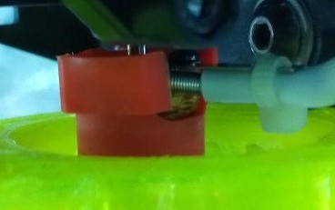

However, as they come with an inbuilt heating element and an inbuilt thermistor, make sure to get yourself the correct type regarding the specs.  
Also pay attention to the length of the wires of these units and the connectors they're coming with - it might be necessary to do a bit of a tinkering to get these ones installed.  
Last but not least check the height of these units and compare it to the V5 heater block setup - most likely it will be necessary to adjust the position of your fan duct and the settings as well.   
 
    
---   
  
## Silicone Sock
The silicone sock that comes with the hotend insulates the heater block. Therefore it should stay in place and shouldn't come off, as it *might* cause the "thermal runaway" error.  
  
The following pictures shows a V5 heater block compatible silicone sock from the aftermarket on the left side and the stock sock on the right side.     
  
   
  
Additionaly, the ones from the aftermarket also cover and therefore insulate the base of the nozzle - something that the stock ones don't do at all.  
  
  
  
??? info "Spare Part Silicone Sock"  

    The sock which comes with the printhead isn't the best one to use (in my opinion) as it seems to come off pretty easily. There are compatible V5 silicone socks at the aftermarket which I personally use and which I can highly recommend. They have a bigger lip which slips over the heater block and covers a bigger area of the top than the one which comes with the printer. Therefore they stay in place much better when they heat up and become more flexible.    
    If you read the above and still don't know what you should look or search for, search for "silicone sock V5" for example as these socks are for a V5 heater block. You can get them pretty much everywhere, so if you use to shop at Amazon or ebay for example, you'll find many offers which are pretty much the same at the end.   Just make sure that you're **not** getting the ones for a V6 or a volcano heater block! You can also diffenrentiate them by already looking at the shape: the wrong ones for the V6 are more flat on one side, the *correct ones* for the V5 are more *cubic* as you can see at the pictures above.  
  
---  
  
## Thermistor 
The thermistor which is used is a capsuled NTC 100k. Based on the setting of the firmware it's an ATC Semitec 104GT-2/104NT-4-R025H42G (4.7k pullup).  
The diameter is 3mm, the length should be minimum 6mm as that is the depth of the hole in the heater block and the length of the wire is about 150cm.   

The following picture shows the stock thermistor being used.  

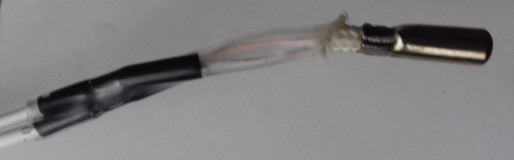

The following picture shows the connector being used, it's a regular two pin JST XH-2.54 type.  

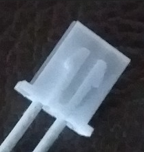

!!! danger "Check The Grub Screws From Time To Time"

    Check the grub screws/set screws of the heater block and the position of the cartridge heater and the thermistor from time to time!  
    Due to expansion and contraction of the aluminum heater block and the vibrations that occur, those screws can come loose - which then can result in a part being slipped out!  
    *This is a serious potential of a fire hazard!*    
    See the following picture of a user where the cartridge heater slipped out of the heater block.  
      

??? info "Spare Part Thermistor"  

    You should be able to find and use a compatible item from the aftermarket (which I successfully did - you just have to pay attention to the wire length actually).  
    The following picture shows the thermistor from the aftermarket I used and the specific plug which is necessary to fit in the belonging socket at the mainboard.  
      

??? info "What Is A 100k NTC Thermistor?"

    A thermistor is an electronical part which changes resistances depending on the given temperature, the resistance will then be interpreted as a temperature reading. The thermistor being used is a 100k Ohm NTC type. That means, that it has a resistance of about *100k Ohm at 25°C* temperature.  
    When the temperature drops, the resistance will become higher/bigger. When the temperature rises, the resistance will become lower/smaller.  
    As an example: at 20°C the resistance is about 125k Ohm; at 30°C the resistance is about 81k Ohm.  
    Therefore you can measure the functionality of the thermistor by measuring the given resistance with a multimeter.  
    For further information please read the expandable textbox "Measuring / Checking The Thermistor" in the section below.  
    
---

### Checking And Replacing The Thermistor 

If problems occur with the electric circuit or the thermistor, you can check each of them for localizing the cause of the error.  
You'll need a [multimeter](../tools.md#multimeter) for doing so.  
Basic knowledge of how to use a multimeter is sufficient - if you don't know how to use a multimeter, please do a web research. If you don't know how to measure resistance, you can start by reading [this article](https://www.fluke.com/en-us/learn/blog/digital-multimeters/how-to-measure-resistance) for example which describes the process.    

!!! warning "Turn Off The Printer And Unplug The AC Connection"

    Before attempting any measurements, *turn off the printer and unplug the AC connector first!*  

!!! danger "Electrical Shock And Severe Damage Possible"

    It's possible to experience an electrical shock and cause severe damage to your printer if you do measurements with the unit being powered on!  
    
    Unless you *have to have the printer powered* on because you need to check certain functions (e.g. if the power supply is working and delivering the belonging 24V for driving the components), *always* turn off the printer and unplug the AC connector first!  
    
    *Doing measurements with the unit being powered on should only be done if you ***really*** know what you're doing!*  

---

#### How To Check The Thermistor

The following expandable textboxes will give you some basic instructions what you can do to check the electric circuits of the thermistor.  
  
??? example "Measuring / Checking The Wiring"  

    Before attempting any measurements, do a visual check if the insulation of the thermistor's wires is still intact.  
    
    *If you can see bare wire shing through due to a melted and/or displaced insulation, change the part immediately!*  
    
    Don't try to cover it up with some kind of insulation, even though Kapton tape should stand the heat. You'll risk a shortcut which then will harm your motherboard and might even cause more severe damage!  
        
    You can check the wiring of the thermistor by measuring the electrical continuity of the wires. If your multimeter doesn't have this function, you can measure the resistance instead. 
    
    However, *it's advisable to measure the resistance, even though your multimeter offers the function of probing for continuity,* because it might be the case that a wire still passes the check for continuity, but that individual strands of the wire are broken. This causes problems if those strands lose contact permanently or during movement of the printhead, as it leads to a higher resistance and therefore a wrong temperature being reported.  
      

??? example "Measuring / Checking The Thermistor"  

    You can check if a thermistor is working or if it's broken by measuring the resistance of it using a multimeter. As described above, at a temperature of 25°C the resistance should be ~100k Ohm (nominal restistance: R25°C = 100 kΩ ± 1%). If the temperature is lower, the resistance value will be higher; if the temperature is higher, the resistance value will be lower.  
    The following table gives you some typical resistance values of a 100K thermistor type 3950 (generic) for temperatures around room temperature. The values might slightly vary from the one you'll get, but they should be pretty close.  
    
    | Temperature in °C | Resistance in kΩ (kilo Ohm) |  
    |:-----------------:|:-----------------------------:|
    | 15° | ~157 kΩ |
    | 20° | ~125 kΩ |
    |**25°**| **~100 kΩ** |
    | 30° |  ~81 kΩ |
    | 35° |  ~65 kΩ |

    *Set your multimeter to resistance testing for a higher Ohm range - in most cases the multimeters have different settings, usually 200/2000/20K/200K/20M -> use the setting "200K" here.*  
    
    You can measure by probing the belonging wires at the plug of the mainboard (unplug it!), that would be the black connector labeled as "T0" with the two white wires (see the chapter ["Mainboard" -> "TriGorilla V_3.0.6 (Stock)"](mainboard.md#trigorilla-v_306-stock) for a picture of the location).  
    Keep in mind though that by doing so you also measure the wiring itself. Means, if there are e.g. broken wires, the thermistor won't work even if the thermistor itself is still fine. Due to the construction of the thermistor and it's wiring, you'd have to replace the whole unit anyway though.   
     

---

#### How To Replace The Thermistor

If you need to replace the cartridge heater and/or the thermistor of the hotend, see the expandable textboxes below for further instructions.  

*Of course always turn off the printer and unplug it from the power outlet first and then unplug the belonging connector at the mainboard before attempting replacing either component.*  

When replacing the thermistor, *make sure you don't overtighten the tiny grub screws / set screws which hold them in place as it could harm both the thermistor and the heater cartridge!*  
Note the dent from the screw and the deformed thermistor due to an overtightened screw from the manufacturer at my **Neo**.      

??? example "Replacing The Thermistor"

    If you need to change the thermistor, you should be able to do so by loosening the tiny set screw / grub screw in the heater block which holds it in place. As the screw and the thread might be blocked by hardened filament, heat up the hotend first to get it soft. Turn off the printer then and pay attention to not burn yourself when approaching to change it.  

    If the screw is unscrewed enough and doesn't hold the thermistor in place anymore, you should be able to pull it out of the heater block. If it doesn't seem to move, carefully grab the metal part with a small pair of pliers, twist it a bit and try to pull it out.  
    Then insert the new thermistor until it won't slide into the belonging hole anymore and carefully tighten up the grub screw. Don't overtighten it though as you don't want to harm the thermistor.  

---

## Cartridge Heater

The cartidge heater which is used is a **24V 40W** element.  
The diameter is 6mm, the length of the original part is about 18mm, the length of the wire is about 150cm.  

The following picture shows the stock cartridge heater being used.  

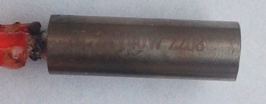

The following picture shows the JST VH 3.96 connector which is necessary to fit into the socket at the mainboard.  

!!! danger "Check The Grub Screws From Time To Time"

    Check the grub screws/set screws of the heater block and the position of the cartridge heater and the thermistor from time to time!  
    Due to expansion and contraction of the aluminum heater block and the vibrations that occur, those screws can come loose - which then can result in a part being slipped out!  
    *This is a serious potential of a fire hazard!*    
    See the following picture of a user where the cartridge heater slipped out of the heater block.  
      
  

??? info "Spare Part Cartridge Heater" 

    You can find suitable cartridge heaters on the aftermarket. You'll probably only find some which are about 21mm long as it seems that it's a typical dimension for V5/V6 heater blocks, but that's fine, it just sticks out at both sides of the heater block at the end which shouldn't be a problem. The following picture shows the original part on the left side and a compatible part from the aftermarket I used at the right side.  
  
      
  

!!! warning "Replacing The Cartridge Heater / Thermistor" 

    See the section ["Checking The Cartridge Heater And The Thermistor"](#checking-the-cartridge-heater-and-the-thermistor) at the end of this chapter for further instructions about how to check and replace those components. 
   
??? tip "General Tips" 

    - If you need to install a new thermistor and/or cartridge heater, you have to unstrip the wires from the wire conduit. You can just unroll the conduit, pull out the wires from the old part while tugging in the wires of the new part. Be careful to not pull too hard to not harm any thin wires which might be wrapped around the wires of the old part.       
    - When installing the parts at the heater block and putting back on the plastic cap of the printhead, I personally avoided to bend the thin wires as it was done within the original installation. I just guided the wires along outside the plastic cover. By doing so, you minimize the risk of getting a shortcut due to a harmed or melted wire isolation at the part where the wires are bent and twisted originally. The following picture shows my new installed thermistor and cartridge heater with the wires running outside of the plastic cap.     

??? info "Ceramic Heater Block With Inbuilt Heating Element"

    There are ceramic heater blocks on the market which come with M6 threads and an inbuilt heating element (24V, 55W) and a thermistor (100k, most likely it's a "Generous 3950" type). The wires usually aren't long enough for these printers and lack the belonging plugs as well, so further tinkering is necessary to get these ones installed.  

??? tip "Execute PID Tuning"      
    
    After successful installation of the new thermistor and/or cartridge heater, execute a [PID tuning](calibration.md#pid-tuning) using e.g. Octoprint!  
    
---

### Checking And Replacing The Cartridge Heater 

If problems occur with the electric circuit or the thermistor, you can check each of them for localizing the cause of the error.  
You'll need a [multimeter](../tools.md#multimeter) for doing so.  
Basic knowledge of how to use a multimeter is sufficient - if you don't know how to use a multimeter, please do a web research. If you don't know how to measure resistance, you can start by reading [this article](https://www.fluke.com/en-us/learn/blog/digital-multimeters/how-to-measure-resistance) for example which describes the process.    

!!! warning "Turn Off The Printer And Unplug The AC Connection"

    Before attempting any measurements, *turn off the printer and unplug the AC connector first!*  

!!! danger "Electrical Shock And Severe Damage Possible"

    It's possible to experience an electrical shock and cause severe damage to your printer if you do measurements with the unit being powered on!  
    
    Unless you *have to have the printer powered* on because you need to check certain functions (e.g. if the power supply is working and delivering the belonging 24V for driving the components), *always* turn off the printer and unplug the AC connector first!  
    
    *Doing measurements with the unit being powered on should only be done if you ***really*** know what you're doing!*  

---

#### How To Check The Cartridge Heater

The following expandable textbox will give you some basic instructions what you can do to check the electric circuits of the 24V catridge heater.  
  
??? example "Measuring / Checking The Wiring"  

    Before attempting any measurements, do a visual check if the insulation of the cartridge heater is still intact. 
    
    *If you can see bare wire shing through due to a melted and/or displaced insulation, change the part immediately!*  
    
    Don't try to cover it up with some kind of insulation, even though Kapton tape should stand the heat. You'll risk a shortcut which then will harm your motherboard and might even cause more severe damage!  
    
    You can check the wiring of the 24V line by measuring the electrical continuity of the wires. If your multimeter doesn't have this function, you can measure the resistance instead.  
    
    However, *it's advisable to measure the resistance, even though your multimeter offers the function of probing for continuity,* because it might be the case that a wire still passes the check for continuity, but that individual strands of the wire are broken. This causes problems if those strands lose contact permanently or during movement of the bed, as it leads to a higher resistance.  
    Here at the at the 24V wires this can lead to the circumstance that the wire will get hot at that spot, that the insulation will melt, that a shortcut might occur and it might even occur that it causes a fire.   
          

??? example "Checking The 24V Heating Circuit Of The Cartridge Heater"  

    You can also check the 24V heating circuit of the cartridge heater itself. Besides inspecting it closely if any visible damages like scratches or abraded spots are visible, you can measure the continuity and resistance of the circuit as well.  
    
    If the circuit and the cartridge heater is ok, continuity will be given and a resistance of about 14.5 Ohm should be reported.  

---

#### How To Replace The Cartridge Heater

If you need to replace the cartridge heater of the hotend, see the expandable textboxes below for further instructions.  

*Of course always turn off the printer and unplug it from the power outlet first and then unplug the belonging connector at the mainboard before attempting replacing either component.*  

When replacing the thermistor and/or the cartridge heater, *make sure you don't overtighten the tiny grub screws / set screws which hold them in place as it could harm both the thermistor and the heater cartridge!*  
Note the dent from the screw and the deformed thermistor due to an overtightened screw from the manufacturer at my **Neo**.      
 
??? example "Replacing The Cartridge Heater"  

    If you need to change the cartridge heater, you should be able to do so by loosening the tiny set screw / grub screw in the heater block which holds it in place. As the screw and the thread might be blocked by hardened filament, heat up the hotend first to get it soft. Turn off the printer then and pay attention to not burn yourself when approaching to change it.  

    If the screw is unscrewed enough and doesn't hold the cartridge heater in place anymore, you should be able to pull it out of the heater block. If it doesn't seem to move, carefully grab the metal part with a small pair of pliers, twist it a bit and try to pull it out.  
    Then insert the new cartridge heater, so that it's placed completely inside of the belonging hole and carefully tighten up the grub screw. Don't overtighten it though as you don't want to harm the cartridge heater. 
  
---  
  
## Nozzle
Anycubic ships the printheads with a 0.4mm **E3D V6 type** brass nozzle for 1.75mm filament.  
  
  

So if you're looking for replacement nozzles, make sure to get yourself the correct type: it's a E3D **V6** type of nozzle!  
I highly recommend to only use high quality nozzles, like the [**original E3D V6 nozzles**](https://e3d-online.com/products/v6-nozzles) (see the infobox below as well)!  

If you're about to print *highly abrasive* types of filament, like "wood" or "glow in the dark" PLA for example, get yourself a hardened steel nozzle or a tungsten carbide nozzle, as regular brass nozzles will be worn out in no time. The following picture shows an "E3D Nozzle X" hardened steel nozzle.  

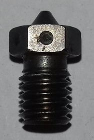  

If you're planning on printing on much higher speeds and need a higher flowrate than a regular nozzle can offer in this stock hotend setup, you can get yourself a "CHT high flow" nozzle. These ones have a special designed copper inlet in the shaft of the nozzle, which splits up the filament in three parts which then results in a much higher flowrate. The following picture shows this kind of design at a cheap CHT nozzle clone.  

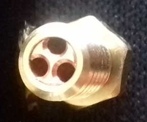  

*Whichever kind of nozzle you decide to get - always make sure to choose an E3D ***V6*** type of nozzle!*  

!!! warning "MK8 Nozzles DON'T Fit!"

    Because some people in various forums and in Youtube videos obviously claim that it's a MK8 nozzle which is being used, I wanna point this out once again: **MK8 is NOT the correct type of nozzle!**  
    Even though MK8 nozzles have a M6 thread and therefore fit in the heater block, the thread is too short! The end of the nozzle won't touch the heatbreak as it's supposed to - and this will create severe problems (e.g.: clogs, burnt filament, leaking filament out of the threads of the heater block).  
    So just get yourself the correct type of nozzle, which is an E3D **V6** type!  
    
    
!!! warning "Nozzles: Handle With Care!" 

    - *Be careful to NOT touch and harm the wires and contacts of the thermistor and the heating cartridge with at brass brush or the wrench!*   You may either harm the insulation, break the wire or even cause a shortcut which can result in a broken mainboard once you powered the printer up again. 
    - If you want to change the nozzle (*check out the expandable admonition below!*) and need to grab the heater block with a wrench, make sure you really just grab the heater block and never get any wires up in between - preferably grab the heater block from that sides where the wires don't come out.   
    - If you want to clean the nozzle using a brass brush for example, *never* do it when the printer is powered up and the heating process of the extruder is in progress to avoid causing a shortcut by touching the contacs with the brush.  
    - *Make sure you DON'T turn the heater block!* In case you want to change the nozzle, you don't want to loosen the heater block from the hotend, so just hold the heater block in place without turning it.     
    - *Don't do cold pulls for cleaning a nozzle when using any kind of coated nozzles!* This also involves hardened steel nozzles! Referring to the manufacturers, the coating might be harmed when doing so.   
    
??? info "About Nozzles In General" 

    - *Do yourself a favour and don't buy those cheap brass nozzles where you'll get a dozen of them for a few bucks.* It's just not worth it.  
    Remember that the nozzle is pretty much the most crucial part when it comes down to printing and achieving good results, as it's the last link in the chain of the print process and puts out the filament - so go for an established manufacturer who is known for producing quality nozzles.  
      Means, avoid those cheap sets of nozzles where you get a dozen nozzles for a few bucks. Those often lack quality: the bore might be off-center and/or might have a burr (which leads to heavy stringing), the thread might not be precise (which leads to leaking) and so on.  
      I personally only use [**original E3D V6 nozzles**](https://e3d-online.com/products/v6-nozzles). Yes, they are a bit more expensive than the super cheap ones, but it's still a good price and it's really worth it - they last longer, they're precisely made and you'll get much better results. As long as you don't want to print special abrasive filaments, you're always good with the standard E3D V6 brass nozzles.  
  
    - If you want to print filaments that are more abrasive, you probably want to go with nozzles made from plated copper, stainless or hardened steel, ruby sapphire nozzles and so on. Check out the web for further and more specific information about what to choose.  
      Be aware of the fact though, that the manufacturers *clearly advise against doing cold pulls with any kind of coated nozzles*! This also involves hardened steel nozzles! Referring to them, the coating might be harmed when doing so.  
    
    - When it comes down to choose the right nozzle size, it all depends on what you want to print and how detailed it should be. The standard size of 0.4mm the printers come with is a good starting point.  
      However, you may find yourself in the situation that you want to print more detailed objects or objects which should be more sturdy or where it doesn't matter if the surface doesn't look as clean and flat as possible, so you probably should adjust the size and switch to a smaller oder bigger diameter like 0.2-0.3mm for high detailed objects and 0.6mm for the 'rougher' prints.   
      Keep in mind though that the printing time usually increases by choosing a smaller diameter and it decreases when you're using a bigger diameter.  
      The printing time as well as the quality also depends on the [layer height](../calibration.md#layer-height) you're using, so by choosing a smaller layer height you can also get detailed and great looking prints with a 0.6mm nozzle.  
      Last but not least a smaller nozzle bore is more likely to clog and some filaments even have a sticker on the spool saying that e.g. it should be printed with minimum a 0.4mm nozzle. So choose wisely if you really want to use a nozzle with a 0.2mm bore for example.  
      Search the web for more specific information about finding and choosing the right nozzle size for your project. You may want to start with this article from [All3DP: The Best 3D Printer Nozzle Types, Sizes & Materials](https://www.all3dp.com/2/3d-printer-nozzle-size-material-what-to-know-which-to-buy). 
  
    - In case you're using *Cura* as a slicer, make sure you update to the current version v5.x (Note: It doesn't run at Ubuntu versions below 20.x though) as it uses the new Arachne engine and offers better quality as a result of that. In case you never heard of that, I recommend to watch the following videos from [Thomas Sanladerer](https://www.youtube.com/channel/UCb8Rde3uRL1ohROUVg46h1A) or read the articles at his page [https://toms3d.org/](https://toms3d.org/) where he shows the result of using a 0.6mm nozzle with Cura v5.x comparing to a 0.4 nozzle using Cura 4.x (SPOILER: you barely can see a difference).  
  
        - [Video: 0.4mm nozzles just became obsolete](https://www.youtube.com/watch?v=WgXM2zPusXo)  
          [Article: 0.4mm nozzles just became obsolete](https://toms3d.org/2022/07/28/arachne-in-prusaslicer-0-4mm-nozzles-just-became-obsolete/)  
        - [Video: Get the benefits of a 0.6mm nozzle with a 0.4?](https://www.youtube.com/watch?v=nmigF5qyJ4M)  
          [Article: Get the benefits of a 0.6mm nozzle with a 0.4?](https://toms3d.org/2022/09/22/get-the-benefits-of-a-0-6mm-nozzle-with-a-0-4/)  
  
  
  
---  
  
### Cleaning The Nozzle
If you need to clean the nozzle during the printing procedure to take off excessive amount of melted filament or if the nozzle is clogged, mind the warnings from above and check out the following steps in the expandable block below.  
  
However, keep in mind that nozzles are consumables though, they won't last forever. So get yourself some good quality nozzles right away so that you can easily replace a nozzle which is too clogged or where the tip may already be harmed.  
A harmed tip or worn out nozzle may also cause artefacts like stringing for example, so also keep that in mind if you suddenly see yourself confronted with weird and unexplainable printing behavior (in terms of quality).  

!!! warning  

    *Don't do cold pulls for cleaning a nozzle when using any kind of coated nozzles!* This also involves hardened steel nozzles! Referring to the manufacturers, the coating might be harmed when doing so.  
    
  
??? example "Cleaning The Nozzle"

    - For cleaning the nozzle and getting rid of excessive filament during the printing process or right before printing starts as the extruder is heating up, you can use a long and thin wooden stick like a skewer. A wooden toothpick also works fine - just make sure you don't burn yourself as it may be a bit short. I personally use these long pipe cleaners which have this kinda cotton stuff all around them. It doesn't melt when touching the hot nozzle and filament sticks great to it.  
    - Before and after each print I recommend to wipe away the melted filament at the nozzle with a 'cotton' pipe cleaner, a paper towel or a cloth - but *don't burn yourself!* This procedure keeps the nozzle clean and the rest of the filament won't burn black onto the brass which makes it hard to remove later.   
    - If the nozzle is already too smeared and has too much filament burnt onto the surface to be cleaned with a paper towel, you can use a small brass brush. Be careful though to not harm the tip of the nozzle by scrubbing too hard across it! Be careful to *not* touch any wires or contacts during brushing at it may cause a shortcut and blow off your mainboard! So I'd suggest you heat up the nozzle and then turn off the printer before starting to brush.  
    - If the nozzle is clogged, using a needle with the correct diameter to stick it into the hot nozzle for cleaning it sometimes works. Just stick in in the heatened up nozzle and poke around. Be careful to not harm the tip of the nozzle though!  
    - You can also use certain filament which is made for cleaning. You load it and let it run through. 
    - If the nozzle is clogged and therefore the cleaning filament can't run through, you could also try to do a *"cold pull"*. To do so you heat up the nozzle to about 220°C, load the cleaning filament and manually push it through a bit. Then let the nozzle cool down to about 90-100°C and rip out the filament. You may have to repeat this procedure a few times until the cleaning filament can run through again. However, be careful not to rip off the filament by doing the cold pull as you then definitely have to disassemble the hotend.  
      *Attention: don't do cold pulls when using any kind of coated nozzles! This also involves hardened steel nozzles! The manufacturers say that it might harm the coating of the inside of the nozzle!* 
    - If you still encounter problems with the flow of the filament though or if you even can't load new filament, most likely the little PTFE tube inside of the heatbreak is clogged. Scroll down to the "Disassembling" section where you'll find a little guide about how to get it out and clean it.  
    - If you took out the nozzle from the heater block and can't get it clean, heat it up with a hot air gun. Then you can poke out the soft filament. You can also try to put it in acetone and let it sit there - the longer the better (I'd say minimum 24hrs). This method works especially great with ABS as that just dissolves, but it also works at least a bit with other types of filament like PLA (although not as good as with ABS at all) and makes it a bit softer. Then you can try to poke the filament out. This also works with the heater block and the heatbreak if you want to clean them also. Make sure to rinse them with water before installing though.  
  
---  
       
### Changing The Nozzle
If you need to change the nozzle, mind the warnings from above and check out the following steps in the expandable block below.
     
!!! warning  
        
    - ***Never try to unscrew the nozzle from the heater block while the parts are cold!***   Melted filament or some kind of screw lock glue will make it hard or even impossible to unscrew it and you risk to shear off the nozzle!  
    - Make sure you're holding the heater block tight to avoid *any* movement and don't overtighten the nozzle when installing it!   Reddit user [I_Sells_Drugs](https://www.reddit.com/user/I_Sells_Drugs/) was so kind to allow me to show pictures of [his attempt to tighten up the nozzle even more](https://www.reddit.com/r/anycubic/comments/10rf58m/does_this_mean_i_need_to_replace_entire_hotend/) as he got irritated by the little gap between the head of the nozzle and the heater block. He managed to shear off the heatbreak from the heater block as the following picture shows.         
     
??? example "Changing The Nozzle"  

    - If you just want to change the nozzle, take off the silicone sock of the heater block, then *heat up the extruder first* about 5-10°C above your regular printing temperature and pull back the filament a bit once it's warm enough. 
    - Once the extruder heated up, let it sit at that temperature for about a minute or two to make sure that even the last amount of filament which might stick somewhere in the gaps or the thread is melted. 
    - Then *turn off the printer* and ideally unplug it from the power outlet. Don't fiddle around while it's turned on - in case you slip with the wrench and harm the wires you could create a shortcut which most likely will blow something up of your mainboard.  
    - Then grab the heater block with a wrench to hold it in place and screw out the nozzle carefully. Use a sufficient tool like a wrench or a socket wrench for the nozzle - don't use a pair of pliers as it may/will round off the screw nut. 
    - Make sure you don't turn the heater block at all to not loosen it from the heat break! Just hold it in place.
    - If the nozzle won't come loose, heat up the extruder again, raise the temperature a bit and let it sit longer to melt the filament in the gaps which seems to block. Before trying to unscrew the nozzle, switch off the printer again.   If that still doesn't work, you could take a piece of damp cloth and hold it against the nozzle (*not* the heater block, *only the nozzle*!) for a moment to cool it down. Due to the sudden decrease of temperature the metal of the nozzle will contract a tiny bit which may result in being able to unscrew it.  
    - For installing the new nozzle, screw it in and turn it back about one rotation once you feel it hits the heatbreak. I personally do this after everything cooled down until it's safe to touch because then I can screw in the nozzle by hand and therefore I can feel right at the start if it doesn't sit correctly.
    - Check if you didn't harm any wires! 
    - If everything is fine, power up the printer and heat up the extruder again. Most nozzle manufacturers say that you should heat it up to about 250°C, but that might already harm the PTFE tube. So go with 230-240°.  
    - Then carefully tighten up the nozzle, but don't overtighten it though. However, you need to make sure that it's tight enough (about 1.5NM) and that it really touches the heatbreak! There shouldn't be any gap between the heatbreak and the nozzle inside of the heater block!  
    - Don't get irritated by the fact that there's a little gap between the head of the nozzle and the heater block oncce you installed everything correctly - that's totally fine and it's supposed to be like that as the following picture shows.        
             
---

## Part Cooling Fan  

The part cooling fans of the **Go** and the **Neo** are different.  

---

### Go

The **Go** uses a 24V, 0.08A, 40x40x10mm fan, model "Coolcox BF4010H24S".  

| Coolcox front side | Coolcox backside label |
|:-------------------|:-----------------------|
| 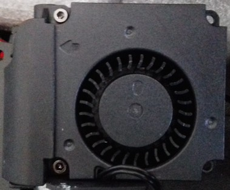 | 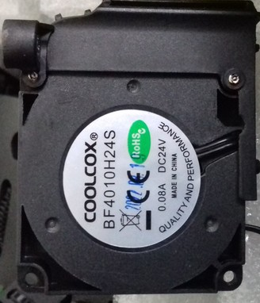 |  

---

### Neo
The **Neo** uses a 24V, 0.08A (early versions) or 0.10A (later versions), 45x45x10 type of fan.  

The first versions of the **Neo** have been supplied with the model "Coolcox BF4510H24S", which draws 0.08A.  

| Coolcox front side | Coolcox backside label |
|:-------------------|:-----------------------|
| 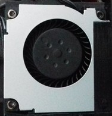 |  |  

At the newer versions of the **Neo**, it seems that Anycubic changed the model of the fan being used. The change probably took place somewhat in the middle of 2023.  
The fan which is now being used is a "HSC BCY4510D24E", which draws 0.10A.  

| HSC front side | HSC backside label |
|:-------------------|:-----------------------|
| 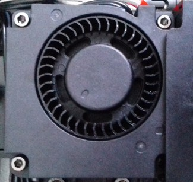 | 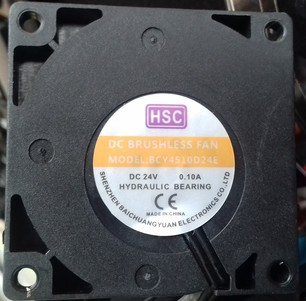 |  

  

!!! warning "Issues With The PWM Control"  

    It seems that the newer version of the fan, the HSC one, does have some issues with PWM control. It has been reported by @ProXinous that the fan doesn't work properly using lower speed settings that 100%. The both of us then did several tests and investigated this problem further, and it seems that this type of fan just isn't capable of working being PWM controlled. We're still investigating this issue, but for now there doesn't seem to be a solution other than swapping out that fan and using a different model. I'll update this warning note as soon as new insights have been gathered.    

---

## Fan Duct

As the stock fan ducts aren't very good in doing their job of part cooling, it's highly recommended to print a better one. This can be done as soon as you can print - you don't need to look out for perfect quality at this point yet. If you're only printing PLA right now, also that is ok for using it for the first enhanced fan duct.  
Due to the way better part cooling then, it'll massively improve the quality of the printed parts as well as puts you into position to successfully print stronger materials like PETG.  

Signs of improper cooling are e.g. weird molten-like patterns and prints that don't come out well in a specific area on one side of the model, mostly at the side which is opposite to the direction the stock fan duct is being positioned.   

*For the final fan duct it's highly advisable to print them with PETG due to the higher temperature resistance.*

In the following I'll list some of the fan duct models for the **Go** and the **Neo** I came across.  
The list is kinda outdated right now tho, I need to look around and add the models that were made since I searched the last time. Until then, maybe just do a little research on your own at Thingiverse and Printables.. ;)

---  
  
### Go  

***I highly recommend to print one of the fan ducts which replace the stock fan duct. It's a huge improvement!***  
It's advisable to (at least) print them from PETG if you're able to do that. If not, printing them from PLA is better than not printing them at all of course. It might happen though that a fan duct printed from PLA will sooner or later sag or deform due to the heat it's being exposed to. This shouldn't be much of an issue as long as you're printing PLA with e.g. a bed temperature of 60°, but if you're about to print PETG for axample, using a bed temperature of 80° (plus a higher hotend temperature), the fan duct will most like start to deform and sag.

- [MW-Mechanical](https://www.printables.com/de/social/455820-mw-mechanical) created an [Upgraded fan duct (exposed print head setup) for Anycubic Kobra Go](https://www.printables.com/de/model/338244-upgraded-fan-duct-exposed-print-head-setup-for-any) which is supposed to achieve better part cooling.
- [Gallapagos](https://www.thingiverse.com/gallapagos/designs) created a [Monomonster](https://www.thingiverse.com/thing:5741047) for the **Go** using a 5015 style blower fan.

  
---  
    
### Neo  

***I highly recommend to print one of the fan ducts which replace the stock fan duct. It's a huge improvement!***  
It's advisable to (at least) print them from PETG if you're able to do that. If not, printing them from PLA is better than not printing them at all of course. It might happen though that a fan duct printed from PLA will sooner or later sag or deform due to the heat it's being exposed to. This shouldn't be much of an issue as long as you're printing PLA with e.g. a bed temperature of 60°, but if you're about to print PETG for axample, using a bed temperature of 80° (plus a higher hotend temperature), the fan duct will most like start to deform and sag.  
  
- [Gregg Bennett](https://www.printables.com/de/social/221278-greg-bennett/about) created an [extension for the stock fan duct](https://www.printables.com/de/model/399159-air-duct-anycubic-kobra-neo-httpsyoutubeso7tb6e8yh) of the **Neo** which has to be mounted onto it and leads the airflow closer to the printed object underneath the nozzle. Based on my personal experience, I'd suggest to maybe print this one with the stock setup first, mount it and then print another, even better fan duct design.   
- [Martin](https://www.printables.com/de/social/443043-martin) created a [replacement for the stock fan duct ](https://www.printables.com/de/model/378928-anycubic-kobra-neo-fan-duct) of the **Neo** which is supposed to achieve better part cooling due to air flow from three sides.  
  He also created a [fan duct for a 5015 radial fan](https://www.printables.com/en/model/426167-kobra-neo-fan-duct-for-5015-fan/files) which replaces the stock parts.  
- [Marius Avasiloaie](https://www.printables.com/de/@MariusAvasiloaie) created a [360° circular fan duct](https://www.printables.com/de/model/498457-anycubic-kobra-neo-fan-duct) as a replacement of the original fan duct.
- [Kaan Okcu](https://www.printables.com/de/@KaanOkcu_682657) created a [180° fan duct](https://www.printables.com/de/model/470004-anycubic-kobra-neo-fan-duct) which replaces the stock fan duct.  

---

## Heatsink Cooling Fan  
Both printers use the same type of heatsink/coldend cooling fan: 24V, 0.03A, 40x40x10mm, model "Coolcox CC4010L24S".  

---

   
  

    

