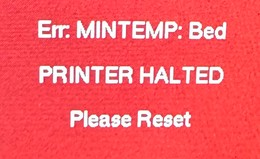

<link rel=”manifest” href=”docs/manifest.webmanifest”>

# Problems  
In this chapter I'll list some of the most common problems people seem to have and what to do about them. Of course this chapter won't cover all of the possible problems one would probably have to deal with, but at least some of the typical problems beginners struggle with will be covered. If you don't find the answer to your specific problem here, please do a research by your own - there are countless websites as well as YouTube videos out there.  

(Note: WIP, so maybe come back another time as well ;) )   

??? info "Anycubic Help Center"  

    Anycubic recently made up a website called "Help Center", where you can select your specific model and search around for problems and possible solutions. You might also wanna have a look at that one: ["Anycubic Help Center"](https://cloud-universe.anycubic.com/w/p/helpCenter/#/pages/machineClassification/machineClassification?id=2&name=FDM%25203D%2520Printer&type=0&isShowShare=true)  

---

## Troubleshooting Guides
There are many pages and troubleshooting guides out there to find, so maybe do a little research on that as well.  
However, to offer you an easier start right away, I'd like to mention a few troubleshooting guides here as well:  

- The [Print Quality Troubleshooting Guide](https://www.simplify3d.com/resources/print-quality-troubleshooting/) from [Simplyfy 3D](https://www.simplify3d.com). 
- The [3D Printer Troubleshooting Guide](https://www.matterhackers.com/articles/3d-printer-troubleshooting-guide) from [Matterhackers](https://www.matterhackers.com).  

If you're (also) looking for tuning and calibration guides, see the chapter ["Calibration"](calibration.md) for some links.  

---

## First Layer Problems / Print Comes Off
If you're having the problem that your first layer isn't consistent across the plate and/or the print doesn't stick on the plate (even though you really cleaned the PEI plate), then it's most likely that your [z-offset](calibration.md#z-offset) isn't right and/or you're dealing with a warped or tilted [bed](hardware/bed.md) and therefore experience certain areas where the distance between the nozzle and the plate will vary too much.   
  
- As a rule of thumb you can keep in mind that if the nozzle is too far above the bed, the prints won't stick and (depending on how far above the nozzle actually is) may result in a spaghetti incident (which is filament all over the place) or a blob of fear (which is a large clump of filament built up around the hotend).  
  If the nozzle is too close to the bed, the filament will get squished into the plate too much and that will (depending on *how* close the nozzle actually is) provoke clogging as well as it makes it difficult to remove the printed model later.  
  *The first layer is crucial for a perfect print, so take your time and get your z-offset dialed in well.*   
  See the section ["Z-Offset"](calibration.md#z-offset) for further tips and check out [this handy reference](https://i.imgur.com/hIcGr8U.png) as well for determining the perfect first layer.  
- Also make sure that you [trammed the x-axis gantry](hardware/axes.md#tramming-the-x-axis-gantry), so that the nozzle has the same distance to the plate across the whole area. This might not be enough though if you're encountering a tilted bed along the y-axis, so check the next listing. 
- If you're using the rigid stock spacers (the black round parts between the bedplate and the bedgantry) that came with the printer, then it's most likely that they're not all of the same height (at my Neo they *all* had a different height!). Of course that'll lead to a somewhat warped or tilted bed.  
  Before you start fiddling around with that either trying to get them all to the same height by e.g. sanding them down or by putting some sort of thin material underneath them to eaglize the height, I'd recommend to just get some [adjustable spacers](hardware/bed.md#different-spacers) for the bed for being able to tram the bed itself as well.  
- I'd recommend to check the bedmesh values (query M503 through a program like e.g. OctoPrint, Pronterface to get them listed) or use e.g. OctoPrint for getting a meshview out of it. By doing so you can see how 'flat' and trammed the bed is.  
  If it's tilted, tram it.  
  If it's warped or bent (like e.g. a bow) or if you're having certain spots which seem to be bulges or dents or if you have a certain area which is lower, you can use *Kapton tape* to equalize those areas/spots. Just take off the PEI plate, stick pieces of the Kapton tape right onto the magnetic foil of the bed, put the PEI plate back on and do another ABL sequence. Then check the values or the meshview again. By doing so step by step, you can get yourself a bed as flat as possible. Minor deviations should be compensated by the ABL function later when printing.  
  See the chapter ["Bed"](hardware/bed.md) (mind the expandable textboxes) as well for more information.  
- Wiggle the bed and check if it moves in the vertical plane. If it does, check the bolts and nuts of the bedgantry and [check the v-slot wheels for perfect position](hardware/axes.md#v-slot-wheels-position_2). Most likely the wheels (or at least one) are a bit too far away from the aluminum frame. Adjust the position of the wheels then, but pay attention to not adjust them too tight as well.  
- Of course you have to pay attention that you really cleaned the PEI plate of the bed properly using e.g. simple dishwasher soap (no balm or 'soft' soap as they often contain some oily ingredients) and IPA to make the prints stick to it. I personally prefer and highly recommend *silicone remover spray* (that's the stuff the guys are using who are painting cars on a professional basis to get off any oil and grease off the chassis before starting the actual paintjob), it just works great. 
- Avoid touching the plate with your bare hands and fingers as that'll leave a tiny amount of grease onto the plate as well.  
- Also make sure that you chose the correct temperature of the bed for the filament you're using. For PLA for example it should be around 55°-60°C. If the bed is too hot, then the print won't reliably stick to it either.   
- Once the plate is clean, the z-offset is dialed in and the bedtemp is correct for the type of filament, the PEI plate really works great. There's *no need* to mess around with some sort of gluestick, tape, hairspray or whatsoever.  
- I'd also suppose to add a brim to your model (you need to do it in the slicer), which helps keeping the print staying on the plate a lot. This is especially useful for objects with a small base. You can configure the width of the brim in your slicer. After finishing the print, you just wait until the object is cooled down and then you can break/tear the brim off the object. If tiny amounts of the brim stay at the model, just use a sharp cutter.   

---

## Stringing
Stringing can be caused and affected by different factors and therefore can't always be avoided by adjusting retraction settings only. You can find countless articles about it, so maybe do a little research on it.  
Based on my own experiences, the following variables besides the retraction settings should be taken into account as well as one probably doesn't think about them in the first place:  
    
- The type of filament (PLA, ABS, PETG, TPU).  
- The quality of filament.  
- The moisture of filament: moist filament increases stringing.  
- The printing temperature: too high as well as too low printing temperatures cause stringing.  
- The [feeder gear pressure](hardware/printhead.md#extruder-feeder): if it's too low, the gear can't grab the filament reliably and therefore can't retract reliably.  
- The state of the feeder gear: if the teeth of the feeder gear which grabs the filament is kinda clogged due to debris of the filament, then it might slip as well.   
- The quality and the state of the [nozzle](hardware/printhead.md#nozzle): low-quality nozzles as well as worn out and/or slightly clogged nozzles can increase stringing. Also the diameter of the nozzle has an impact as it determines how much filament gets extruded.   
- The quality and the state of the PTFE tube inside of the heatbreak (Neo) or the bowden tube overall (Go).  
  As an example: stringing got way better after I replaced the stock PTFE tube with a Capricorn one, it seems that the lower friction of the Capricorn tube affected the retraction capability. Also a slightly clogged and/or deformed tip of the PTFE tube affected this a lot.  
- [Retraction settings](calibration.md#retraction-settings), so the retraction *distance* and the retraction *speed*.  
  Even though one would usually assume that higher values should/would be better to avoid or at least deal with stringing, it's not always the case. So instead of e.g. going higher than 1mm retraction distance at the direct drive of the Neo (which would provoke clogging), go much lower and see how it goes.  
  This seems to be affected not only by the *type* of filament (flexible filament like TPU needs completely different settings than pretty hard filament like PLA for example), but also by the *quality* of filament. Often cheap filament is lighter and more flexible than high quality filament and therefore it needs lower retraction settings overall to achieve good results.   
- The object one wants to print: certain objects just caused stringing, even tho I usually printed without any stringing. I'd recommend to print retraction towers with two cone-shaped towers as well, to get the different diameter into account as well.  
- The settings of the slicer, like wiping, z-hop, outer- vs. inner perimeter and so on. There are many articles and videos about this topic, so I'd recommend to do some research on it for your specific slicer.  

---

## Holes And/Or Bulges In Layers 
These are mostly signs of under- / overextrusion and/or a clogged nozzle.  

- If you observe a **regular pattern** like a vertical line where these **gaps and bulges** occur, then it's most likely the z-seam. You could change the setting of your slicer for the z-seam to "random", but that'll lead to random artefacts all over the print. In that case you'll most likely also note these artefacts in other spots of your model where layers start or end.  
  As you can't use Linear Advance with the stock firmware, there isn't that much you can do about this under- and overextrusion an the beginning and the end of a layer besides making sure that you [calibrated the e-steps](calibration.md#calibrating-e-steps) correctly. You might be able to tweak some settings in your slicer though and optimize it a bit.    
- If you observe **holes in layers**, or even longer **lines in layers where filament is missing**, then it's most likely too much retraction distance and/or a (partial) clog you're dealing with (which also gets provoked by too much retraction distance btw).  
  So I'd recommend to check the [retraction settings](calibration.md#retraction-settings) and [clean the nozzle](hardware/printhead.md#cleaning-the-nozzle) by e.g. doing some cold pulls. If the problem gets a bit better but persists, I'd recommend to disassemble the hotend, clean everything, inspect and maintain it and reassemble it again. Also pay attention to the PTFE tube and make sure you reassembled the hotend correctly. Check out the chapter ["Printhead"](hardware/printhead.md) for further information.   

---

## Zits And Blobs
If you're printing from an SD card and you notice zits and blobs all over the print in a regular pattern, then turn off the resume function. It makes the printer stop regularly for a tiny moment when saving to the card which results in those artefacts due to the leaking filament.  
Best would be to not print from the SD card and use an [extra host](printserver.md) running e.g. OctoPrint on.  

---

## 'Rough' Look, Uneven And 'Bubbly' Surface
This is mostly caused by moist filament. When the filament gets heated up in the hotend and gets extruded, the water 'boils' up and the damp releases which results in a pretty 'rough' look. Even tho PLA isn't *that* sensitive to moisture like e.g. Nylon, it still may be moist - even a fresh and sealed spool can be moist (due to the production procedure).  

It's actually kinda difficult for me to describe the look of the surface to give you an exact impression, so I'll keep my eyes open for a good picture I might use to illustrate it.  
You can check if the filament is (way) too moist by extruding with the nozzle up in the air. Watch the string of melted filament which comes out of the hotend, right at the nozzle. Does it seem to be 'bubbly'? Do those bubbles even pop? If so, then it's definitely too moist.  

The solution for this would be to dry your filament. You can either get yourself one of those (imho overpriced) filament dryers, put the spool in the oven in your kitchen (don't go over 50°C for PLA tho!) or use a food dehydrator. I personally don't use any of that - I just use the well-controlled solution we all already have: the heated bed! Just lay your spool flat onto the bed, cover it with e.g. a cardboard box or so and heat it up to about 45°C. Then let it sit for a few hours.  

When storing your filament, use e.g. some vaccum sealed bags and add dessicant.  

---

## The Pattern Of The Infill 'Shines' Through
If you experience a regular pattern on the outside of the printed model, it might be caused by the infill. If you print the infill first and then print the outer perimeters, then the infill will 'shine' through so to say. So try to change the belonging setting in your slicer and print the outer perimeters/walls first.  

---

## Dark Pieces Of Melted Filament
If you see dark (like honey or even brown or black) pieces of melted filament somewhere on your print, then this is a sign of a clogged or (most likely) even wrong assembled hotend. It's caused by filament which stays in the hotend somewhere, gets burned and when it comes out it's dark.  
Most of the time there is a little gap where the filament gets collected, like between the nozzle and the PTFE tube when not being cut or assembled properly.  
  
The solution here would be to do some cold pulls first to get as much filament out as possible, then disassemble the hotend and inspect it. Pay attention to the PTFE tube as well. When reassembling, make sure everything sits in place as it should and the tube is long enough to hit the nozzle (and at the Neo it also has to go up to the extruder gear as well). The tube needs to be cut perpendicular as well.  
*If any gap occurs, the melted filament will stick there again and get burned and the problem will occur again.*    

---

## Layer Shifts / Pushed Off Prints / Stuck Axes
- If you're experiencing layer shifts or stuck movements at either the x- or y-axis, check the position of the wheels and the belt tension.  
- If you're experiencing problems in the height or if your prints get pushed off the bed because the nozzle hit them at a certain height, check the wheels of the x-axis gantry which run along the aluminum frame of the z-axis as well as the lead screw, the anti-backlash nut, the alignment and the complete assembly of the whole z-axis.  

Generally speaking, everything should run smooth when you move it manually by hand. If you feel some kind of resistance or a jam at certain spots, check the belonging axis and the involved parts. Deformed and/or too tight wheels can cause 'similar' problems like a misaligned z-axis for example. See the chapter ["Axes"](hardware/axes.md) for further information.  

---

## Can't Load New Filament
If you can't load new filament, first of all check if you pulled the lever on the feeder gear.  
If you did so and were able to insert the filament but it seems that it's getting stuck lower down in the hotend, then it's most likely that the PTFE tube inside of the hotend is clogged or deformed or that you have a clog in or above the nozzle somewhere. To clean, inspect and maintain it, you need to disassemble the hotend. Check the section ["Disassembling The Hotend"](hardware/printhead.md#disassembling-the-hotend) for more information.  

---

## Blue Silicone Sock Comes Off
If the blue elastic piece, which covers the heater block of the hotend, came off, try to put it back on. This one is called ["silicone sock"](hardware/printhead.md#silicone-sock).  
It kinda insulates the heater block and should be used. If it's missing and the fan duct of the part cooling fan is pointing not at the printed piece, but at the heater block, then you even may face a "Thermal Runaway" error.  
If it doesn't stay on, just get yourself some new ones. I'd suppose to get yourself the ones which are slightliy shaped different and have bigger lips, they wrap around the heater block much better and therefore stay in place better.  
Read the section ["Silicone Sock"](hardware/printhead.md#silicone-sock) for further information and to see both types for comparison.  

---

## Large Clump Of Melted Filament Built Up
If you had a problem with a clump of melted filament that built up around the heater block or hotend, see the violet expandable textbox in the section ["Hotend & Heatbreak"](hardware/printhead.md#hotend-heatbreak) to get some tips about how to clean everything again.  
Also check the belonging sections in the chapter ["Printhead"](hardware/printhead.md) to see how to assemble the belonging parts  of the hotend (heater block, heatbreak, nozzle) correctly for avoiding this kind of incident in the future.   

---

## Wrong Temperature Is Read
If an obviously wrong temperature is read (like e.g. 10° for the bed when you have 25° room temperature or even a negative temperature when it's obvously not *that* cold), then it's most likely that you face a faulty cable. The wires inside of the cables tend to break due to the movement and poor quality, and when only a few wires are left, the resistance becomes bigger - which results in an obviously faulty reading.  
See the section ["Err: MINTEMP/MAXTEMP/THERMAL RUNAWAY"](#err-mintempmaxtempthermal-runaway) and the reasons listed there as well as the possible solutions for further information.   

---

## Homing/Movement Problems

If you face **homing problems** of  

- the **x- or y-axis**, like the printhead crashes into the limit switch and doesn't seem to stop trying to move (which most likely makes an awful sound as well), please see the section ["Homing Failed: X/Y](#homing-failed-xy).
- the **z-axis**, then it's most likely either a wiring problem (like a broken cable or a loose or unplugged connector) or a faulty switch. Of course the mainboard might be defective as well, but this is more unlikely (imho) if you didn't create a shortcut or so.  
  So first of all check if the little metal piece at the x-axis gantry which triggers the switch really is in the correct position to trigger the switch.  
  Check if the wiring of the switch is correct and if the connectors are plugged in at both the limit switch as well as at the mainboard.  
  You can also measure the cable with a multimeter to see if you face a broken cable.  
  If you know how to use a multimeter correctly, you can also measure the voltage coming from the mainboard to the switch itself, it should be around 3.3V DC. If that's the case, then it's most likely that the limit switch itself is faulty.
  
If you face **movement problems** of    

- the **x- or y-axis**, check the belonging wheels and belts.  
  Are the wheels in the perfect position, can they turn how they're supposed to?  
  Is the belt neither too sloppy nor too tight?  
  Can you move the belonging part (printhead/bed) manually without feeling any kind of unusual resistance or jam while moving it along the axis?  
  Everything should move smooth. Check out the chapter ["Axes"](hardware/axes.md) for further information.  
  *If no movement occurs at all*, check if the belonging motor is working.  
  Check if the wiring is correct and if the connectors are plugged in at the motor and the mainboard correctly.  
  If that's the case, you could measure the cables using a multimeter to check if there's a broken cable maybe.  
- the **z-axis**, check the belonging wheels of the x-axis gantry which run along the z-axis aluminum frame.  
  Are the wheels in the perfect position, can they turn how they're supposed to?  
  Is the lead screw system assembled correctly?  
  Can you move the axis by turning the lead screw manually without feeling any kind of unusual resistance or jam?  
  Everything should move smooth. Check out the chapter ["Axes"](hardware/axes.md) for further information.  
  If no movement occurs at all, check if the coupler between the motor and the lead screw is tight and mounted correctly.  
  Check if the belonging motor is working.  
  Check if the wiring is correct and if the connectors are plugged in at the motor and the mainboard correctly.  
  If that's the case, you could measure the cables using a multimeter to check if there's a broken cable maybe.  
  *Another problem might be the z-axis limit switch.* This is an optical type of switch. So if the z-axis only move a tiny bit upwards or if it doesn't move downwards while homing, then it might be that the problem is caused by the limit switch system here.  
  So first of all check if the little metal piece at the x-axis gantry which triggers the switch really is in the correct position to trigger the switch.  
  Check if the wiring of the switch is correct and if the connectors are plugged in at both the limit switch as well as at the mainboard.  
  You can also measure the cable with a multimeter to see if you face a broken cable.  
  If you know how to use a multimeter correctly, you can also measure the voltage coming from the mainboard to the switch itself, it should be around 3.3V DC. If that's the case, then it's most likely that the limit switch itself is faulty.    

---

## Error Messages 
In the following I'll list some of the error messages that might appear on the screen of the control unit.  

### Err: MINTEMP/MAXTEMP/THERMAL RUNAWAY  

It might happen that either a **wrong temperature will be read** or that the **whole display turns red** and an error message "Err: MINTEMP/MAXTMEP/THERMAL RUNAWAY: E1/Bed - PRINTER HALTED - Please reset" will be shown (see the following sections for the specific message), blocking any further usage. In this case (red screen) you won't be able to use the printer anymore unless the problem that causes this error will be solved (at least it was the case when I faced this kind of error message).  
  
| Err: MINTEMP | Err: MAXTEMP | Err: THERMAL RUNAWAY |
|--------------|--------------|----------------------|
|    |  |  |  
  
Before going into details here, I have to mention that I personally only came across the warnings "Err: MAXTEMP: E1" and "Err: MINTEMP: Bed". I might be wrong of course, but looking at the underlying reasons for these kind of errors, I *assume* that it's also possible to get the warnings "Err: MINTEMP: E1" and "Err: MAXTEMP: Bed". Therefore I'll write the next sections assuming and regarding that both type of messages may occur for either the extruder or the bed. So please keep that in mind when reading further..   
  
- **MINTEMP** and **THERMAL RUNAWAY** errors:  
  These kind of errors are called "thermal runaway errors" (*Attention: I'm not sure about the MINTEMP error yet though!*) and they are triggered by a function called "thermal runaway protection".  
  Basically it's a good thing that these appear (even though the underlying problem isn't 'good' most of the time), as that shows you that this protective function is working. The function observes the development of the heat in a given time and triggers the messages when the expexted temperature of either the bed or the hotend drops about a certain amount of degrees within a certain amount of time and then it triggers the "MINTEMP" error.   
  These are the sections in the files `Configuration_adv.h` of the belonging [stock firmware](firmware/fw_marlin.md#default-settings):   
  ```
  Thermal Protection / Thermal Runaway -> Hotend:
  #define THERMAL_PROTECTION_PERIOD 35         // Seconds
  #define THERMAL_PROTECTION_HYSTERESIS 10     // Degrees Celsius
  ```
  ```
  Thermal Protection / Thermal Runaway -> Bed:
  #define THERMAL_PROTECTION_BED_PERIOD        20 // Seconds
  #define THERMAL_PROTECTION_BED_HYSTERESIS     2 // Degrees Celsius
  ```
  
- **MAXTEMP** errors will be triggered when the temperature of the belonging part (extruder or bed) exceeds the defined maximum temperature (or if a certain hardware error occurs which leads to a resistance value which will be interpreted by the MCU as a too high temperature).  
  The maximum temperatures for both the extruder and the bed are set in the files `Configuration.h` of the belonging [stock firmware](firmware/fw_marlin.md#default-settings):  
  ```
  // Above this temperature the heater will be switched off.  
  // This can protect components from overheating, but NOT from shorts and failures.
  #define HEATER_0_MAXTEMP 275  
  #define BED_MAXTEMP      120  // max target temp-10=110
  ``` 
  
- It also might happen that just an **obviously wrong temperature** or even a **negative temperature** will be reported. This is most likely the case when a lot of the thin wires of the cable inside of the insulation broke and lost contact and only a few wires are still ok. In that case the resistance raises which leads to a faulty temperature reading.  
  This is also one of the most common reasons which cause the MINTEMP error due to a fluctuating resistance and temperature reading while the e.g. bed and therefore the cable moves (which then causes lost contacts of the broken wires in certain positions), but it'll be mentioned as one of the possible reasons further down below as well. There were just some users who reported a negative temperature reading of the actual bed temperature but they didn't had the red 'locked' screen, so I wanted to mention this scenario already here as well.    

In the following sections I'll go over these messages for noth the extruder and the bed and what the reasons and possible solutions might be.  

---

#### Err: MINTEMP/MAXTEMP/THERMAL RUNAWAY: E1
  
These messages will be triggered either if the temperature of the extruder (= E1) drops more than 10°C within a timeframe of 35seconds (= MINTEMP error), doesn't reach it's desired temperature in a certain amount of time or fluctuates too much (= THERMAL RUNAWAY) (*Attention: I'm not sure about this yet though!*) or if it reaches above the limit of 275°C (or if you have a certain hardware issue which causes a certain resistance value) (= MAXTEMP error) as you can see in the belonging code sections of the firmware settings:  
```
Thermal Protection / Thermal Runaway -> Hotend:
#define THERMAL_PROTECTION_PERIOD 35         // Seconds
#define THERMAL_PROTECTION_HYSTERESIS 10     // Degrees Celsius
```  
```
// Above this temperature the heater will be switched off.  
// This can protect components from overheating, but NOT from shorts and failures.
#define HEATER_0_MAXTEMP 275  
```
  
Reasons that can cause this might vary from being easy to fix to a real hardware issue. Often the moment *when* this error message actually appears can give you a hint where to search for the problem. I'll list the (imho) most common reasons in the following.   

- The printer is exposed to cold air and therefore the temperature drops rapidly. This might be caused by e.g. a window or door you opened. So make sure to prevent the printer being exposed to an area where (cold) air ventilates too much. Also use the printer in a room which isn't too cold in general.  
- The blue [silicone sock](hardware/printhead.md#silicone-sock) of the heater block came off (or isn't present because you took it off) and the part cooling fan blows at the heater block instead of blowing at the printed part. So make sure to add a silicone sock and adjust the airflow of the part cooling fan.  
- *The wires of the thermistor cable are broken (inside of the insulation) and they're losing contact due to movement that occurs.*  
- The insulation of the thermistor cable is harmed and the blank wires of both cables are touching each other.  
- The thermistor cable is completely broken or ripped off.  
- The thermistor itself is faulty.  
- The plug of the thermistor cable at the mainboard somehow came off.  
- An electronic component of the mainboard is broken (e.g. due to a shortcut).   

If the error pops up while the printer is moving or printing, then it's most likely one of the first two things I mentioned above.  
It might also be the third point as a broken wire loses contact due to movements and therefore the resistance becomes bigger (if just a few wires of the cable are broken inside of the insulation) or the signal won't be transmitted anymore at all (if the wire is completely broken).  
If the error pops up right away when you turn on the printer, then it's most likely one of the other problems.  

The solution depends on the underlying problem of course.  
If you face a hardware issue of the thermistor part (like a partially or completely broken sensor cable or a faulty thermistor which you could determine by using a multimeter as well), just get yourself a new thermistor and replace the broken one.  
  
If that doesn't solve the issue, I'd suppose to take a magnifying glass and inspect the SMD parts of the mainboard. You probably won't be able to spot a faulty part as not every defect will be visible, but it might happen that you'll spot a melted part like I did when I faced the "Err: MAXTEMP: E1" issue as the following picture shows. <br>   

Once you solved the problem and turn the printer back on, the error message shouldn't appear anymore and you should be able to print again.  
Good luck!

---

#### Err: MINTEMP/MAXTEMP/THERMAL RUNAWAY: Bed

These messages will be triggered either if the temperature of the bed drops more than 2°C within a timeframe of 20seconds (= MINTEMP error), doesn't reach it's desired temperature in a certain amount of time or fluctuates too much (= THERMAL RUNAWAY) (*Attention: I'm not sure about this yet though!*) or if it reaches above the limit of 120°C (or if you have a certain hardware issue which causes a certain resistance value) (= MAXTEMP error) as you can see in the belonging code sections of the firmware settings:  
```
Thermal Protection / Thermal Runaway -> Bed:
#define THERMAL_PROTECTION_BED_PERIOD        20 // Seconds
#define THERMAL_PROTECTION_BED_HYSTERESIS     2 // Degrees Celsius
```
```
// Above this temperature the heater will be switched off.  
// This can protect components from overheating, but NOT from shorts and failures.
#define BED_MAXTEMP      120  // max target temp-10=110
```
  
Reasons that can cause this might vary from being easy to fix to a real hardware issue. Often the moment *when* this error message actually appears can give you a hint where to search for the problem. I'll list the (imho) most common reasons in the following.   

- The printer is exposed to cold air and therefore the temperature drops rapidly. This might be caused by e.g. a window or door you opened. So make sure to prevent the printer being exposed to an area where (cold) air ventilates too much. Also use the printer in a room which isn't too cold in general.  
  
- *The wires of the thermistor cable are broken (inside of the insulation) and they're losing contact due to movement that occurs.*  
- The insulation of the thermistor cable is harmed and the blank wires of both cables are touching each other.  
- The thermistor cable is completely broken or ripped off.  
- The thermistor itself is faulty.  
- The plug of the thermistor cable at the mainboard somehow came off.  
- An electronic component of the mainboard is broken (e.g. due to a shortcut).   

If the error pops up while the printer is moving or printing, then it's most likely one of the first two things I mentioned above.    
It's actually *most likely that you're dealing with broken wires* - that's a pretty common issue, as they are made of poor quality and tend to brake over time due to the movement. In this case broken wires of the cables (inside of the insulation) temporary lose contact due to the movement of the bed and cables and therefore the resistance fluctuates, which results in a fluctuating temperature reading. The more wires break and the more permament this 'gap' between the broken wires will be, the more 'permanent' this problem will be until to the point that all wires broke and the signal won't be transmitted anymore at all. At this stage the error message will pop up right away when you turn on the printer.    

The solution depends on the underlying problem of course.  
If you face a hardware issue like a partially or completely broken sensor cable, you can replace the sensor cables. I'll add more specific information about how to do so soon.  
If you face a hardware issue of the thermistor part (which you could determine by using a multimeter), you can get yourself new thermistor 100K NTC thermistor and replace the broken one - but as mentioned before, this is (imho) pretty unlikely, it's more likely that the cables cause the problem.   
  
If that doesn't solve the issue, I'd suppose to take a magnifying glass and inspect the SMD parts of the mainboard. You probably won't be able to spot a faulty part as not every defect will be visible, but it might happen that you'll spot a melted part like I did when I faced the "Err: MAXTEMP: E1" issue as the following picture shows. <br>   

Once you solved the problem and turn the printer back on, the error message shouldn't appear anymore and you should be able to print again.  
Good luck!

---

### Homing Failed: X/Y
When trying to home the x- and/or y-axis, the error message "Homing Failed: X/Y - PRINTER HALTED - Please Reset" might occur.  
  
This occurs when either  

- the belonging switch isn't installed correctly and therefore can't be properly triggered by the belonging part of the head or the bed, 
- the wiring is faulty (e.g. a loose connector either at the belonging switch or at the mainboard, a broken cable),
- the limit switch itself is faulty, 
- the mainboard is damaged (which ususally is pretty unlikely if you didn't somehow create a shortcut or so).  

To determine whether it's the position, the wiring or the switch (as these are the most likely reasons), check the position of the switch first. Make sure it's properly installed and the belonging part of either the head of the bed touches the metal lever of the switch properly, so that the switch itself really will be triggered. You can do so by manually moving the head or bed towards the switch while observing it.  
If everything seems to be ok here, check if the connections of the wirings are established and the connectors sit tight (at the side of the switch as well as at the mainboard).  
If everything looks ok here as well, then I'd suppose to continue with triggering the belonging limit switch of either the x- or y-axis (whichever is reported in the error message) while the printer is homing that axis: 

- If the **x-axis** is reported, move the printhead completely to the right side and then initiate the homing sequence using the control unit. 
- If the **y-axis** is reported, move the bed completely to the front and then initiate the homing sequence using the control unit.  

When the homing movement occurs and the head/bed made it about half the way towards the home position, trigger the belonging limit switch manually by pressing the metal lever. If the movement doesn't stop, trigger the switch more than once, just to make sure that you got it right.  
If the movement stops, then the switch is working fine and the wiring is good as well. In this case it must be an incorrect installation of the switch in terms of it's position. So check that again and adjust the position.   
If the movement still doesn't stop, *turn off the printer immediately to avoid that the part will crash into the end of that axis*. Then measure the switch itself as well as the wiring using a multimeter. If it turns out that either part is defective, replace the belonging part.  

---

### SD Init Fail
This error will be reported when the printer somehow doesn't recognize the [micro SD card](hardware/other.md#microsd-card).  
Try to reformat the card as FAT32 (full format, not fast format). If that still doesn't solve the issue, try different cards (always formatted as FAT32!). The card that came with the printer is 8GB, but cards up to 32GB should work.  

However, it might happen that you'll have to try more than one card, as the printer somehow seems to be a bit picky - I personally had to try five(!) different cards, until it finally accepted one. The reason for this is unknown to me..  
