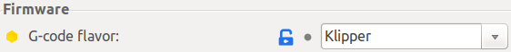

<link rel=”manifest” href=”docs/manifest.webmanifest”>

# Slicers  
In the following you'll find some short notes about the most common Slicers: Cura, PrusaSlicer, SuperSlicer, OrcaSlicer.  

A slicer is a program you open your STL file with, adjust the settings for how the printer should print the model (like speed, temperature etc.) and then you "slice" the model for getting the gcode-file generated, which then will be taken by the printer.  

So no matter if you're using the stock firmware of the printer or if you're using Klipper, you always need a slicer.

However, due to the fact that Klipper uses extended G-code and macros, there are a few things to be aware of.  
In the following I'll just go over the abovementioned slicers really quick as it would be too much to discuss the slicers in detail. You'll find many resources online though where you'll find more information about them.    

---

## Cura  
Cura is probably the most commonly known slicer. If you check support page of Anycubic or if you have a look at the content of the microSD card that was shipped with the printer, you'll find an *outdated* version of Cura and some printer profiles for it. My suggestion would be: *don't* use that outdated Cura version and *don't* use the profiles Anycubic offers, at least not without inspecting them (especially Neo users!). You can find more notes on the profiles further down below.  

Even though Cura and Klipper work perfectly together, there are a few things to be aware of.  
Certain classic G-code commands aren't directly supported by Klipper as it uses extended G-code and scripts for certain things. As an example the G-code command `M0` (unconditional stop) isn't recognized by Klipper, you'd have to use the extended G-code command `PAUSE` for that.  

Also there are a few functions of Cura which should improve the print quality which interfere with Klipper's own approaches for that (like Pressure Advance or Input Shaping).  

You'll find a good overview of what to be aware of in the tutorial from [All3DP: Cura & Klipper: How to Make Them Work Together](https://www.all3dp.com/2/cura-klipper-tutorial).  
 
The latest version of Cura also offers the option to now set the G-code flavor to Klipper.   
However, there's also a ["Klipper Settings Plugin"](https://github.com/jjgraphix/KlipperSettingsPlugin) available which adds a category to Cura called "Klipper Settings" and offers Klipper specific settings and features.  
 

---
 
## PrusaSlicer, SuperSlicer, OrcaSlicer 
PrusaSlicer and it derivates like SuperSlicer and OrcaSlicer are my personal favourites after using Cura for some time.  

You can set the G-code flavor depending on the firmware of the printer (menu "Printer Settings") to "Klipper" as shown in the screenshot of SuperSlicer below, so it's already everything set up correctly within the G-code of the sliced files.  
  

  
Of course all slicers have many functionalities to finetune and control the output - you can even choose between different patterns for the top layer finish. They're all pretty identical overall, yet they differ in certain functions. One of them being worth mentioned is a *handy set of calibration tools that comes with SuperSlicer and OrcaSlicer*. This function actually guides you step by step through the calibration process and allows you to generate calibration models like temperature or retraction towers with individual settings by just a few clicks.  

Make sure to enable the optional "Arachne Engine" (Print Settings -> Perimeters) as it improves the quality of the printed parts. 

---

# Printer Profiles

The microSD card shipped with your printer should contain Cura profiles. If you don't have them, you can download them at [Anycubic's support page](https://www.anycubic.com/pages/firmware-software) but I'll list and link to them further below also.  

However, these profiles don't seem to always work right away, even though it's a good start. The specific profile and settings may differ from printer to printer, even within the same model type. The settings like print speed, retraction settings, extruder and bed temperature etc. also depend on the type of material you want to use (e.g. PLA/ABS/PETG/TPU). But also for the same type of filament material like PLA the settings often need to be adjusted again if you're using filament of a different manufacturer or even just another spool or colour of the same brand.  
There are countless guides about this topic in general, so I'd recommend to dig into it deeper using your preferred sites or specific videos.   
  
There are users who offer their profiles for the Go and Neo, so that beginners have a better starting point if the stock ones don't seem to work for them. In the following I'll list them as far as I'm aware of them. Be aware though that you still have to check the settings and finetune them for your device.   

You can always set up your own custom profile in your slicer. Just pay attention to the general machine settings, like the bed size and so on.  
  
??? tip "Set Up Filament Specific Profiles"

    When you're using more than one filament, it's a good idea to set up a profile for each spool of filament you have. So not only for the type of filament (like PLA, PETG etc.), but also for the different manufacturer, the colour and so on. It happens that you have to use slightly different settings even with the same type of filament from the same brand but just when using a different colour of it.   
  
---  
  
## Go 

---

### Official Profiles

The following list links to the specific profiles from [Anycubic's firmware page](https://www.anycubic.com/pages/firmware-software):
 
 - [PLA v1.0](https://cdn.shopify.com/s/files/1/0245/5519/2380/files/Kobra_Go_suggested_parameters_for_PLA_V1.0.curaprofile?v=1669192042) 
 - [ABS v1.0](https://cdn.shopify.com/s/files/1/0245/5519/2380/files/Kobra_Go_suggested_parameters_for_ABS_V1.0.curaprofile?v=1669192041)
 - [TPU v1.0](https://cdn.shopify.com/s/files/1/0245/5519/2380/files/Kobra_Go_suggested_parameters_for_TPU_V1.0.curaprofile?v=1669192041)
  
---

### Custom Profiles 

The following list links to profiles provided by users which I became aware of:  

- @[natur3kid](https://github.com/natur3kid) offers profile for PrusaSlicer for the Kobra **Go**: [https://github.com/natur3kid/PrusaSlicer_KobraGo](https://github.com/natur3kid/PrusaSlicer_KobraGo) 

---

## Neo 

---

### Official Profiles

The following list links to the specific profiles from [Anycubic's firmware page](https://www.anycubic.com/pages/firmware-software): 
 
 - [PLA v1.0](https://cdn.shopify.com/s/files/1/0245/5519/2380/files/Kobra_Neo_Suggested_parameters_for_PLA_V1.curaprofile?v=1669192662) 
 - [ABS v1.0](https://cdn.shopify.com/s/files/1/0245/5519/2380/files/Kobra_Neo_Suggested_parameters_for_ABS_V1.curaprofile?v=1669192662)
 - [TPU v1.0](https://cdn.shopify.com/s/files/1/0245/5519/2380/files/Kobra_Neo_Suggested_parameters_for_TPU_V1.curaprofile?v=1669192662)
 - [PETG v2.0](https://cdn.shopify.com/s/files/1/0245/5519/2380/files/Kobra_Neo_Suggested_parameters_for_PETG_V2.curaprofile?v=1669192662)
  
!!! warning "Don't Use Anycubic's Profile Right Away!"

    Watch out if you're going to use the profile of Anycubic, the *retraction distance is set to 6mm there*, which is *way* too much for the direct drive system of the **Neo**!  
    6mm is more a setting for a bowden drive like the **Go**, direct drive systems are supposed to be used with retraction distance settings around/up to 1mm! Using 6mm will lead to clogging!  
    *Always make sure to check this setting in general when using preconfigured profiles!*   
  
!!! warning "Better Don't Print The Owl.gcode!"  

    It's advisable to *not* print the owl.gcode example with the **Neo** which Anycubic provides. In there the retraction distance is also set to 6mm, which is *way* too much for the direct drive of the **Neo**! Even tho people reported a great quality of this owl when they printed it, it'll most likely lead to clogging.  
    
---

### Custom Profiles  
  
The following list links to profiles provided by users which I became aware of: 

 - @[sclebo05](https://github.com/sclebo05) offers his profiles for different slicers for the Kobra **Neo**: [https://github.com/sclebo05/KobraNeoProfiles](https://github.com/sclebo05/KobraNeoProfiles)

---

  

