<link rel=”manifest” href=”docs/manifest.webmanifest”>

# Tools 
When it comes down to tinkering, the fun factor and the results raise and fall with the tools you have. So if you're new to this whole world and find yourself in front of an empty toolbox, the following tools might be a good start (the list will be extended by time).  
  
??? tip "Quality Matters"

    If you're about to buy tools, you're probably tempted to get yourself cheap tools (which might be ok for certain parts tho). However, I personally just want to give you the advise to spend a bit more and get yourself some quality tools from well known brands. Yes, you might pay the same amount of money for one good wrench then you'd pay for a whole set, but believe me, it'll be worth it. Quality tools are made more precisely and from better material so they just last longer.  
    So let's say you want to get yourself some hexagon socket tools, don't go for the cheapest ones out there. The cheap ones tend to become round on the edges pretty quick and it's really no fun at all to fiddle around with a 1.5mm hexagon socket tool trying to loosen up that little grub screw of the heater block with a messed up tool. Doing so, you could even harm the socket of the screw which could/would result in the fact that you either won't be able to get it out at all or that you'd have to replace it with a new one (which might be hard to find).  

---

## Height Gauge for ABL Sensor
Well, even though this isn't a 'tool' you can buy, you probably want to print out the [height gauge](https://cdn.shopify.com/s/files/1/0245/5519/2380/files/Height_gauge.rar?v=1667814312) from Anycubic to make the leveling opration of the ABL sensor a bit easier. You have to make sure though that you're printer already works fine to print it to not mess up the height ratio of the tool.  
It's not necessary to print this though, as you can just use the big two-sided open end wrench that came with the printer.  
Maybe you even already got it with your printer though, so check if you have this little plastic tool shown in the picture picture below.  

  

---

## Feeler Gauge
I'd recommend to get yourself some feeler gauges. Those are thin metal sheets in different thicknesses. They come in handy when e.g. setting the z-offset, as their thickness doesn't vary like paper does.  

  

---

## Caliper
A slide gauge comes in handy if you want to measure accuracy of e.g. your printed test cubes. I'd recommend to get a digital one as it's easier to read the measured value and it's more precise as well.   

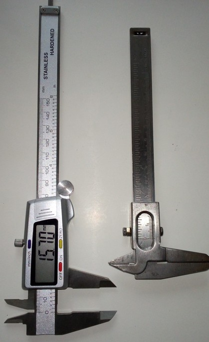

However, keep in mind that these slide gauges (especially the cheap ones one usually buys) also have a measuring and a manufacturing tolerance - so don't go crazy about 0.05mm or so. 

---

## Multimeter
Get yourself a multimeter. You don't have to get a professional one, a cheap multimeter will do the job just fine. You'll need a multimeter to measure voltage and current and to measure if maybe a wire is broken somewhere. You can also measure if your limit switch is faulty or if a sensor or a thermistor is working correct.  

(add image)

---

## Allen Keys 
You already got some of them with the printer I guess, but it's probably a good idea to get yourself some quality ones.  

(add image)

---

## Wrench 
For tinkering at the Go/Neo, you don't necessarily need a whole set of wrenches as most of the screws are hexagon socket ones. However, I recommend to get yourself at least a sufficient one for the nozzle and one which fits the heater block.  
For the nozzle you can also use a socket wrench and for the heater block you could use a little adjustable wrench - just make sure that you don't get yourself a huge one as it might be hard to get around with that due to a bit of a limited space.  

!!! tip

    I highly recommend to use a wrench instead of just some universal pair of pliers as the wrench fits the object perfectly and doesn't harm it because of its smooth surface.  

The following picture shows a small adjustable wrench I like to use to hold the heater block in place.  

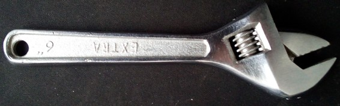

---

## Side Cutter
A sharp side cutter is always good to have.  

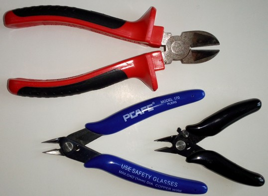

---

## Soldering Iron 
It's always good to have a soldering iron because it allows you to solder wires together, replace a broken wire of the heat bed and so on.  

Soldering irons are available with different power and tips.  
Depending on what you want to solder, you should choose the best option. Generally speaking, for small parts like thin wires, electronic components and so on, you want to use an iron with a lower wattage and a pointed tip. If you need to solder thick wires or bigger components, you most likely will choose a more powerful iron with probably a more flattened tip. Often both kinds of irons are sold in a set, like a more powerful 80W one with a wide and flat tip and a 40W iron with a pointed tip. If you don't have any soldering irons at all, you can go with one of those cheap sets.   
I personally love my little 12W "Weller Mini" for tinkering, as it is thin and good to grab and parts don't tend to overheat quickly as it could happen when you use a 40W or 80W iron for example.  
There are well-priced soldering stations out there which allow you to adjust the power and the heat and which also offer a small hand piece, so I'd recommend you go for something like that. They usually also include a holder for the hot iron and something like a brass sponge or so to clean the tip.  

The following picture shows my little 12W Weller at the bottom and the beforementioned 40W and 80W irons from a cheap set which I once bought at a discounter.  

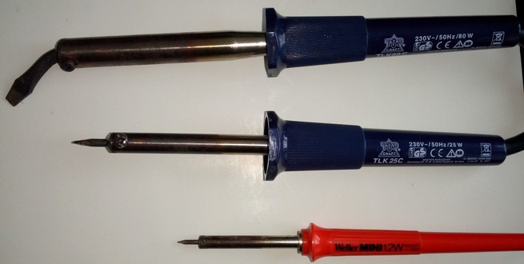  

Most likely you'll get some kind of set, like either a set of two different soldering irons as mentioned above or a soldering station. Thse use to come with the additional components you need, like solder wire and a holder for the iron.  
However, depending on what you got, it might be smart to buy additional solder wire and solder sucking wire (to suck away molten solder when you want to unsolder something). I personally prefer to use thin solder wire with a flux core and a bit of lead in it for tinkering and soldering small parts, as the lead makes soldering easier and the thin wire allows to be more precise when adding the solder. Nowadays you'll most likely won't be able to get leaded solder wire anymore though, as lead produces toxic fumes while soldering. Instead of that, you'll get lead free solder with silver in it.    

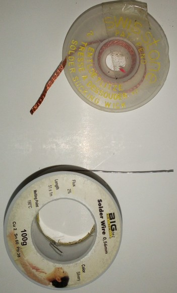
   
---

## Hot Air Gun
A hot air gun comes in handy if you have to disassamble your hotend after you've already taken it out of the printhead or in case you cartridge heater and/or thermistor is broken and therefore you can't use the heating function of the printer itself.  
You could either use a 'big' heat gun like the ones from the tool shop and put a 'nozzle' on top of it which concentrates the airflow or you get yourself a hot air gun station which is used to solder SMD with. Here it's nice to be able to set the desired temperature and choose the diameter of the nozzle depending on the part you want to heat up. The following picture shows one of these cheap SMD hot air stations.  

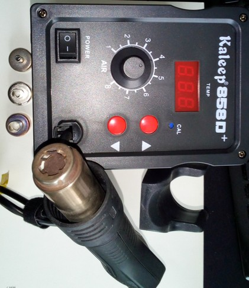

---

## Hot Glue Gun
Using a hot glue gun allows you to add a small spot of molten glue onto the connectors to secure them from coming loose due to the vibrations. You can easily peel the glue off again once it's cold.  

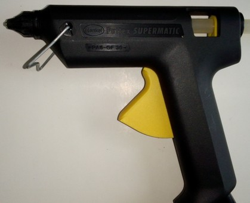

---

## Silicone Mat 
Speaking about soldering irons and hot air guns, I personally use a silicone mat to put it on the table for protecting the surface.  

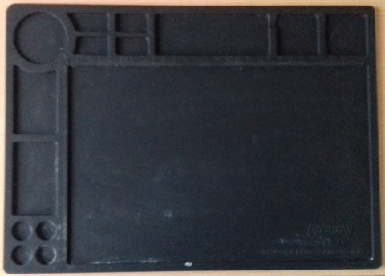

---

## Needles for the Nozzles
Get yourself some of those long acupuncture needles which fit the diameter of your nozzle. Maybe one of those for the stock 0.4mm nozzle already came with the printer. You can use them to stick them up into a heated up nozzle to get rid of clogs.  
However, I personally don't use these needles anymore, I prefer to just do a quick cold pull for getting rid of any clogs.  

!!! tip

    *Always* use them when the nozzle is warm though as they tend to bend or even break if you try to push it into the cold nozzle where the hardened filament sticks in.  

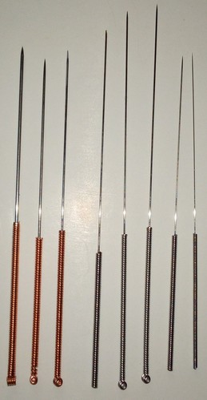

---

## Pipe Cleaner  
I like to use pipe cleaners for wiping excessive or leaking filament off the heatened up hotend. They catch molten filament just great and you can bend them to easily wipe around the nozzle.  

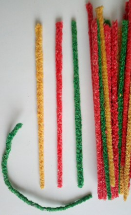

---

## Brass Brush
Get yourself a small brass brush for cleaning the outside of the nozzle and the heater block as well.  

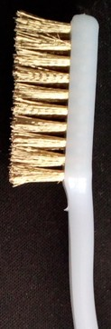

---

## Tweezers
Get yourself some long handled tweezers, preferably a few different ones with different shaped and bent tips.  

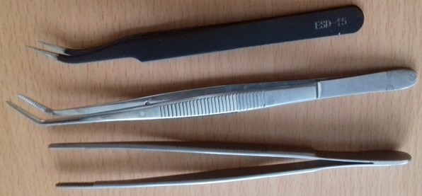

---

## Ferrules & Crimping Tool
Being able to add ferrules to the end of wires is just great. You can get them as a set with the specific pliers for that and it's not even expensive.  

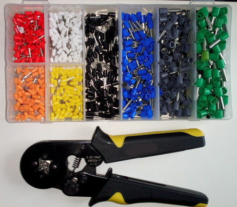

When you're looking out for that, make sure to get those kind of pliers which use four brackets to squeeze the ferrules and which engage during squeezing.   

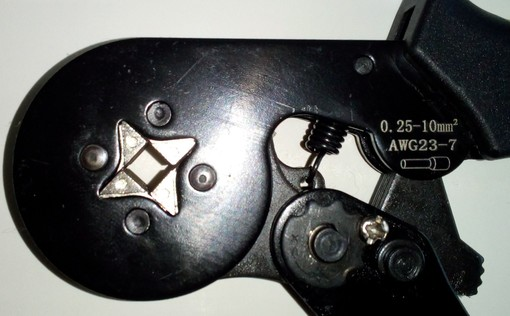

The results will be much better than the ones that just use two brackets. Especially when it comes down to small ferrules it's also much easier to take out the ferrules afterwards as they don't stick in one side of the jaw.

---

## JST XH 2.54 Connectors & Crimping Tool
Most of the connectors being used are JST XH 2.54 ones, so when tinkering, sooner or later you'll need the equipment for being able to crimp those connectors yourself.  

I personally am using the "IWISS iCrimp SN-2549" which works really well. This specific SN-2549 type of crimping tool also comes from other manufacturers, but I personally found the jaws of this particular one being made pretty well for a still reasonable price.  
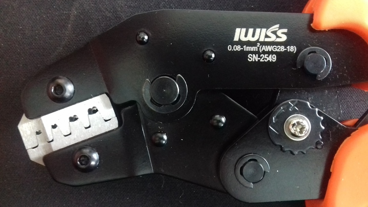  

Then just get yourself one of those sets which contain connectors for soldering and crimping and you're good to go.  
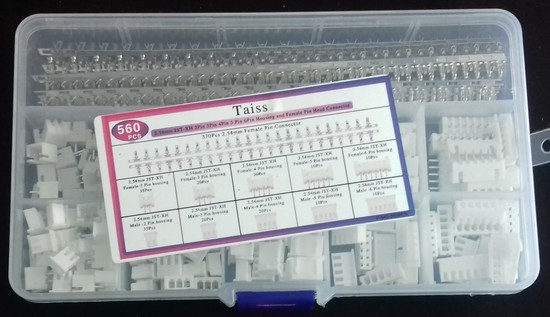  

Before attempting to crimp wires for your printer, I highly recommend to make some test crimps beforehand for getting used to the procedure.  
Make sure the crimp went well and to plug in the crimped contacts into the correct holes of the connector housings then when attempting the crimps for the printer's wiring.  

---

## Infrared Thermometer
An infrared thermometer allows you to measure higher temperatures without touching the part you want to measure. It comes in handy when you want to check the temperature of the bed a t diffferent spots or when you want to check the temperature of the stepper motors.  

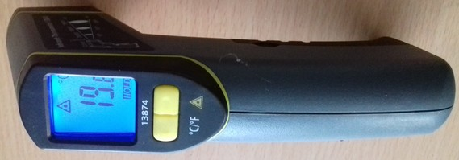

---

## Cable Ties
Get yourself some of those small cable ties, it's always good to have some of them laying around in your toolbox. Most likely you'll need smaller ones, but as you can get them in cheap sets of different sizes, maybe just get yourself one of those.  

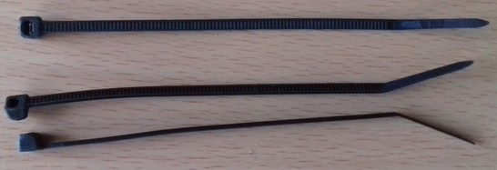

---

## Heat Shrink Tubings
A set of heat shrink tubings is always good to have, as they allow you to insulate soldered wires and other parts.  

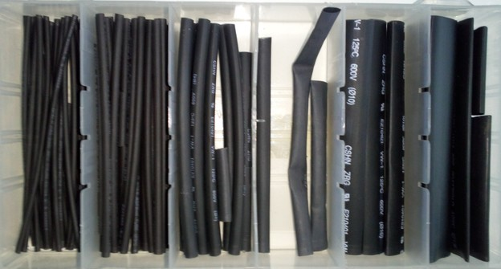

---

## Blow Torch
A small blow torch comes in handy when you need to heat up disassembled parts.  

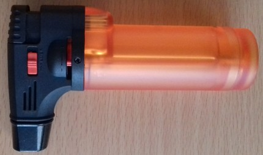

---

## Kapton Tape
Get yourself some Kapton tape. This tape is kinda heat resistant and has silicone glue applied, which makes it easy to remove.  
You can use it to e.g. secure insulation of the heated bed, equalize dents or certain areas of the bed for achieving a flat surface and so on.  

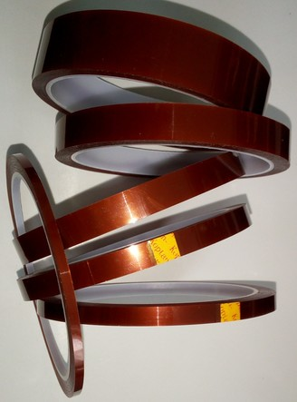

---

  
 
